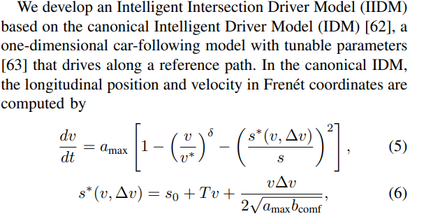
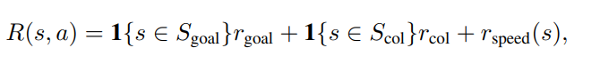

# [TRO24] Interactive Autonomous Navigation with Internal State Inference and Interactivity Estimation

1. Link: https://arxiv.org/pdf/2311.16091
2. Authors: Honda (USA) + Stanford  Intelligent Systems Laboratory (SISL)
3. [jintian]comments/critisism
   1. A sophisticatedly designed solution for addressing the 'driving through junction' problem
   2. The authors proposed the ISI module, which demonstrated a significant impact on these metrics. They claimed that the module performs robustly even when $\mathcal{P}(aggresive)$ changes during testing. Can I interpret this as an inaccuracy in the module's estimation?
   3. Is it feasible to implement this work in the real world? (I'm doubtful, since we cannot get the GT of intention)
   4. The difference between the setting of conservative and aggresive is not that significant.
4. hypothesis:
   1. modeling human internal states explicitly improves the decision making performance 
   2. the inferred internal states can serve as explainable indicators
5. previous methods:
   1. use attention mechanism to "weight the importance of obs. to ego" may make mistakes
   2. DRL methods for sequencial decision-making is underexplored, especially in satefy-critical applications
   3. (1) brings similiar problem when it's used for decision-making
6. related works
   1. Interactive Decision Making: 2 ways for doing so
      1. agents are co-learning: use game theoritic formulation and multi-agent DRL (nash equilibria, stakelberge game....)
      2. other agents is a part of environment --> single agent contrl
   2. counterfactual learning: to answer those "what if..." problems
7. proposed methods:
   1. model:
      1. estimate the difference between the predicted trajectory distributions of the agent under the situations with and without the existence of the ego vehicle as a quantitative indicator (feature)
      2. use (1) as “interactivity score" to measure the impact of ego car to obs.
      3. (2) is a counterfactual reasoning problem, so they trained a model by using a dataset which removes ego car
      4. use spatial-temporal GNN to model relational reasoning
      5. add auxiliary features to indicate how the model infers
   2. simulator:
      1. four-way partially controlled intersectionenvironment that simulates challenging traffic scenarioswith interactive vehicles and crossing pedestrians
8. Details
   1.  INTERSECTION DRIVING SIMULATION
       1.  Intelligent Intersection Driver Model (IIDM) a model for simulating the motion of obs
       2.  the peds are simulated as 
       3. ego car init. in random, obs. cars on lane, peds on crosswalk/sidewalk
    2. POMDP
       1. state: x are pos, vel, and type, z is intention 
       2. observation: 
       3. action: 
       4. transition 
       5. reward 
    3. DRL
       1. Internal State Inference
          1. goal 
          2. use GT from simulator, use classification models
       2. Graph-Based Representation Learning
          1. 
          2. 
       3. traj prediction 
          1. use GNN as encoder, mlp output mean estimation, freezed during training the system as a whole.
       4. Interactivity Estimation
          1. function in terms of KL(traj w/ego, w/o ego)
       5. 
       6. 