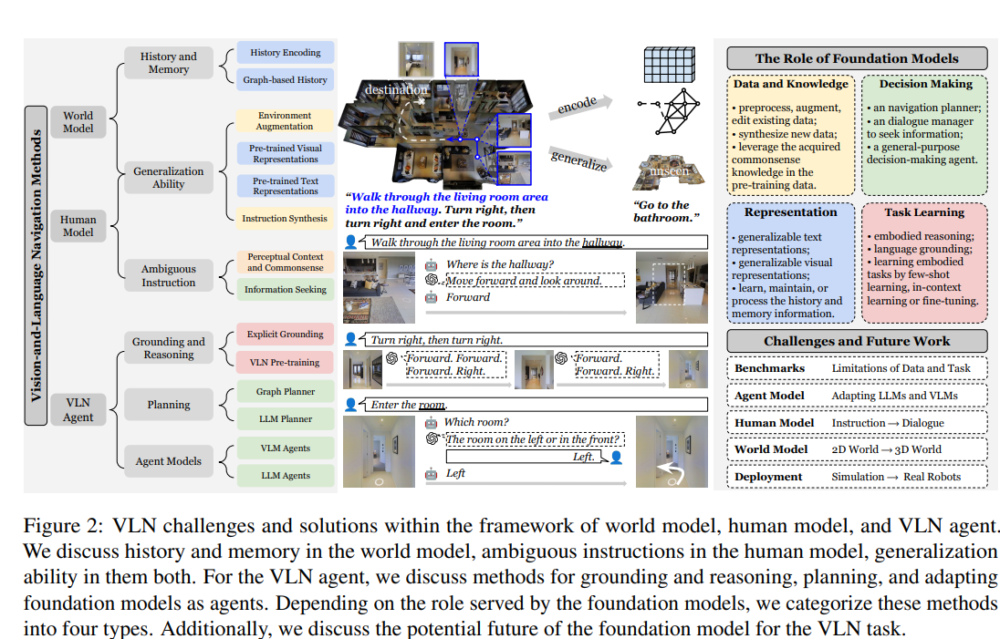
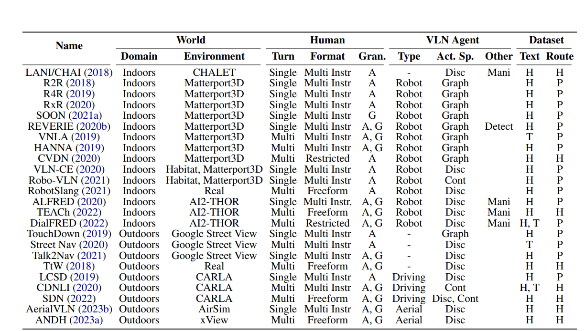

# 1. Vision-and-Language Navigation Today and Tomorrow:A Survey in the Era of Foundation Models
1. Link: https://arxiv.org/pdf/2407.07035
2. TL;DR: we provide a top-down review that adopts a principled framework for
embodied planning and reasoning, and emphasizes the current methods and future opportunities leveraging foundation models to address VLN challenge

## Key concepts
1. VLN: A kind of Multimodel LLM, which processes both natural language instructions from human, and visual inputs from raw sensors. A VLN could output the navigation route (sequencte of trajectory/low-level action) based on the instruction and then execute the route by its own
2.  VLN-DE: VLN agents to operate in a discrete environment and rely on pre-defined connectivity.
3.  CE: continous spaces
4.  VLN benchmarks:human.gran. {action/goal directed} dataset.text {human, templated}, route {planner, human demostration} 
5.  VLN metrics: success rate, FDE and their variants
## Interested sub-problems
1. Ambiguous Instructions: how LLM could process the unclear, unopaque instructions, how to measure its ability, what is a proper metric for this
2. Commonsense reasoning: Clarify or correct ambiguous landmarks
in the instructions, and break instructions into actionable items
3. Information Seeking
   1. deciding when to ask for help;
   2. generating information seeking questions
   3. developing an oracle that provides the queried information
## Why MLLM as backbone of VLN
1. agent should consider previous actions, identify the part of the sub-instruction to execute, and ground the text to the visual environment to execute the action accordingly
2. adapt to environmental changes and improve navigation
strategies on the fly (graph-based planner/ llm-based planner)
3. some VLN-agents use low-level control instead of high-level graph-based actions
## Challenges
1. no benchmark with large data and task. wish to have a benchmark with:
   1. unified tasks and platforms
   2. dynamic environment
   3. indoors to outdoors
2. 2d- navigation to 3-d
3. LLM lack of embodied experience (data from internet), need to transfer the commonsense knowledge in foundation model agents to generalize to embodied situation.
4. LLMs have hallucination issue
5. sim to real deployment