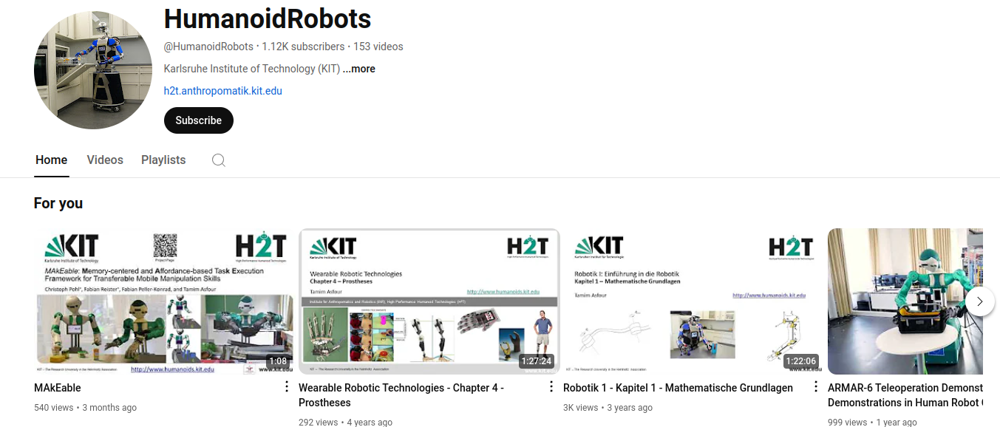
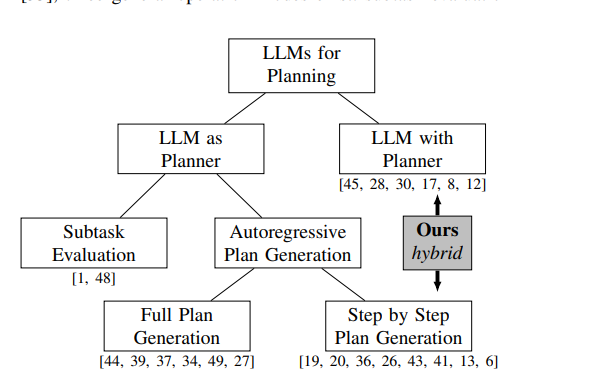
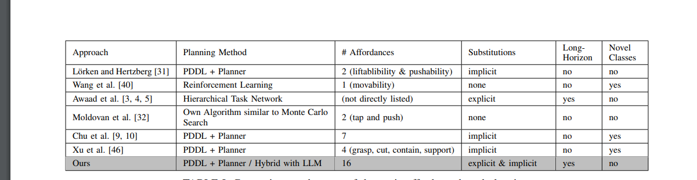
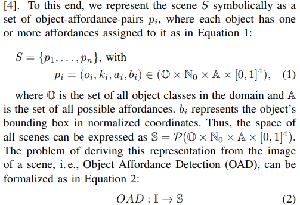
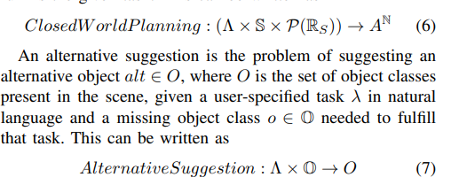
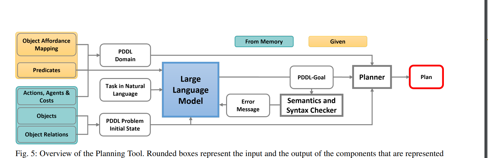

# [RSS'24] AutoGPT+P: Affordance-based Task Planning using Large Language Mode

1. Link: https://arxiv.org/pdf/2402.10778
2. Arthurs and institution: Timo Birr, Christoph Pohl, Abdelrahman Younes and Tamim Asfour, KIT
3. brief intro: a German team focuses on building mobile manipulators (humanoid manipulations) https://www.youtube.com/channel/UCQC4i8MlCMCefJmPz7PmDMw

## Comments:
1. How does the function $checksyntax(\Delta, \Xi)$ work in algorithm 3?
2. Comparing AutoGPT+P with INTERPRET, what are the key differences between them in ystem architectures and task capabilities?

## Conclusions
The authors proposed AUTOGPT+P, a system for robotic task planning which 1. introduce an LLM-based approach to generate object affordance function 2. use (1) to automatically generate init state file, predicates file and goal file in PDDL. Meanwhile, this work still did not address the probability problem in LLM+P area for task planning.

## Existing problems
1.'LLM + classical planners' can only generate plans if all
objects needed to complete the task are available.

2. LLM+P has no automated error correction

3. It's vulnerable to contradictory goal definitions of the LLM.
## Contributions
1.Deriving the planning domain from an affordance-based scene representation, which allows symbolic planning with arbitrary objects.

2. Handle planning with incomplete information, such as tasks with missing objects, by exploring the scene, suggesting alternatives, or providing a partial plan.

3. The affordance-based scene representation combines
object detection with an Object Affordance Mapping that is
automatically generated using ChatGPT.

The core planning tool extends existing work by automatically correcting semantic and syntactic errors leading to a success rate of 98% on the SayCan instruction set.

## Key concepts
1. generates the initial state of the PDDL problem from OAD and
not from natural language
2. dynamically generates the PDDL domain based on the capabilities of the agents and
the OAM, 

## Details
1. a literature collection of LLM+P

2. problem formulation 
2.1 OAD

2.2 closed world planning and alternative suggestion

2.3 semantic errors as the occurrence of multiple predicates that cannot be true at the same time in a real scene.

2.4 overview of the system arch.
