# [ByteDance'23] Towards Generalist Robot Policies: What Matters in Building Vision-Language-Action Models
1. Link: https://arxiv.org/pdf/2412.14058
2. Arthurs and institution: Xinghang Li, Peiyan Li, Minghuan Liu, Dong Wang, Jirong Liu, Bingyi Kang, Xiao Ma, Tao Kong, Hanbo Zhang, Huaping Liu from NUS, ByteDance and Tsinghua

**TL;DR**
Answering three essential VLA design choices: which backbone to select, how to formulate the VLA architectures, and when to add cross-embodiment data. A new family of VLAs, RoboVLMs, which require very few manual designs and achieve a new state-of-the-art performance in three simulation tasks and real-world experiments.
## Thoughts and critisim
1. the paper provides solid conclusions by good experiment setups
2. the whole 'RoboVLMs' idea is not , we have to look into the code.
3. the tasks are in table-top environment, and the task is less difficult compared to $\pi_0$
4. the best recipe is Continous action output+policy head + kosmos/paligemma backbone+ cross-embodi pre-training+in-domain data post-traning, which shows similiar results from $\pi_0$                            
## Contributions
1. we disclose the key factors that significantly influence the performance of VLA and focus on answering three essential design choices: which backbone to select, how to formulate the VLA architectures, and when to add cross-embodiment data.
2. Develop a new family of VLAs, RoboVLMs, which require very few manual designs and achieve a new state-of-the-art performance in three simulation tasks and real-world experiments.

## Findings
### Q1: Why VLAs
1. Q1.1: Are VLAs a proper choice for building generalist robot policies?
   1. 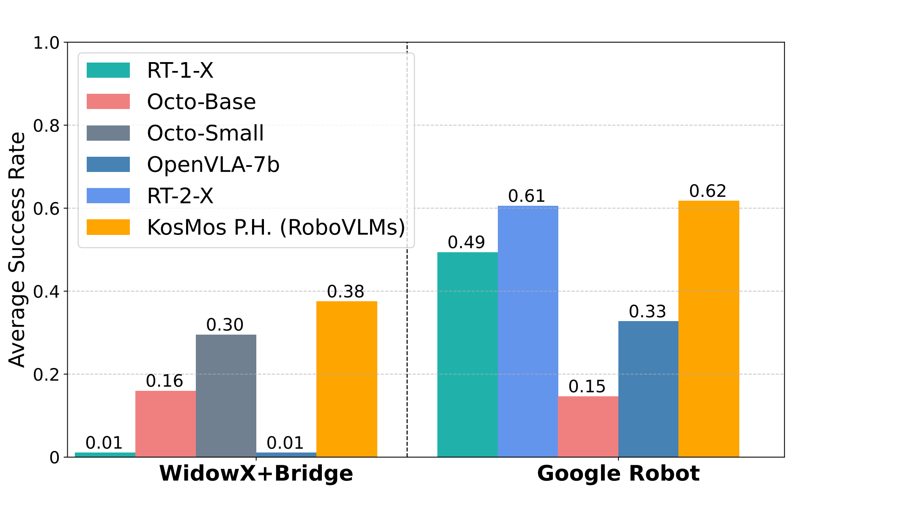
   2. VLA is a promising path to generalist robot policies.
2. Q1.2: How do VLAs perform in real-world scenarios?
   1. The best setup VLA built by RoboVLMs appears strong effectiveness and robustness in real scenarios.
### Q2: How should we formulate VLAs?
1. Q2.1: What is the best-performing VLA structure?
   1. observations
      1. continuous action matters, particulary as task horizon invraeses (accumalationg of compounding errors)
      2. history observation matters, the longer the better
      3. policy head improves history fusion
   2.  The VLA achieves its best performance when using multi-step historical observations as inputs and continuous actions as outputs. For integrating history with continuous action space, the policy head structure performs better.
2. Q2.2: How do different formulations affect the generalization and data efficiency for VLAs?
   1. test generalizability by training on split ABC and test on D
   2. test data efficiency by scaling down the dataset
   3. Leveraging policy head for history fusion is the best in terms of generalization and data efficiency.
### Q3: Which VLM backbone is better for VLAs?
1. Q3.1: Which type of VLMs is most suitable for constructing VLAs?
   1.  VLAs benefit from the sufficient vision-language pre-training on large vision-language datasets of VLMs backbone.
   2.  KosMos and Paligemma demonstrate the distinctively better performance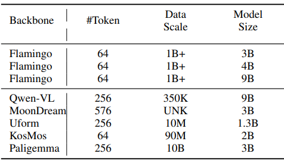
### Q4: When should we leverage cross-embodiment datasets?
1. Definitions
   1. Pre-train: Pre-training the model with in-domain manipulation data and cross-embodiment datasets
      1. RT-2, OpenVLA, OCTO
   2. Post-train: First, training the VLMs on cross-embodiment datasets, followed by fine-tuning with in-domain manipulation tasks
      1. $\pi_0$
2. Q4.1: How do large-scale cross-embodiment datasets contribute to VLAs?
   1. Pre-training with cross-embodiment data does not help significantly
   2. Post-training after cross-embodiment pre-training shows potential benefits
   3. Pre-training improves few-shot learning performance
   4.  Extra in-domain data, even from different tasks, shows beneficial, and large-scale cross-embodiment pre-training further improves overall as well as few-shot performance.
## Hardware
1. 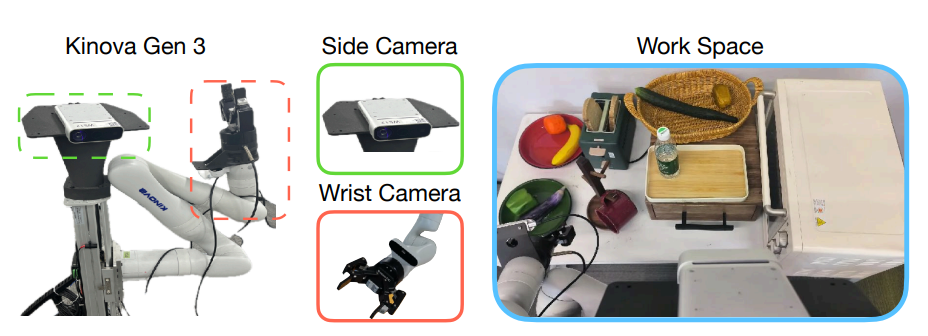
2.  Kinova Gen-3 robot arm, equipped with a Robotiq 2F-85 parallel-jaw gripper and two cameras: one static camera for capturing the workspace and another camera mounted on the end-effector. The static camera is a Kinect Azure, while the wrist-mounted camera is a RealSense D435i. The workspace is a 55 cm x 24 cm table, and there are more than 40 objects distributed across the evaluated scenes.
## Simulator
1. CALVIN
   1. pybullet
   2. A simulation benchmark for multitask table-top manipulation.
   3. 34 basic tasks with 24K human teleoperated demonstrations annotated with language instructions in total.
2. SimplerEnv
   1. sapien+maniskill2
## RoboVLMs
### VLM
1. 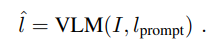
2. Encode: 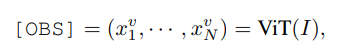
3. Loss: 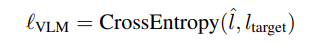
### VLA
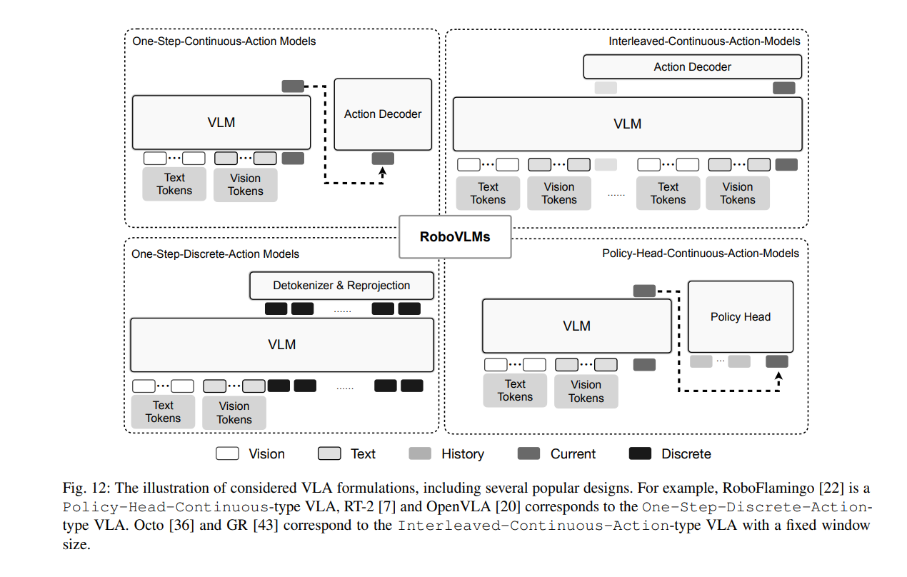
1. formulation: 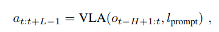
2. general principles
   1. action pre-processs
      1. normalization: 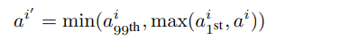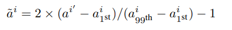
      2. discretization: discretize each robot action dimension into one of 256 bins separately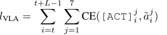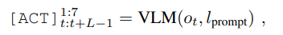
      3. continuous actions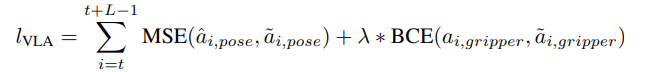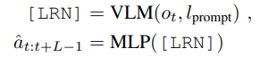
3. VLA structures
   1. one-step
   2. interleaved-continuous-action model
      1. formulation of observation: 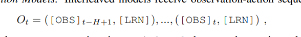
   3. Policy-Head-Continuous-Action Models
      1. get action at each timestep t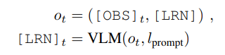
      2. use diffusion model
         1. 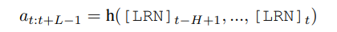