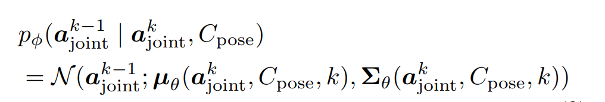

# [CVPR'23] Hierarchical Diffusion Policy for Kinematics-Aware Multi-Task Robotic Manipulation
1. Link: https://yusufma03.github.io/projects/hdp/
2. Arthurs and institution: Xiao Ma, Sumit Patidar, Iain Haughton, Stephen James from Dyson Robot Learning Lab

**TL;DR**
HDP factorises the policy space into a high-level task-planning agent and low-level goal-conditioned diffusion policy, which achieves both task-level generalisation and flexible low-level control.

## Thoughts and critisims
1. to manipulate the articulated objects, the arthurs method sounds like 'the eef pose learning the kinematics of the object' and 'the FK funtion learns the kinematics of the robot'
2. When would the first assumptions violates: new objects, thus the generalizability could not be addressed well, updating the kinematic structure during operatiing is still worthy to explore.
## Related works
### E2E visual manipulations
1.  learn a direct mapping from RGB images to a robot action 
2.  sample inefficiency
3.  methods:
    1.  next best pose
        1.  Perceiveractor: A multi-task transformer for robotic manipulation.
    2.  3D action-value map
        1.  Act3D
## Contributions
1. A hierarchical agent for kinematics-aware robotic manipulation.
2. We show that HDP achieves state-of-the-art performance on a set of challenging RLBench manipulation tasks. On a real robot, HDP learns
to solve both opening oven and sorting objects into drawer task.

## Key concepts

### Differentiable Kinematics
the end-effector pose $s_p$ of a robot can be obtained by a differentiable forward kinematics function $\mathcal f_K$  as $$s_p = f_k(s_j)$$, where $s_j$ are joint angles
then the joint angles can be upated by gradients $\frac{\delta L(s_p)}{\delta s_j}$
### Factorized Hierarchical policy
$\pi(\mathbb a|o, l)$ = $\pi_{high}(\mathbb a_{high}|o, l) \pi_{low}(\mathbb a_{low}|o, a_{high})$
### key frame discovery
1. training the high-level agent on all trajectory points is inefficient
2. key frame
   1. joint velocity is zero
   2. gripper state remains unchanged
3. training
   1. use key frame data
   2. 
### low level RK-Diffuser
1. the policy is conditional on the NBP, point cloud, robot state, eef post, gripper state 
2. use inpainting to inforce the last step pose is the NBP
3. kinematic Aware
   1. predcited eef pose is lack of kinematic, which lead failures druing IK solving
   2. use 7-DOF robot to generate 6-DOF eef pose is overactuated, which means infinite number of corresponding joint positions given the eef pose
   3. use foward kinematic function to update the joint positions
   4. {size=0.5}
## Experiments
1. HDP is the SOTA in RLbench
2. HDP outperforms low-level only policies
3. task-aware is important, especially for articulated objects
4. IK errors takes majority in robot failure
5. real-world implementation could be solved by 20 demostractions
## hardware
franka panda 7-DOF with 2 D435 cameras