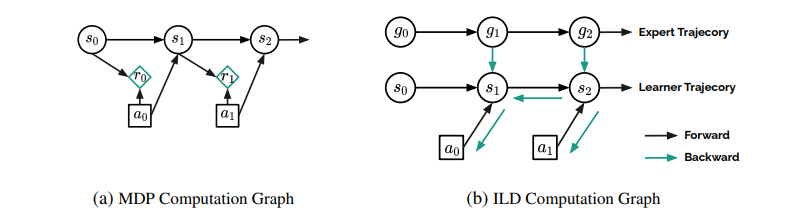
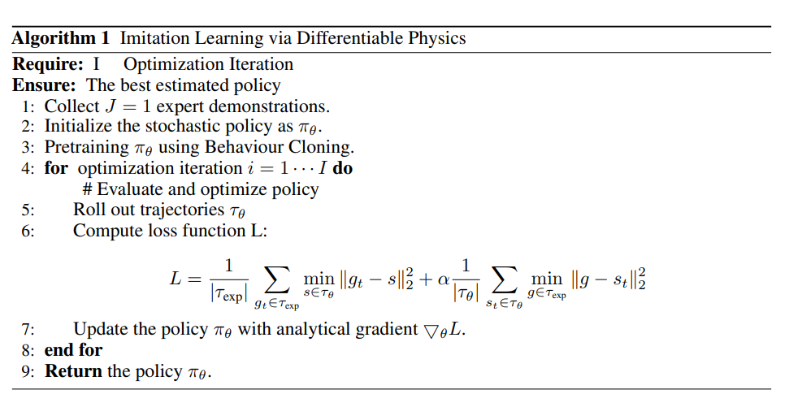
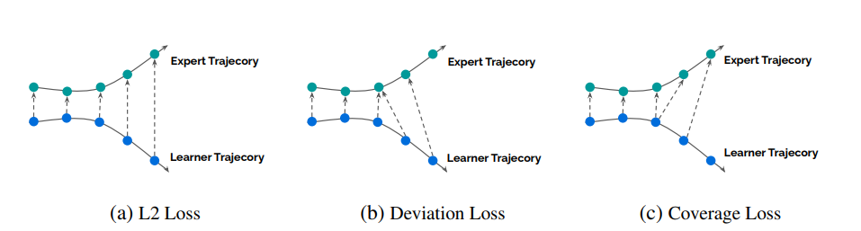
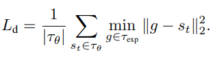
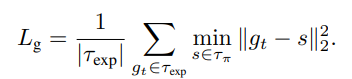
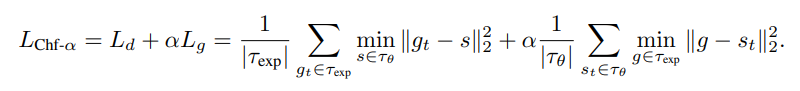

# [CVPR'23] Imitation Learning as State Matching via Differentiable Physics
1. Link: https://github.com/sail-sg/ILD
2. Arthurs and institution: Siwei Chen, Xiao Ma, Zhongwen Xu from NUS and Sea AI Lab
**TL;DR**
We propose an imitation learning method that incorporates the differentiable physics simulator as a physics prior into its computational graph for policy learning.
# comments and critisim
1. how does the quality of gradient may affect policy learning process?
2. (from author) normalizes its gradient in every step-wise transition function call, the gradient exploding issue can be significantly alleviated.
# Existing Problems
## Imitation learning
1. directly imitate the expert demonstrations via Behaviour Cloning
   1. suffer covariant shift problems due to insufficient expert training data
## Inverse Reinforcement Learning
1. a type of imitation learning that learns policies by recovering reward functions to match the trajectories demonstrated by experts
2. a double-loop learning process
   1. outer loop learns the reward function
   2. inner loop solves the forward RL learning problem
## Differentiable Dynamics for Policy Learning
1. improve the stability and sample efficiency of policy learning
2. classical method
   1. a parameterized generative dynamics model by reconstructing the trajectory observations
   2. train a policy by “imagined” trajectories with the learned generative model 
   3. drawbacks
      1. suffer temporal accumulative model error
      2. long training time by switching over two loops for model learning and policy learning
3. new ideas
   1. back-propagating the gradients through the physics operators
   2. long temporal non-convex physics operators introduces a complex optimization landscape, which may cause stuck at local minima

## Key Insights
1. We assume that the underlying transition function of the task is built on a set of physics rules so that the cumulative compound error is small compared to a dynamics model learned from data
2. Consider the differentiable dynamics as a physics prior and incorporate it into the computational graph for policy learning. Thus, future states in the trajectory can exert influence on early actions, which leverage the rich information from future states and learn a policy that is aware of the environment specifications
3. Rich information may leads to a complex optimization landscape
4. Decompose the optimization problem into many small and simple sub-steps.

## Key points

### Differentiable Physics as Computational Graphs

1. minimizing the state distance between the learner agent trajectory and the expert trajectory by differentiating through the temporal computation graph G
$$s_{1:H} = G（s_0, \theta）$$
$$arg min_{\theta} \Sigma_{s\sim\tau_\theta} \Sigma^T_{t=0}(g_t - s_t)^2$$
2. the objective function suffers an issue of enforcing exact match
3. such impractical goals exceed the capability that the differentiable dynamics can offer and hence often result in local optima

### Imitation Learning via Differentiable Physics

#### Chamfer-$\alpha$ loss
1. help to selects the nearest local goals to the demonstrated states, which gives a simpler optimization landscape.
2. deviation loss

   1. select the easier goals for the agent to follow.
   2. stable optimization process
   3. may cause "state collapse" issue and lead to sub-optimal
1. coverage loss

1. together

### Experiment details
1. Brax
2. hanging a piece of cloth on a stand
3. Ant, Hopper, Humanoid, Reacher, Walker2d, Swimmer, Inverted Pendulum, and Acrobot
   1. train a PPO agent to act as an expert
   2. collect only one expert episode for each task
4.  one policy network consisting of three MLP layers with Swish activation