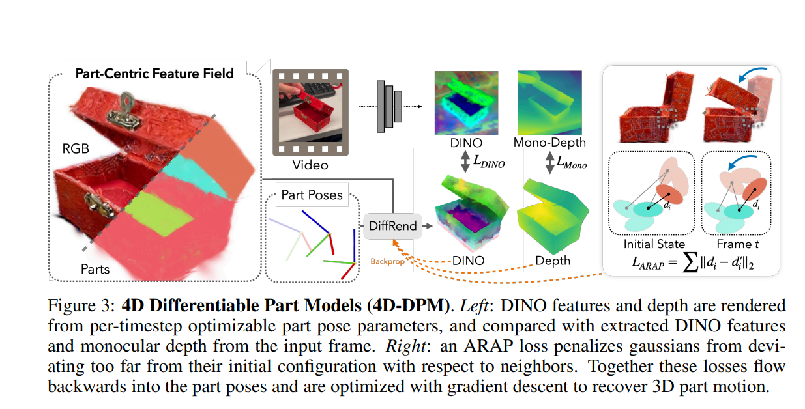
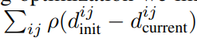
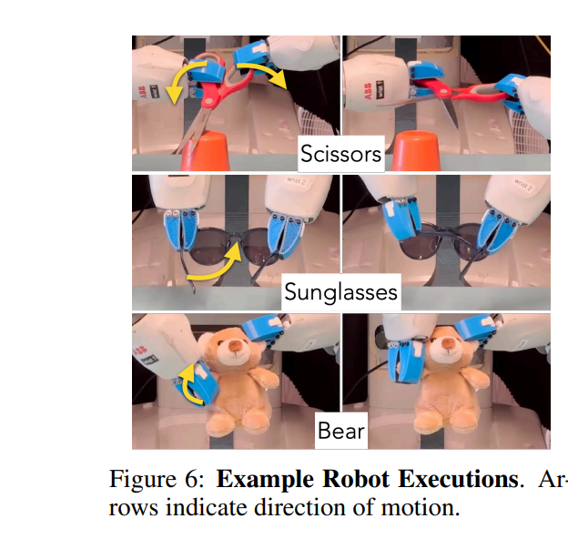

# [CoRL'24] Robot See Robot Do: Imitating Articulated Object Manipulation with Monocular 4D Reconstruction
1. Link: https://robot-see-robot-do.github.io/
2. Arthurs and institution: Justin Kerr*, Chung Min Kim*, Mingxuan Wu, Brent Yi, Qianqian Wang, Ken Goldberg, Angjoo Kanazawa from UCB
      1. Angjoo Kanazawa is an AP in BAIR, UCB, she also hold position in Google research team, advisory board of Wonder Dynamics https://wonderdynamics.com/ and LumaAI https://lumalabs.ai/dream-machine.

**TL;DR**
Robot See Robot Do uses a 4D Differentiable Part Model (4D-DPM) to visually imitate articulated motions from an object scan and single monocular video.

**TODOs**
1. TRY Nerfstudio https://arxiv.org/pdf/2302.04264 WITH QINGYUAN DATA!!!

# Miscellaneous work
1. [CVPR'24] GARField, a previous work by the team https://www.garfield.studio/. GARField hierarchically groups in 3D by training a scale-conditioned affinity field from multi-level masks.

## Thoughts and critisims
1. A key insight that enables visual imitation across a morphology gap is not to
focus on the exact motion of the manipulator, but o**bserve the consequence of the action at the object level**, so one's goal is planning to replicate the percieved 3D motion of object.
2. The detection of part of interest/part of task is computed via trajectory of human hands, which sometimes is not attainable for new tasks. Can we leverage VLM to solve this?
3. The way arthors use 3DGS does not consider all physical parameters, though they demostrate manipulation of deformable objects. That comes to the question "at what level of difficulty for a non-prehensile manipulation task, an estimationo of physical parameters is neccessary?"
4. The experiment stops at prehensile manipulation level.

## Related works
1. **Recovering 3D Motion for Objects with Moving Parts**
   1. defination: Reconstructing the 3D motion trajectory of articulated object from a single video
   2. Inputs:
      1. sequences of articulated motions of objects
      2. single point clouds
   3. requirements
      1. RGBD videos/multi-view observations
   4.  known kinematic chains/category-specific priors
2. **Learning from one demonstration.**
   1. use human data
      1. need additional robot teleoperation data for target tasks
      2. paired human-robot data to bridge the morphology gap
   2. learn policy from single demonstration
      1.  require extensive in-domain data
      2.  require well-curated meta-training tasks for training
3.  **Object-centric representations for robot manipulation**
    1. methods:
       1. representation of specific classes of data
          1. using 3D structure as a signal for contrastive learning 
          2. intermediate object properties as a bottleneck for image prediction
          3. canonical object views as conditioning
       2.  generalization methods
           1.  imitation
           2.  RL
           3.  semantic
           4.  relational
           5.  uncertainty-based
           6.  symbolic reasoning
           7.  pair-ware reasoning
4.  **Feature fields for robotics**
    1.  NERF
    2.  3DGS
    3.  Feature3DGS
   
## Contributions
1. A method for recovering 3D part motion from a monocular video with differentiable
rendering.
2. A manipulation framework that leverage the object-centered representation

## Key concepts

### Task defination
**Assumptions** internal part deformation is negligible
**Robot**: bimanual robot with parallel-jaw grippers
**Object**: an object with two or more movable parts
**Observation**:
   1. a multi-view object scan of an object
   2. a monocular human demonstration
   
**Goal**: manipulate the object through the same configuration change starting from an unknown location in the robot’s workspace.

### Algorithm
#### Constructing 4D Differentiable Part Models、

1. contruct a 3DGS model of object
2. contruct a GARField model of object, cluster the gaussians into subgroups
3. train a Feature 3DGS model o each subgroup

#### Monocular 3D Part Motion Recovery
**Analysis-by-synthesis approach**
we optimize, or synthesize, a model of the object parts over time, to
understand (i.e analyze) their motion

1. 4D part pose ---> trajectory of SE3 pose
2. backpropagate pixel error into 3D pose delta
3. better than feed-forward as it can be intergrated with geometry rigidity and temporal smoothing through optimization
**Part Motion Optimization from Video**
1. get rendered RGBD image and feature maps
2. optimize pose of the part by B.P.
tricks:
   1. blur them with a kernel at ViT size
   2. clip features with low alpha in 3DGS
   3. 1st done per frame, them optimize all in once with Laplacian Temporal smoothness
**3D Regularization Priors**
two additional lossed are added into DINO loss
   1. depth loss from DepthAny
   2. rigidity loss
      1. find boundaries of each gaussian parts
      2. derive a distance between neighboring pairs
      3. add it to the loss 
**Initialization**
1. initialize the object pose
   1. get location in 2D image
      1. compare object 3D DINO feature with 2D image feature
      2. find mutual nearest neighbors btw 3DGS and pixel feature
      3. pixel centroids --> ray
2. after that, the procedure is used in stereo depth instead of monocular depth

### Object Motion and Grasp Planning

**Hand-Guided Part Selection**
Decide which part to move, this part firstly estimate the pose of human hands in the view by previous work, then estimate each part-hand distance and rank them, finally select the part with the highest rank.

**Part-Centric Grasp Planning**
sample 20 antipodal grasp axes per part use analytical methods them augmente them to 480 grasps

**Robot Trajectory Planning**
1. use trajectory optimization methods to a list of robot end-effector pose motions
2. use cuRobo for collision avoidance checks and to plan robot approach motions, execute the first successful trajectory

## Experiments
**Hardware**
1. ABB YuMi bimanual arms
2. soft 3D-printed parallel-jaw grippers
3. ZED 2 stereo camera
4. Polycam phone scanner

