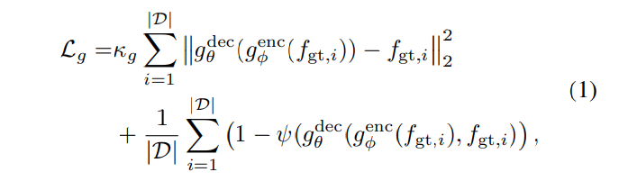
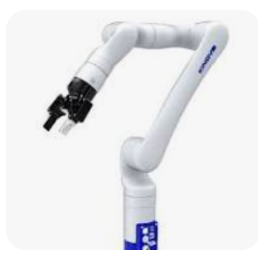

# [CoRL'24] Splat-MOVER: Multi-Stage, Open-Vocabulary Robotic Manipulation via Editable Gaussian Splatting
1. Link: https://splatmover.github.io/
2. Arthurs and institution: Ola Shorinwa, Johnathan Tucker, Aliyah Smith, Aiden Swann, Timothy Chen, Roya Firoozi, Monroe Kennedy III, Mac Schwager from Stanford MSL lab

**TL;DR**
A modular robotics stack for open-vocabulary robotic manipulation, which leverages the editability of 3DGS scene representations to enable multi-stage manipulation tasks.

## Thoughts and critisims
1. How do the authors address the issue of object penetration when applying transformations to Gaussians?
2. Could you provide a brief introduction about the affordance foundation model and Nerfstudio?
3. paper writing
   1. The appendix is more like sub-paragraphs of the main part, meaning the author does not explain well in the main part. How can we avoid such a problem during paper writing?
## Related works
### Open-World Robotic Manipulation
1. Definition: Robots manipulate objects given naturallanguage task instructions at runtime, without being trained on those specific objects or tasks
2. Categories
   1. smart policy: E2E policy with VLM
      1. vla like open-xbodiment...
   2. smart map: 3D VLM-empowered representation + traditional planning
### Language-Embedded NeRFs and Gaussian Splats
1. Concept: Distill information from 2D data sources into
a view-consistent 3D field by back-propagating through a
differentiable image renderer
1. NeRF
   1. slow training and rendering times
   2. inability to reflect dynamic scenes
2. 3DGS
   1. faster training and rendering speeds
   2. modeling dynamic scenes through real-time scene editing
## Contributions
**Key novelty: grasp affordance features into the 3D field, together with CLIP semantic features.**
1. ASK-Splat, a Gaussian Splatting scene model with embedded affordance and semantic features, enabling geometric, semantic, and affordance scene understanding.
2. SEE-Splat, a scene-editing module that uses 3D object masks from ASK-Splat to enable realtime editing of Gaussian Splatting scenes, reflecting the motion of objects in the scene due to the robot’s actions.
3. Grasp-Splat, a grasp-generation module that proposes affordance-aligned grasp candidates for specified objects, leveraging the embedded affordance features in ASK-Splat.
## Key concepts
### ASK-Splat
#### Grounding Language Semantics in 3D GSplats
1. Reason: directly expanding dimention of Gaussian to add semantic information is computational and memory inefficient
2. Method: learn a lower-dimensional latent space associated with the highdimensional semantic feature embeddings, and subsequently,
leverage the lower-dimensional latent features for semantic
knowledge distillation
1. details: 
   1. get image features from MaskCLIP
   2. train an autoencoder to get the encoded feature as distilled feature with loss function  the first term is l2 distance btw clip feature, and the second term is the cosine desimilliarity. This step is trained while initiating 3DGS
   3. resize the encoded feature by bilinear interpolation
####  Grounding Affordance in 3D Gaussian Splatting
1. similar to semantic features, use feature from VRB (2D affordance fundation model) to get a 1D grasping score

### See-SPLAT
#### Scene-Editing-Enabled Gaussian Splatting
1. Semantic Localization via ASK-Splat
   1. generate semantic similarity map to extract task-relevance Gaussians
2. Masking the Gaussians in SEE-Splat
   1. extract task-relavance Gaussians and its neighbours by 7D (3D position+RBG+grasping score) kd-tree query
3. Editing the Gaussians in SEE-Splat
   1. transform gaussian and infilling the missing parts

### Grasp-Splat
1. rank the grasp proposals from GraspNet by the fundation model
2. use LLM to get choose the desired object and target location

## Implementation details
### Hardware
1. Kinova Gen3 robot, equipped with a Robotiq parallel-jaw gripper (902mm)
### Software
1. visionaffordance foundation model VRB, which is trained
on the EPIC-KITCHENS dataset
2. finetune the vision module in nerfstudio
3. a Kitchen scene; Cleaning scene; Meal scene; Random scene; and a Workshop scene
**Hardware**