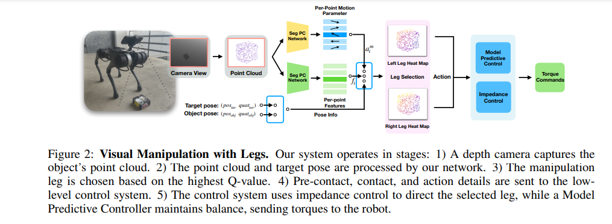
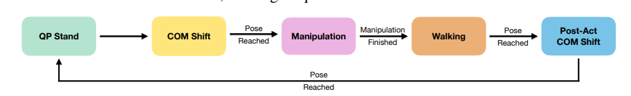
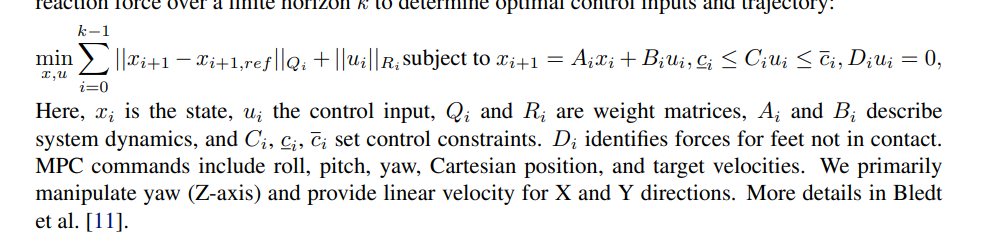
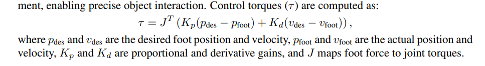
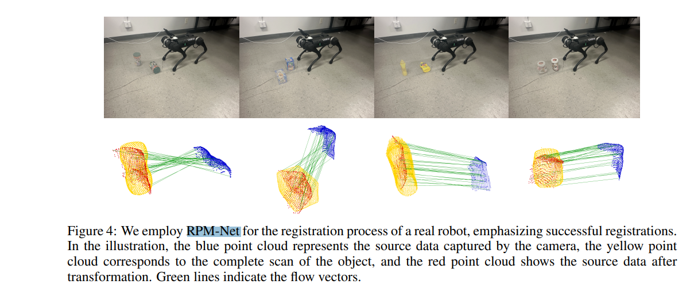
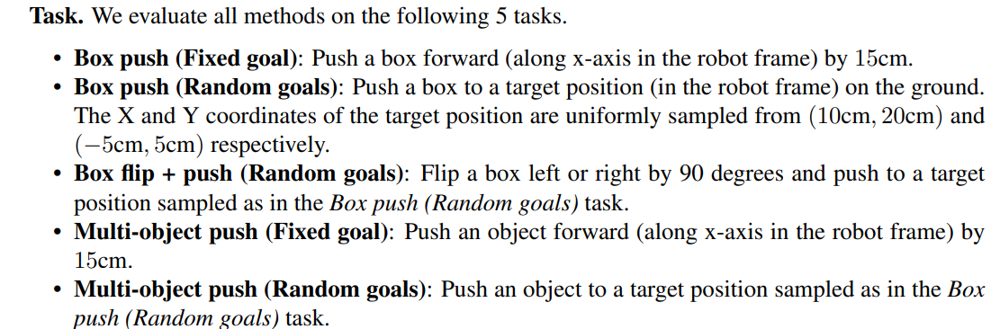
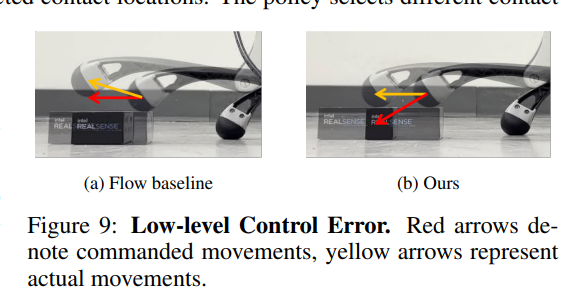

# [CoRL'24] Visual Manipulation with Leg
1. Link: https://arxiv.org/pdf/2410.11345
2. Arthurs and institution: Xialin He†, Chengjing Yuan, Wenxuan Zhou, Ruihan Yang, David Held, Xiaolong Wang from UIUC, UCSD and CMU
   1. Wenxuan Zhou is a researcher in META, she's doing non-prehensile manipulation and planning
   2. Xialin He is a PHD student, he's doing RL locomotion and manipulation

**TL;DR**
A system that enables quadruped robots to interact with objects using their legs, it has a visual manipulation policy decides how the leg should interact with the object, and a loco-manipulator controller manages leg movements and body pose adjustments, based on impedance control and Model Predictive Control (MPC).

## Thoughts and critisims
1. the system architecture is useful
2. their task is object pose alignment, which is an easier level of joint configuration alignment/articulated object pose alignment.
3. instead of apply impedance control for all joints, the user only use it for leg doing manipulation task
4. the perception module needs target pose as input, which has cost to get
## Related works
### Quadrupedal Locomotion
1. inputs
   1.  proprioceptive senses
   2.  exteroceptive perception
       1.  2.5D height map
       2.  depth sensing
2.  methods
    1.  RL (reduce computation cose, generalizability)
    2.  model based control (ensure stability, require computation power)
### 6D Manipulation with Manipulators
focused on dexterous hands and grippers on fixed bases
### Non-Prehensile Manipulation
1. defination: a task involves interacting with objects without grasping, has been a focus for tasks like pushing, sliding, and flipping
2. methods: model based, model free RL
### Manipulation with Legged Robot
1. manipulate part
   1. arm
   2. base
   3. gripper on leg(prehensile)
   4. leg (non-prehensile, door pushing, basket lifting)

## Contributions

## Key concepts

### Task defination
**Object Pose Alignment**
Align an object’s 6D pose with a given target pose, represented as a transformation relative to the current object pose. Using an observed object point cloud and the target transformation, the quadruped robot interacts with the object using its front legs to achieve alignment
### Algorithm
#### Learning Visual Manipulation Policy
1. framework: RL Actor-critic policy
2. inputs: point clouds
3. outputs: choice of leg, contact point and a vector of motion parameters that define the post-contact movement
4. details
   1. TD3
   2. actor outputs per-point motion param, critic outputs per-point Q-values
   3. use PointNet++ as backbone
#### Model-Based Loco-Manipulation Controller
1. 
2. function
   1.  interact with the target object using the learned visual policy
   2.  move the robot for long-horizon object manipulation
3. FSM design
   1. QP stand: Quadratic Programming-based Standing Control
      1. stand with 4 legs
   2. COM shift (center of mass)
   3. manipulation: impedance control for one leg, MPC for stance leg
   4. walking: MPC
   5. Post-act COM shift: get back leg
4. details
   1. MPC
   2. Impedance Control

#### Point-cloud Registration Module
1. inputs: source and target point clouds with per-point normals
2. outputs: the transformation from source to target.
3. model: RPM-Net
4. 
5. metrics: flow distance, Chamfer distances

## Experiments
1. Task

2. Evaluations: sim and real
   
## Claimed limitation
1. QP computation cost
2. uncertainty in observation
   1. IMU
   2. camera
   3. no friction estimation