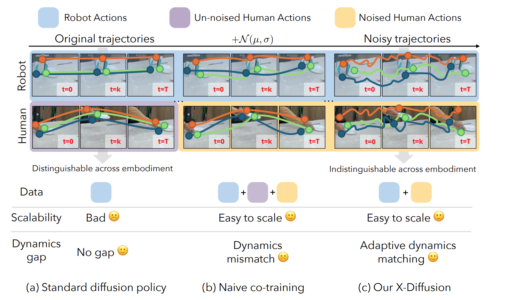
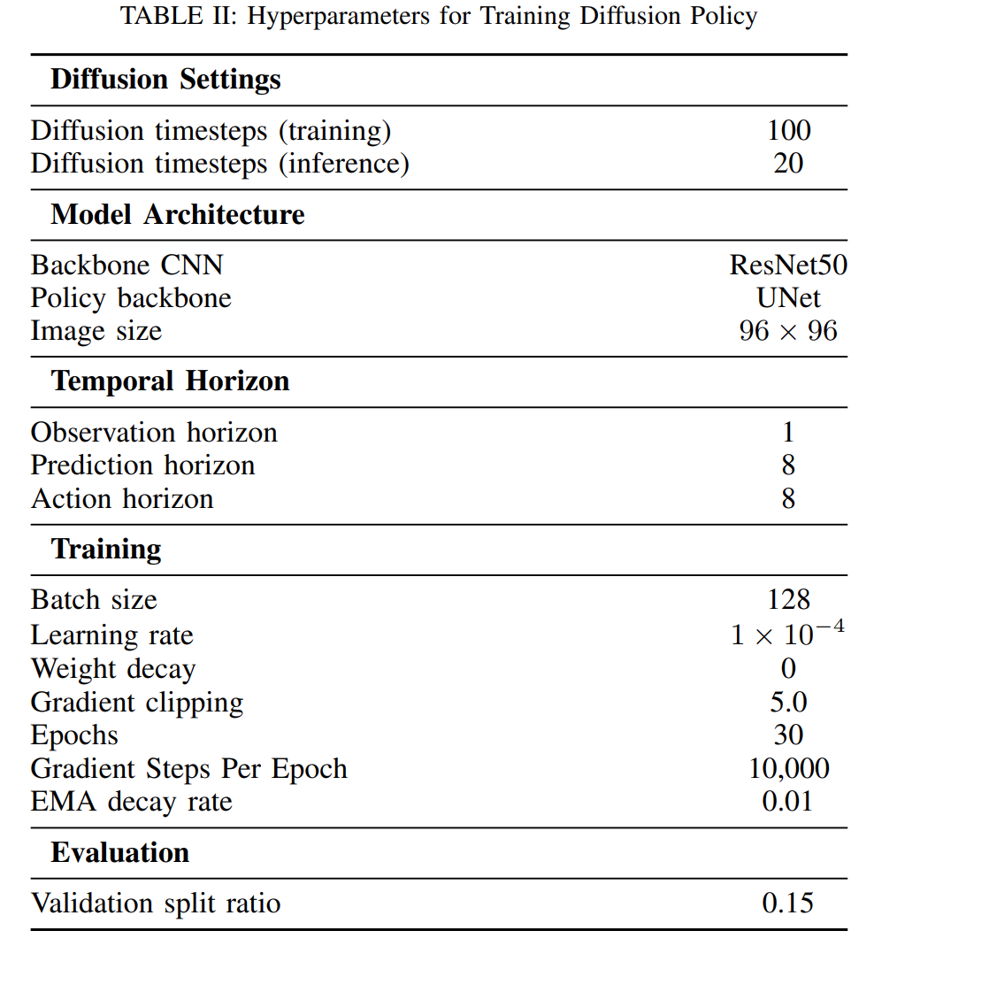
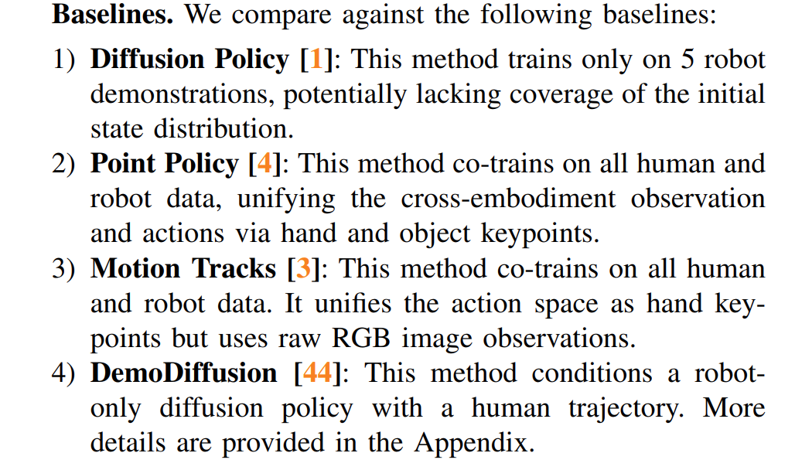
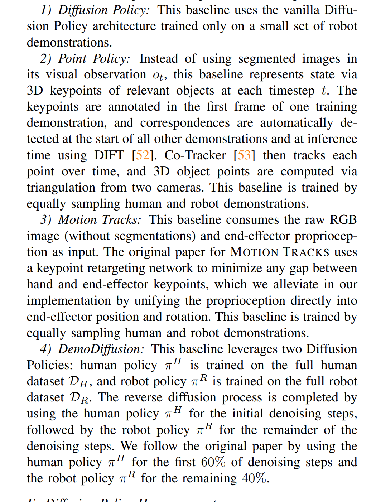
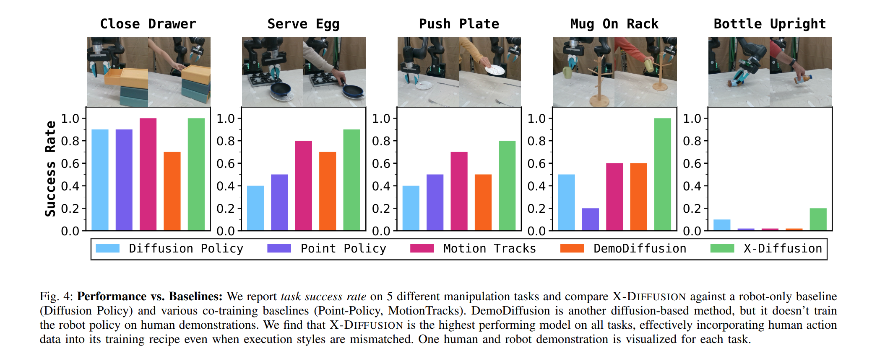
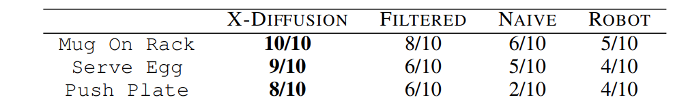
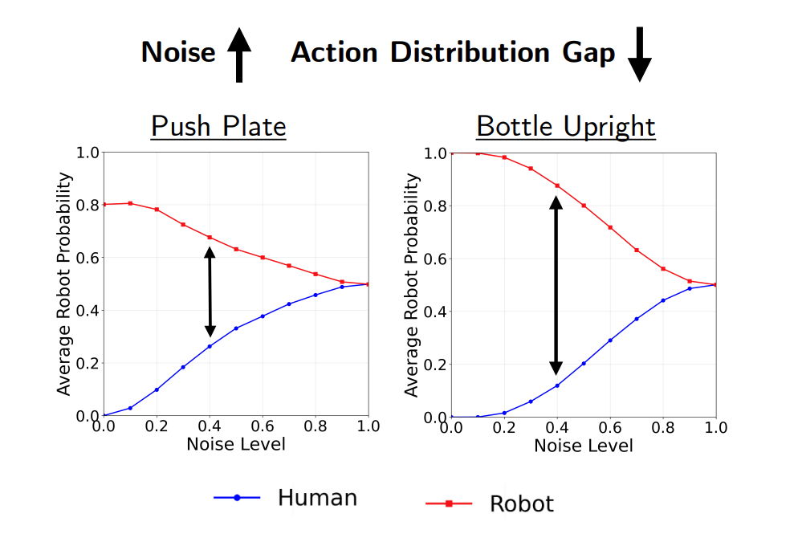

# [Cornell'25] X-Diffusion
1. Link: https://portal-cornell.github.io/X-Diffusion/
2. Arthurs and institution: Maximus A. Pace,Prithwish Dan, Chuanruo Ning, Atiksh Bhardwaj, Audrey Du, Edward W. Duan, Wei-Chiu Ma,Kushal Kedia all from Cornnel.

**NOTE:**
1. Wei-Chiu Ma was a Ph.D student of Prof. Antonio Torralba in MIT. His research lies at the intersection of 3D/4D computer vision and robotics. He is interested in building AI systems that can understand, reconstruct, and re-simulate our dynamic world, and leverage these capabilities to enable more robust autonomous systems or advance entertainment applications.

**TL;DR**
X-Diffusion selectively incorporates noised human actions into Diffusion Policy training

**Todos**
1. The baseline DP model works well with only 5 demostrations, which is suprising.
2. read 
## Thoughts and critisims

1. How can we use human data to generate valid robot domain?
## Related works
### 1. Learning from Human Hand Motion
methods:
    1. track 6DoF hand trajectories and map them to the robot end-effector
    2. define corresponding keypoints between human and robot hands to unify their state and action spaces
    3. object-aware retargeting of human motion （synthesize robot data by overlaying rendered robot arms on human videos ）
drawbacks:
    1.  many human actions involve kinematics or dynamics outside a robot’s capabilities, limiting the reliability of direct retargeting
### 2. Extracting Rewards from Human Data
leverage human data by defining rewards from human motion
1.  tracking reference motion
2. video similiarity
3. language alignment
4. object-centric signals in real-to-sim-to-real pipelines
5. object interactions or classifier judgments of task success
drawbacks:
a realistic simulator or costly and unsafe real-world environment interactions for RL
### 3. One-Shot Imitation from Human Videos
1. learn correspondences from paired human–robot videos (costly to scale)
2. unify visual embeddings of humans and robots (require a lot of robot demostrations)
3. human video acts a guide to retrieve the task-relevant (in-context learning, DemoDiffusion)
### 4. Learning from Sub-Optimal Data
As robot datasets scale, filtering low-quality demonstrations becomes critical
1.  down-weights or removes poor trajectories using online rollouts (costly)
2. by proxy metric loss
3. training classifiers to detect data quality under noise and selectively updating diffusion models
## Problem formulation

The goal is to learn a robot policy, denoted as $\pi_{\theta}(A_t | s_t)$, that predicts a sequence of future actions $A_t = a_{t:t+S}$ over the next $S$ timesteps, given the current robot state $s_t$.

Training relies on two sources of supervision:
*   A small, high-quality dataset of robot demonstrations, $D_R$.
*   A larger dataset of human demonstrations, $D_H$.

Following prior work, the state and action spaces of humans and robots are unified. States ($s_t$) include proprioceptive inputs and third-person camera views, while actions ($a_t$) are represented by the motion of the human hand or the robot end-effector.

A straightforward approach for policy learning in this context is **co-training**, where the robot dataset $D_R$ and the human dataset $D_H$ are simply combined. The policy is then trained on this aggregated mixture. The co-training loss function is expressed as:

$\mathcal{L}_{\text{co-train}}(\theta) = \mathbb{E}_{(s_t, A_t) \sim D_R \cup D_H} [l(\pi_{\theta}(s_t), A_t)]$

where `l` denotes the behavior cloning loss function.

## Contributions
*   **Introduces X-DIFFUSION,** a novel framework that effectively trains robot policies using large-scale human video demonstrations by bridging the human-robot embodiment gap.

*   **Proposes a selective training method** that uses a classifier to determine when a noised human action is "robot-like" enough to be used for training, filtering out infeasible motions.

*   **Achieves a 16% higher average success rate** than baseline methods across five manipulation tasks, demonstrating its ability to learn from diverse human data without generating physically impossible robot actions.
## Key concepts
* cross-embodiment equivalence under noise
    1. The forward diffusion process progressively removes embodiment-specific features from actions.
    2. The **minimum indistinguishability step ($k^*$)** is defined as the earliest diffusion step $k$ where the Kullback-Leibler (KL) divergence between the distribution of noised human actions ($p_{H}^{k}$) and the distribution of noised robot actions ($p_{R}^{k}$) is less than or equal to a small threshold $\epsilon$.

        $k^* = \min \{k \mid D_{KL}(p_{H}^{k} \| p_{R}^{k}) \le \epsilon\}$

        Where:
        *   **$k^*$** is the minimum indistinguishability step.
        *   **$p_{H}^{k}$** and **$p_{R}^{k}$** are the probability distributions of human and robot actions, respectively, after $k$ steps of adding noise.
        *   **$D_{KL}(\cdot \| \cdot)$** is the KL divergence, which measures how different the two distributions are.
        *   **$\epsilon$** is a small threshold, indicating that the distributions have become sufficiently similar.
    3. the classifier

        The classifier, $c_{\theta}$, is trained to predict the probability that a noised action sequence came from a robot. It is optimized using a **binary cross-entropy loss**:

        $\mathcal{L}_{\text{class}}(\theta) = \mathbb{E}_{(k, A^{(k)}, s_t) \sim D_R} [-\log c_{\theta}(k, A^{(k)}, s_t)] + \mathbb{E}_{(k, A^{(k)}, s_t) \sim D_H} [-\log(1 - c_{\theta}(k, A^{(k)}, s_t))]$

        Where:
        *   $\mathcal{L}_{\text{class}}(\theta)$ is the loss function for the classifier.
        *   $D_R$ and $D_H$ are the robot and human demonstration datasets, respectively.

        $k^*(A_t) = \min \{k : c_{\theta}(k, A_t^{(k)}, s_t) \ge 0.5\}$

        Where:
        *   $k^*(A_t)$ is the minimum indistinguishability step for the human action $A_t$.
        Then learn a DP with loss function
        
            $\mathcal{L}_{X-DP}(\theta) = \mathbb{E}_{(k, A_t, s_t) \sim D_R} [l(p_{\theta}, A_t^{(k)})] + \mathbb{E}_{(k, A_t, s_t) \sim D_H} [\mathbb{1}\{k \ge k^*(A_t)\} \cdot l(p_{\theta}, A_t^{(k)})]$
    3. Unifying State and Action Space
        1. Assumptions: (i) single-hand demonstrations that begin with an open grasp, and (ii) two calibrated RGB cameras
        2. method:
            1. use HaMeR to detect 2D hand keypoints and triangulate them to 3D in robot frame
            2. grasp point is the mean of thumb and index fingertips, gripper status is the distance between the points
            3. fit a local handframe to eef  to get orientation
            4. use groundSAM to segment task-relevant objects, add keypoint of eef on each frame
## Implementation details
### Hardware
1. a 7-DOF Franka Emika Panda arm
### Training

## Experiments
1. baselines

2. data: 5 robot demonstrations and 100 human demonstrations
3. results

