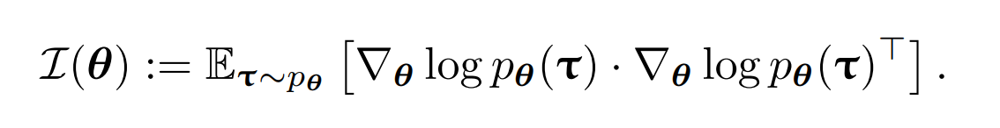
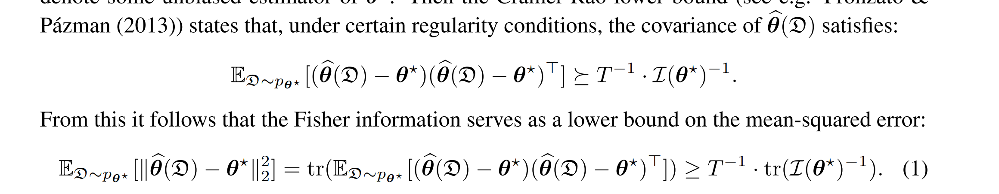
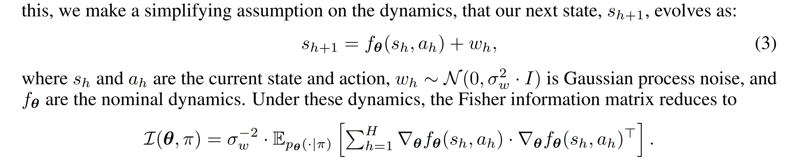
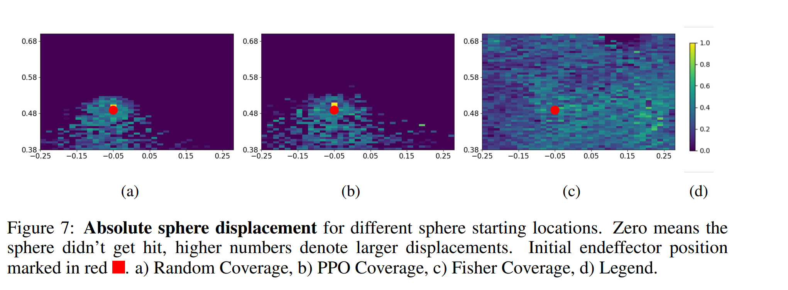
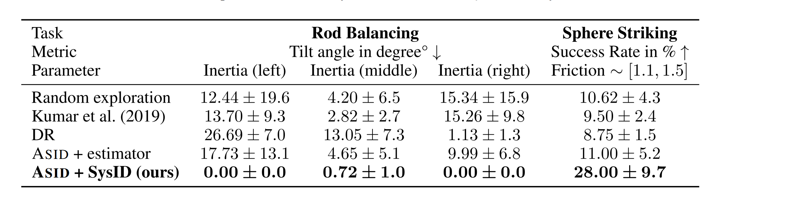

# [ICLR'24] ASID: ACTIVE EXPLORATION FOR SYSTEM IDENTIFICATION IN ROBOTIC MANIPULATION
1. Link: https://weirdlabuw.github.io/asid/
2. Arthurs and institution: Marius Memmel, Andrew Wagenmaker, Chuning Zhu, Patrick Yin,
Dieter Fox, Abhishek Gupta from University of Washington

**NOTE:**
1. Dieter Fox, Abhishek Gupta are 2 big names in robotics
2. Marius Memmel is one of the authors in URDFormer and HAMSTER
3. Patrick Yin is doing system identification.
**TL;DR**
A learning system that can leverage a small amount of real-world data to autonomously refine a simulation model and then plan an accurate control strategy that can be deployed in the real world.
**Todos**
1. read the related works and their further works.
## Thoughts and critisims
1. can we use a unified representation of \theta, which
   1. contains as much parameter of simulator
   2. contains as much information in the scene, not just an object
2. use gradient from simulator instead of the non-linear approximation
## Related works
### System Identification
1. theoretical (dynamic system, control theory):
   1. how to learn a model of the system dynamics efficiently
   2. how inputs to a system should be chosen to most effectively learn the system’s parameters
   3. how to deal with partial observability
   4. choose their inputs to maximize some function of the Fisher information matrix
2. real-world application
   1. active identification of physics parameter
   2. kinematic structure
   3. learn the parameters of the simulator to ultimately train a downstream policy on the learned parameters, and therefore apply task-specific policies for data collection
   4. exploration policies that minimize its regret
### Sim2Real
1. Domain randomization
   1. change the distribution dynamically
   2. add real-world data
2. train a policy in sim and then fine-tune in the real environmen
### Model-based RL
1. Definition: solve the RL problem by learning a model of the dynamics, and using this model to either plan or solve a policy optimization problem
2. most of the works focus on fully learned dynamic models
## Problem formulation
1. Under MDP setting
2. the dynamics of the real environment belong to some known parametric family $\mathcal{P}  = \{\mathcal{P}_\theta:\theta \in \Theta\}$, $\theta$ is unkown (mass, friction)， might know the dynamics
3. The goal: 
   1. 1earn as much useful information as possible about the real environment from a single episode of interaction
   2. use this information to obtain a policy that can solve the task in real as effectively as possible.
### Fisher information

1. The Fisher information thus serves as a fundamental lower bound
on parameter estimation error

## Contributions
1. provide a real-world manipulation problem implementation of using fisher-information as learning signal for exploration policy with a non-linear approximation
2. provide details experiment on questions of interest, shows the algorithm outperforms selected baselines.
## Key concepts
###  EXPLORATION VIA FISHER INFORMATION MAXIMIZATION
1. Goal: play an exploration policy which generates a trajectory on the real environment that provides as much information as possible
2. 
3. assumption to non-linear approximation
4. 
### SYSTEM IDENTIFICATION
1. minimizing 
### SOLVING THE DOWNSTREAM TASK
run any rl mased learning policy in a simulator with identified environment.
## Implementation details
### Hardware
1. Franka Emika Panda robot for exploration and task performance in the real world
2. 2 D435
### Software
### Training
## Experiments
### Exams
1. sphere manipulation
2. articulation
3. rod balancing
### Questions of interest
1. DOES ASID LEARN EFFECTIVE EXPLORATION BEHAVIOR

1. HOW DOES ASID PERFORM QUANTITATIVELY IN SIMULATION ON DOWNSTREAM TASKS?
2. DOES ASID ALLOW FOR REAL-WORLD CONTROLLER SYNTHESIS USING MINIMAL REAL-WORLD DATA?
   