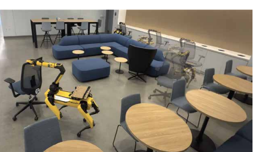
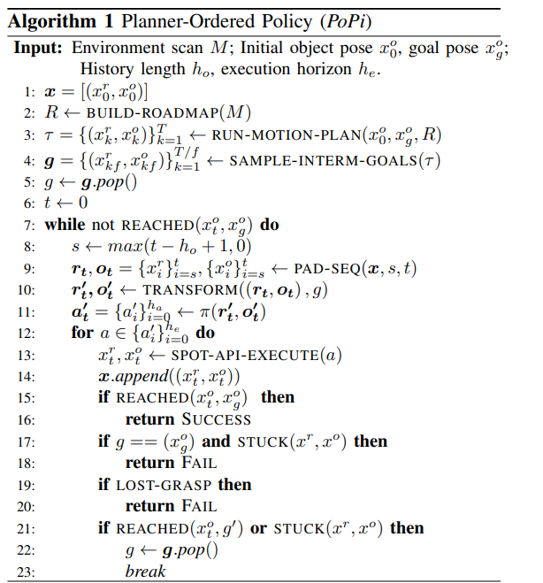
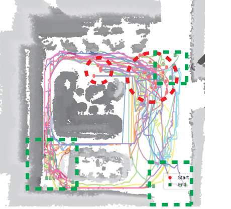

# [Stanford'24] ACDC: Automated Creation of Digital Cousins for Robust Policy Learning Models and Multi-level Goal Decomposition
1. Link: https://yravan.github.io/plannerorderedpolicy/
2. Arthurs and institution: Yajvan Ravan, Zhutian Yang, Tao Chen, Tomás Lozano-Pérez, Leslie Kaelbling from LIS Group. Z.T Yang is a PHD student who develops algorithms for solving multi-step manipulation problems in geometrically complex environments. Tao Chen revicied phd in MIT from Pulkit Agrawal.
   
**Plus**
   1. In slang, "popi" is a term derived from the Spanish word "popular." It’s often used in the Caribbean, especially in the Dominican Republic, Puerto Rico, and nearby regions, to describe someone who is popular, fashionable, or trendy. A "popi" is typically seen as someone who is part of the in-crowd, dresses well, and is associated with a more affluent or urban lifestyle.
   
**TL;DR**

POPI is an approach for long- horizon robot manipulation problems in which the dynamics are partially unknown, for example, pushing and pulling a 5-wheeled office chair.

**TODOs**
1. read a pushing survey: J. Stuber, C. Zito, and R. Stolkin, “Let’s push things forward: A survey on robot pushing,” Frontiers in Robotics and AI, vol. 7, 2020.
## Thoughts and critisims
1. Hirerachical design of system is good.
2. Diffusion-based behavior cloning is very good at reproducing behavior from human demonstrations， it tends to fail when the horizon is long or if out-of-distribution scenarios are encountered, and addressing both requires drastically scaling data. 2. On the other hand, motion planning is good at long-horizon tasks, but struggles with planning over contact-rich tasks due to complex dynamics
3. The demo is quite astronosing and the problem what to solv is quite clear, experiment setting is strictly controlled, followed by its purpose with a minimum workload effort
4. The arthur view the non-prehensile manipulation task as long term manipulation with partial observed object dynamics, which is quite new to me.
5. What may the failing cases be? Assumptions may fail in a contrained environment which robot has to change its grasp pose, robot pose, use a mixture of grasp and push, push together to get to the sub-goal
6. still, the paper is inspiring.
## Related works
1. **Scientific Problem:** Manipulation of large objects over long horizons
2. **Solutions**
   1. **Using a simple a priori model of the dynamics and applying feedback control**
   2. **Motion planning from an approximate or learned model**
   3.  **Learning a policy via reinforcement learning**
   4.  **learning a policy via imitation learning**
3. Area
   1. Feedback
      1. simple model of pushing and very fast kinematic control
   2. Motion planning
      1.  multi-level RRT-based push planner (e.g. a high-level planner to generate sub-goals for a lower-level planner)
   3. Reinforcement learning
      1. **Most of these works assume simple/known object dynamics**
      2. **hierarchical policies** for mobile manipulation
      3. tracking end-effector pose/whole body velocity
         1. RL
         2. use nonlinear model-predictive control to achieve stable pushing
      4. behavior cloning
         1.  human demonstrations on cheap hardware
         2.  expert demonstrations from simulation.
       5. high-level policies that output trajectorie
         1. use task planning to chain together primitives for longhorizon tasks
         2.  using expert coordination and skill correction policies
    4. Imitation Learning
       1. scene
          1. table top
       2. methods
          1. DDIM
          2. score-based online replanning
          3. goal-conditioned

## Contributions
1. A method requiring zero human input to generate digital cousin scenes from a single image
2. An automated recipe to train simulation policies in DCs generated by ACDC
3. Show that robot manipulation policies trained within DCs can match the performance of those trained on digital twins, and outperforms when tested on unseen objects.

## Problem Formulation
1. statement
   1. focus on moving an attached object with difficult to-characterize dynamics to a specified location that is far(multiple meters) from its initial location.
   2. concentrate on the robot-chair dynamics and chair-floor dynamics in the pulling action alone
   3. assuming that the robot starts with a secure grasp of the object.
2. Inputs
   1. A known map of a room-size environment
   2. The robot pose within the map at all times. 
      1. Achieved through online localization. 
      2. Assume that the robot pose is known accurately (within 5 cm)
   3. The object’s pose at all times.
      1. Estimated from point clouds, or by tracking an April Tag affixed to the object
3. Demonstrations: 
   1. We assume a set of long-horizon, human demonstrations of moving the attached object and trajectories
## Key concepts
### Algorithm
#### Planner-Ordered Policy

   1. assume holonomic dynamics for the robot and object and     that the object’s pose relative to the robot remains fixed
   2. get a trajectory from a*
   3. down sample to get subgoals
####  Short-Horizon Diffusion Policy
 1. inputs object poses and robot poses, outputs robot poses
 2. same setups as diffusion policy from shuran song
 3. we transform these seqences relative to the goal object pose, thus, our policy sees short-horizon coordinates only and learns to perform relative movements
 4. apply head and tail padding to the data sequence to ensure
that the input and output sequence stays the same length
## Experiments
1. hardware
   1. Spot robot
   2. a 6-dof arm with a simple claw gripper
   3. six RGBD cameras (five when manipulating)
   4. command SE(2) pose of the robot
   5. front cameras reads an April tag on the chair to observe the chair’s SE(2) pose
2. training dataset
   1. 35 demonstrations (~1 hour) in the environment
    
   3. The global diffusion policy is trained on whole trajectories and thus has 35 examples. 
   4. The diffusion submodule of PoPi is trained on relative snippets, which allows substantial data reuse giving 36,000 examples