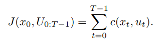
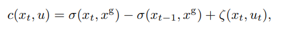
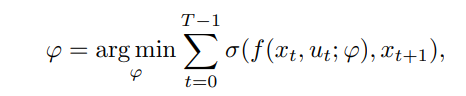
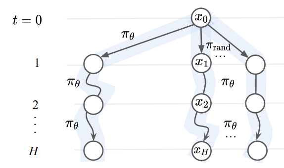
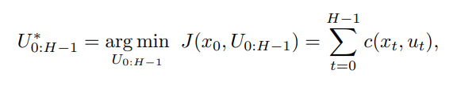
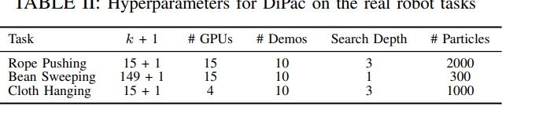
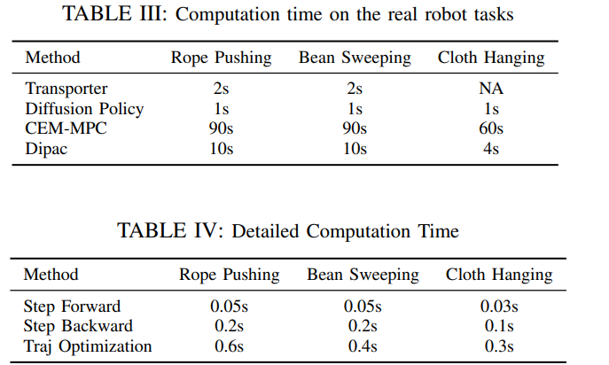
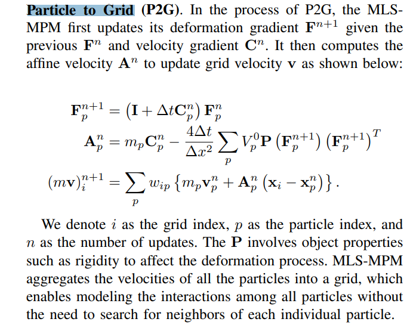
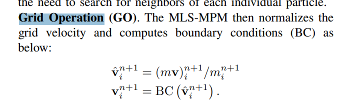
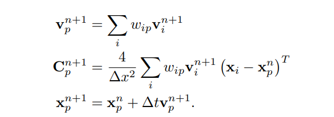

# [NUS'24] Differentiable Particles for General-Purpose Deformable Object Manipulation
1. Link: https://arxiv.org/pdf/2405.01044
2. Arthurs and institution: Siwei Chen, Yiqing Xu, Cunjun Yu, Linfeng Li and David Hsu from NUS
**TL;DR**
DiPac represents a deformable object as a set of particles and uses a differentiable particle dynamics simulator to reason about robot manipulation. It combines learning, planning, and trajectory optimization through differentiable trajectory tree optimization to find the best manipulation action.
# comments and critisims
1. can other params, such as the number of particles, mass be optimized
2. how does a MLS-MPM system measure rigidity
3. why use two simulators
4. the policy seems could be replaced by a diffusion policy
# Related Works
1. Model-based DOM (deformable object manipulation)
   1. manually design the model
   2. learn from data
   3. online adaptation in real-world
2. Data-driven DOM
   1. LfD
   2. struggle to generalization in unseen scenarios
3. Differentiable Dynamics
   1. serve as a dynamic model
   2. control problem
   3. sim-real gap in dynamics
      1. learn model param from real-world data
## Deformable Object Manipulation With Differentiable Particles
### Definitions
1. differentiable simulator serves as $x_{t+1} = f(x_t, \mu_t; \varphi)$, where x is state of object, u is robot action and $\varphi$ is dynamic parameters
2. objective function of the problem

where $\sigma$ is chamfer distance and $\zeta$ is a contact cost of l2 distance btw gripper and object. 
### Inputs and Outputs
1. inputs RGBD images
2. outputs manipulation actions
### Particle State Construction
1. assumptions
   1. no occlusion
   2. good segmention is obtainable
2. steps
   1. get maske point clouds from each view
   2. merging them together
   3. unobserved interior is then filled with uniformly sampled particles
### Dynamics Model Calibration
1. parameter involved
   1. stiffness
   2. friction coefficient
2. purpose
   1. for better action selection
3. steps
   1. collection expert demostration data from real-world
   2. update the params though gradient descent from simulator 
### Integrating Learning, Planning, and Optimization

1. Objective function

1. Steps
   1. use an initial policy to roll out actions
   2. random sample particle with angle and position as explorations, with an action from initial policy
   3. use gradient descent to optimize the actions over each trajectory
   4. select and excute the action with minimal cost
2. benefits
   1. good inital policy help to find a solution more efficiently
      1. initialize us with a near-optimal trajectory
      2. enable us to optimize the gradients on a good optimization landscape
   2. balances sample complexity, computation speed, and final performance

## Details
1. hardware
   1. kinova gen3 robot
2. simulation
   1. PlasticineLab for rope pushing and bean sweeping, Plastic
   2. DaX for Cloth Hanging, Water Pouring and Soup
3. param
4. computation time
   1. take about 20 - 40 seconds for model param learning
   2. real world task
   
5. MLS-MPM
   1. Particle to Grid
   2. Grid Operation
   3. Grid to Particle