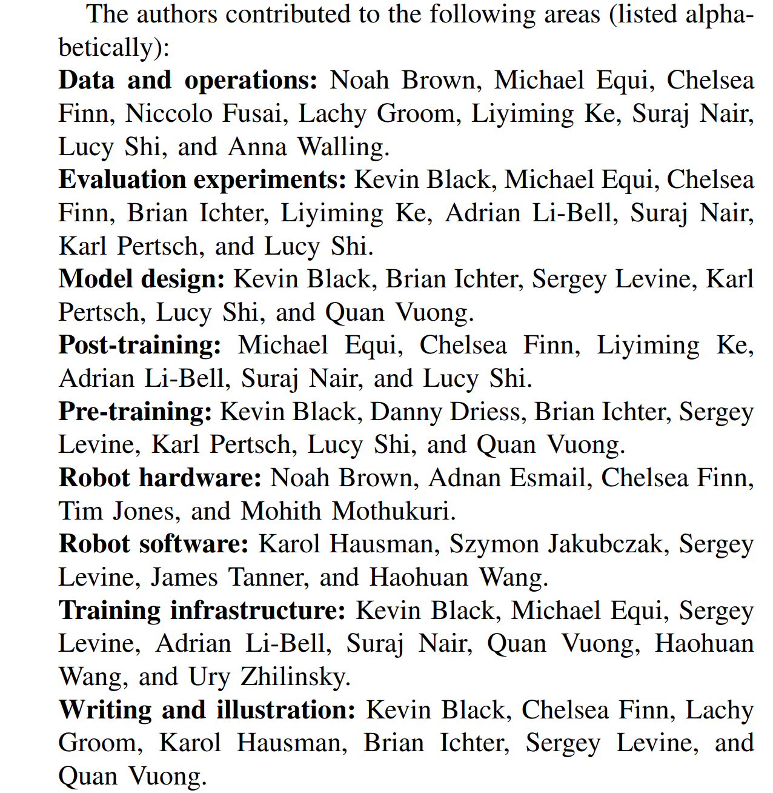
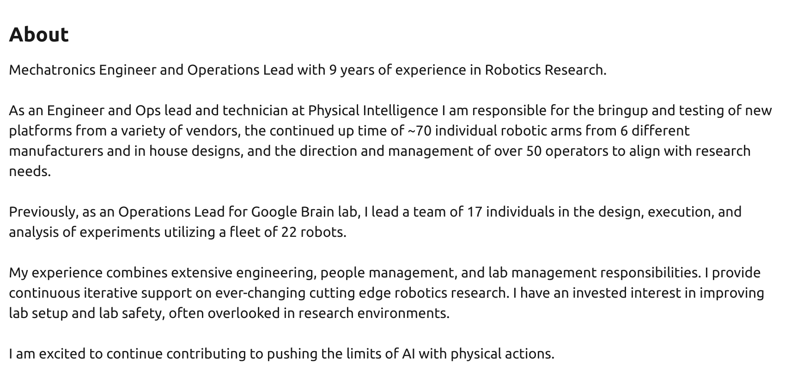
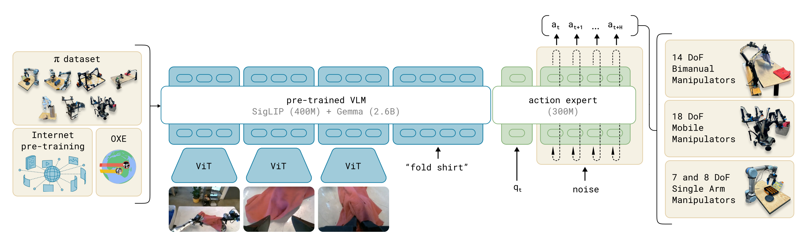
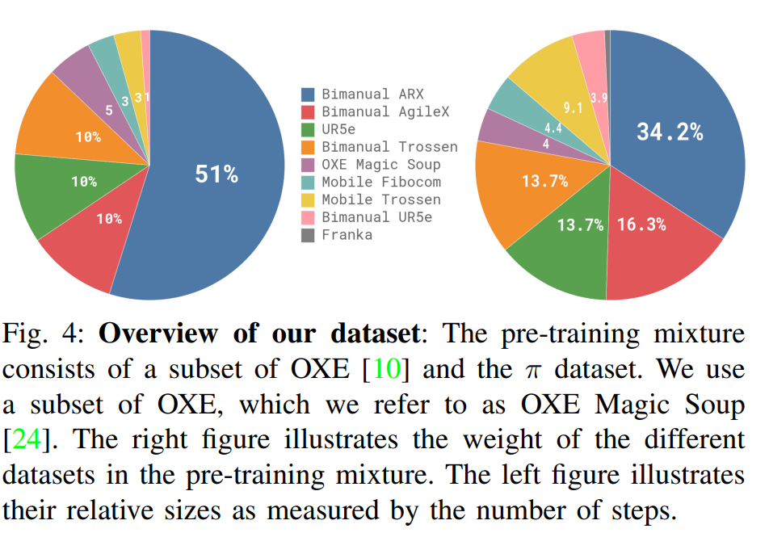
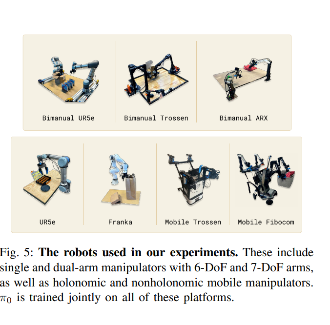
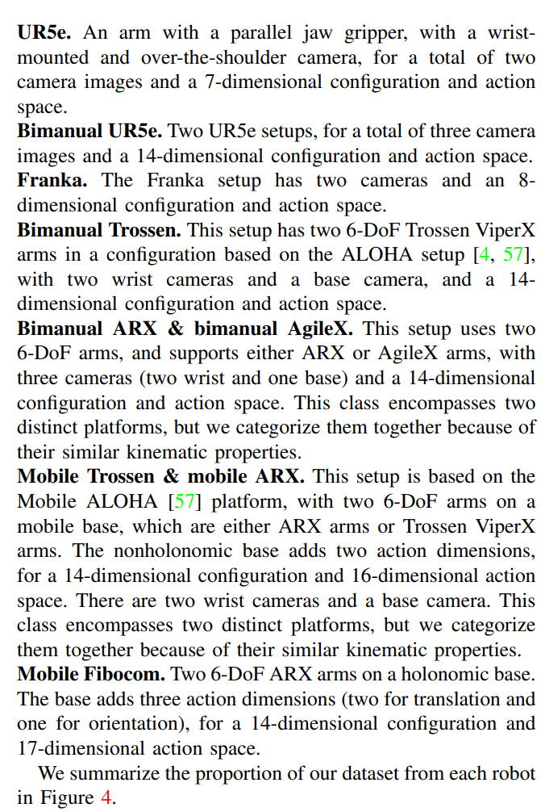
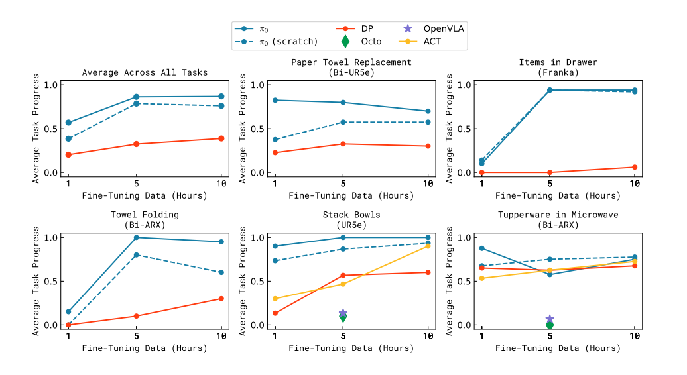

# [PI'24] $\pi_0$: A Vision-Language-Action Flow Model for General Robot Control
1. Link: https://www.physicalintelligence.company/blog/pi0
2. Arthurs and institution: Physical Intelligence
   { width=50% }
   1. Kevin Black, Karl Pertsch, Suraj Nair, Lucy Xiaoyang Shi: Sergey and Chelsea's student
   2. Noah Brown: testing engineer--> robot data collection--> google brain operation{ width=70% }
   3. Danny Driess: Marco Toussaint's stutdent
   4. Adnan Esmail: SVP hardware Engineering from tesla
   5. Lachy Groom: CEO of PI, Stripe --> angel investor
   6. Karol Hausman: CEO of PI, Standford+deepmind
   7. Brian Ichter: co-founder, deepmind
   8. Liyiming Ke: phd from UofW
   9. Adrian Li-Bell: phd from Cambridge
   10. Mohith Mothukuri: 3D product designer
   11. Quan Vuong: phd from UCSD(Su Hao)
   12. Anna Walling: operation guy
   13. Ury Zhilinsky: manager?
   14. rest of them are unkown.

**TL;DR**
A generalist robot policy uses a pre-trained vision-language model (VLM) backbone, as well as a diverse crossembodiment dataset with a variety of dexterous manipulation tasks. The model is adapted to robot control by adding a separate action expert that produces continuous actions via flow matching, enabling complex multi-stage tasks with precise and fluent manipulation skills.

**TODOs**
1. read other VLA papers
2. read flow-matching, conditional flow-matching paper
   1. Flow matching for generative modeling
   2. Rectified flow: A marginal preserving approach to optimal transport
3. read transfussion
   1. Transfusion: Predict the next token and diffuse images with one
multi-modal model
   1. Diffusion Forcing: Next-token Prediction Meets Full-Sequence Diffusion

## Thoughts and critisims
1. Compared to a clear instruction in model architecture, the arthors did not fully reveal the training process.
2. The model split the inputs into a 'blockwise' attention mechanism. Will the block of states be attended to the image and task instruction?
3. Comparing to the other LLM, does the choice of 3B VLM backbone indicate we need less knowledge for our daily routines than an almighty assistant?

## Related works
### VLA
1. Definition: use pre-trained VLMs that are fine-tuned for robot control, the model employ autoregressive discretization to represent actions in a manner analogous to text tokens.
2. works
   1. RT-2 (previous work)
   2. Transfusion: Predict the next token and diffuse images with one
multi-modal model (hybridize diffusion and autoregressive largelanguage models)
## Contributions
1. a novel generalist robot policy architecture based on VLM pre-training and flow matching
2. An empirical investigation of pre-training/posttraining recipes for such robot foundation models.
3. We evaluate our model out of the box with language commands, with
fine-tuning to downstream tasks.
## Key concepts

### The philosophys of paper
1. If VLA are to make tangible progress toward AI systems that
exhibit the kind of physically situated versatility that people
possess, we will need to train them on physically situated data
1. general-purpose foundation models that are pre-trained on diverse multi-task data tend to outperform narrowly tailored and specialized
solutions
   1. resolve data scarcity
   2. resolve robustness and generalization challenges
1. VLA should
   1. be done on large scale data
   2. get the right model architecture
   3. get a right training recipe
### Model
1. inputs
   1. images (supports multiview) at time t
   2. language instruction at time t
   3. robot states at time t
   4. noisy actions
2. outputs
   1. vector field $v^\tau_t$ (use to get H-step action chunk)
3. MoE architecture
   1. VLM backbone to process image and text
      1. PaliGemma 3B
      2. blockwise causal attention mask
   2. action backbone to generate actions
      1. 0.3B
### Training
#### training
{ width=70% }
1. dataset
   1. OXE Magic Soup and $\pi$ dataset
   2. 1-2 cameras
   3. 2-10hz control
   4. $\pi$ data consists of 106M steps single-arm robot and 797M dual-arm, with 68 tasks with complex behaviors
   5. unbalanced dataset
   6. add paddings to those robot with lower dim.
2. instruction processing
   1. use Saycan to decompose complex task
#### Hardwares
{ width=70% }
{ width=70% }
## Experiments
### questions
1. How well does $\pi_0$ perform after pre-training on a variety
of tasks that are present in the pre-training data
1. How well does the model follow language commands?
2. How does the model compare to methods that have been proposed
specifically for addressing dexterous manipulation tasks
1. Can the model be adapted to complex, multi-stage tasks?