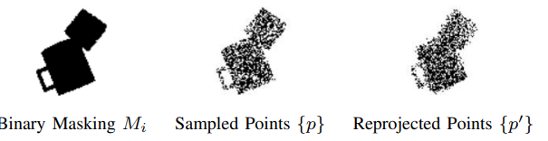

# [RSS'21] Ab Initio Particle-based Object Manipulation
1. Link: https://arxiv.org/pdf/2107.08865
2. Arthurs and institution: Siwei Chen, Xiao Ma, Yunfan Lu and David Hsu from NUS
**TL;DR**
A particle-based object manipulation framework, which enables robots to achieve dynamic manipulation on a variety of tasks, including grasping, pushing, and placing with novel objects
# comments and critisims
1. Will the system bring similar performance once not in a table-top situation?
2. why not using difftachi?
# Related Works
1. Manipulation with 3D Mesh Model
   1. based on assuming the mesh model is known
   2. 3D mesh reconstruction
      1. combination of primitave shapes
   3. evaluate by specific metrics
      1. $L^1$ grasp quality: alibity to resist wrenches
2. Manipulation with Latent Representation
   1. lable
      1. human labling
      2. self labling by trial and error
   2. data source
      1. real world
      2. simulation
   3. drawbacks
      1. data gathering in real-world data
      2. distribution shift
      3. Dynamics reasoning: the trained policy often lacks explicit dynamics reasoning and may result in sub-optimal actions
   4. Structure From Motion (SFM)
      1. track the feature correspondences cross multi-view images and reconstruct a scene point cloud
      2. sparse and incomplete or time-comsuming
   5.  Shapes from silhouettes (SFS)
       1.  silhouette images are like object-masked image
       2.  performance does not scaling well
## Particle Based Object Manipulation

### Inputs and Outputs
1. inputs are set of masked images and camara intrinsics
2. outputs are actions
   1. top-down obj grasp
      1. 3D grasp location and angel
   2. pushing
      1. start and end 2D position
### Key Definitions
1. particle
   1. 3D location, 3D velocity and mass
2. particle state
   $$S = (V, R, \mu)$$
   1. vertices are particles
   2. edges include particle pair and relationships(collision, spring connection)

### Multi-view Particle State Estimation

1. assumptions during reconstruction
   1. mass are uniformly distributed
   2. static objects
2. KNN-Chamfer distance
   
   1. avoid particles squeezing up
   2. K=100
3. benefits
   1. did not use offline datasets
   2. works on translucent objects

### Model-based Planning
1. leverages the particle-based physics engine to perform the virtual grasping and evaluate the final performance
   1. 
   2. indicator function: whether grasp is successful
   3. sumation term indicates the robustness of the grasp
2. Given the predicted particle state, the dynamics model, and the reward function, we perform model-based planning that explicitly reasons the dynamics
   1. cross-entropy model-predictive control (MPC)
   2. In each iteration
      1. samples sequences of actions from a Gaussian distribution
      2. compute the accumulative reward
      3. update the mean of the Gaussian distribution with the K action sequences with the highest achieved reward. 
   3. The fist action of the best action sequence is used as the output
### Object State Estimation
1. Closed-loop Object Pose Estimation
   1. fix the shape of objects and update pose parameters
2. CoM estimation
   1. assume COM follows a gaussian distribution
   2. use CE to minimize the gap between prediction and observation

## Details
1. the presented work only focus on rigid body
   1. edge types are fixed
2. hardware
   1. eye-in-hand RGB camera
   2. fetch
3. simulator: Nvidia-Flex based on Pyflex(from yunzhu li)