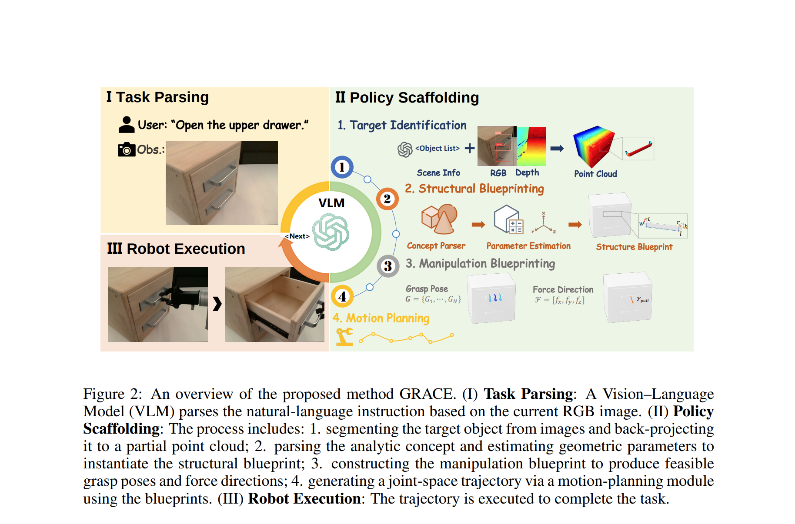
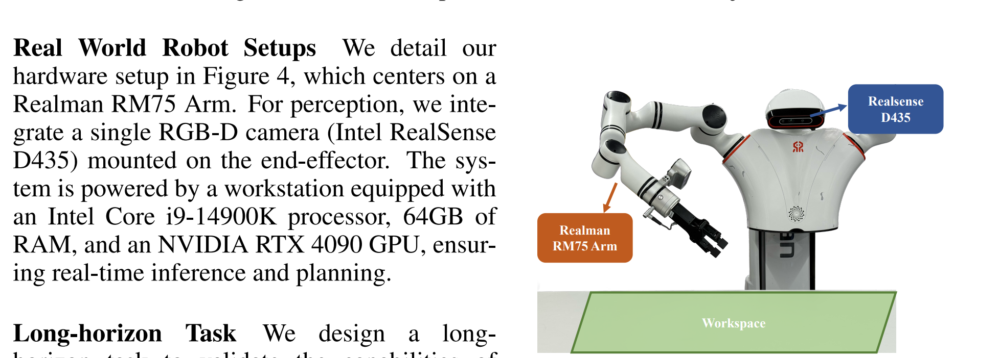
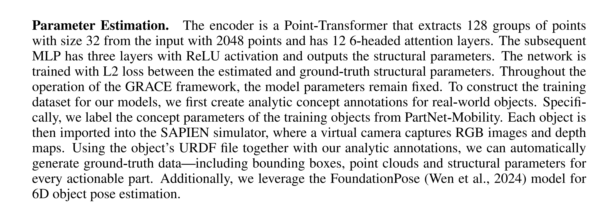

# [SII'25] EXECUTABLE ANALYTIC CONCEPTS AS THE MISSING LINK BETWEEN VLM INSIGHT AND PRECISE MANIPULATION
1. Link: https://arxiv.org/pdf/2510.07975v1
2. Arthurs and institution: Mingyang Sun, Jiude Wei, Qichen He, Donglin Wang, Cewu Lu and Jianhua Sun from SII

**NOTE:**
**TL;DR**
A framework that grounds VLM-based reasoning through executable analytic concepts (EAC)—mathematically defined blueprints that encode object affordances, geometric constraints, and semantics of manipulation.

**Todos**

## Thoughts and critisims
1. the whole pipeline is a obeject part retrieve and param estimation, which sounds better than the other retrieve methods
## Related works

### Structural Representations for Manipulation
1. method 
    1. learned object centric embeddings
    2. particle based modeling
    3. keypoint or descriptors
2. drawbacks
    1. instability
    2. manual annotation
    3. rely on handcraft priors
## Problem formulation
1. This paper addresses the challenge of enabling a robotic system to perform manipulation tasks based on high-level language instructions.
2. Our system is given a visual observation Ot of the environment and a natural language instruction l describing the desired task. To successfully complete the task with a parallel gripper, the robot must not only understand the object and task description but also manage the complex physics of contact-rich interactions.
## Contributions
1. We introduce a plug-and-play framework that elicits the inherent robotic control potential of VLMs by structured, physics-aware object representations. The framework provides a unified interface that bridges high-level instructions and low-level executable
actions for long-horizon manipulation.
2. We develop a policy scaffolding pipeline that incorporates analytic concept to translate object-centric semantic knowledge into physically meaningful blueprint, thereby building executable guidance for robot control policies.
3. We demonstrate our approach’s outstanding performance in a wide range of manipulation tasks, showcasing the remarkable zero-shot generalization capability in both simulated and real-world environments.
## Key concepts
### SPATIAL-AWARE TASK PARSING
1. given the input language instruction and RGB-D observation, the pipeline queries VLM to output a graph, where nodes are task-relevant objects, includes object categories and states, and edges represent spatial relationships.
2. then VLM decomposes the tasks into sub-tasks, each with a short language description and verification condition, all in natual language form
### Policy Scaffolding
#### Structual blueprinting
1. identify and localize the previous objects by GroundingDINO + SAM, then project the 2D mask into detph images to obtain a set of object P.Cs.
2. querying a pre-defined library of analytic concepts, which are parameter-driven models that capture common structural archetypes
    1. prune the concept library according to the part category detected in the previous step
    2  prompt the VLM with the synopses of the remaining candidates, asking: “Find the part to interact within <target object> the in order to complete the task <sub-task>, and determine the <concept> of the part.”
3. turn that symbolic layout into an executable program by instantiating every node with concrete parameters, estimated directly from the point cloud P
    1. get structual parameters by regressing the encoded point cloud vector
    2. get 6D-pose estimation of concept(part)
#### Manipulation blueprinting
1. General idea: Affordances of geometric ontologies are encoded as analytic manipulation knowledge for grasp poses, pushing contacts, and similar actions, while kinematic ontologies additionally provide force directions that produce motion. All of this knowledge is expressed by maathematical formulas with tunable parameters and offers critical guidance for downstream control.
2. details
    1. given a short task description, ask VLM to select a proper manipulation function
    2. use the function to get grasp pose and force vector (manipulation direction)
#### Execution
1. The planner first synthesises a collision-free approach path, then a compliant trajectory to realise the grasp, and finally an interaction phase that applies a wrench aligned with Fworld.
## Implementation details
### Hardware

### Software
### Training
1. keep SAM frozen and finetune Grounding-DINO with object parts annotation
2. param estimation

## Experiments
1. GRACE does better in simplerenv than other VLAs for PNP tasks
2. GRACE is better than other affordance methods for articulated objects in SAPIEN
3. conduct a long horizon task in realworld with realman robot
### System error debug
1. pose estimation and inverse kinematics
2. multi-view images makes better pose estimation
3. error in param estimator is minor
4. VFM parts does a good job.