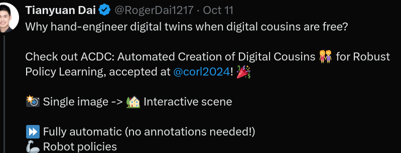
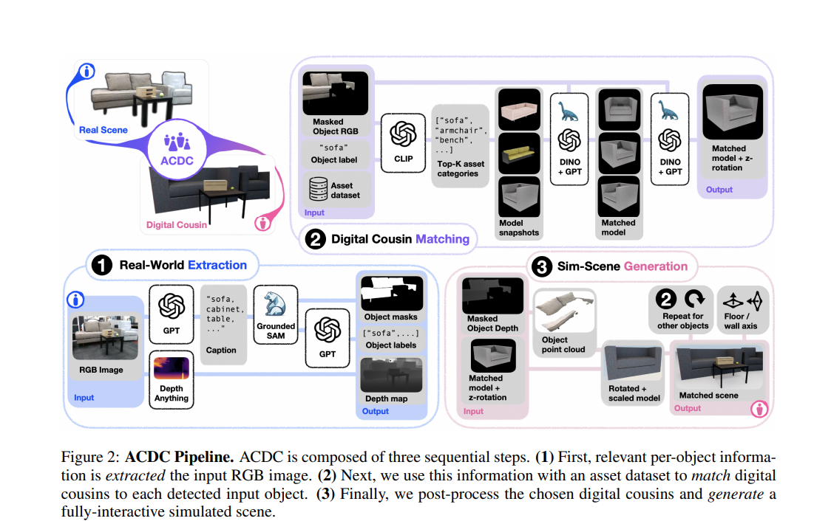
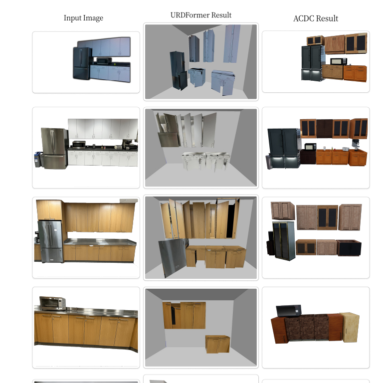

# [Stanford'24] ACDC: Automated Creation of Digital Cousins for Robust Policy Learning Models and Multi-level Goal Decomposition
1. Link: https://digital-cousins.github.io/
2. Arthurs and institution: Tianyuan Dai*, Josiah Wong*, Yunfan Jiang, Chen Wang, Cem Gokmen, Ruohan Zhang, Jiajun Wu, Li Fei-Fei from Stanford HAI lab 
   
**TL;DR**

## Thoughts and critisims
1. 3 tasks are demostracted: door opening, drawer opening and put away bowl 
2. what kind of tasks need precise estimation of physical parameters
3. the arthor claim this is object-agnostic, while such work depend heavily on the quality and variaty of the dataset, does the rate of expansion of dataset would fit the need of robotic manupulation tasks perfectly?
4. the gap of physical parameters between real and sim is not addressed directly, the arthur bypass such issue by claiming "the trained policy fits the reality well"
## Related works
1. **Real-to-Sim Scene Creation for Robotics**
   1. defination: Creating realistic and diverse digital assets and scenes from real-world inputs is a prevalent and long-standing problem
   2. methods:
      1. manual curation
      2. procedural generation
      3. few-shot interactions
      4. inverse graphics 
      5. foundation model-assisted generation
   3. **cannot handle scene-level generation**
2. **Policy Learning with Synthetic Data**
   1. purpose: alleviate the burden of collecting data in the real world with physical robots
   2. methods: 
      1.  action primitives operating on privileged information available in simulation
      2.  leverage task and motion planning (TAMP) to generate robot motions 
      3.  train and distill RL policies
      4.  automate data generation given an initial set of human demonstrations
3.  **Sim-to-Real Policy Transfer**
    1.  defination: Seamlessly deploying robot policies learned in the simulation to the real world
    2.  methods:
        1.  domain randomization
        2.  system identification
        3.  simulator augmentation
        4.  training on diverse simulated scenes

## Contributions
1. A method requiring zero human input to generate digital cousin scenes from a single image
2. An automated recipe to train simulation policies in DCs generated by ACDC
3. Show that robot manipulation policies trained within DCs can match the performance of those trained on digital twins, and outperforms when tested on unseen objects.

## Key concepts
### Algorithm
#### ACDC  Automatic Creation of Digital Cousins

**generate digital cousin scenes from a single image**
1. Real-world extraction
   1. given an original RGB image, use GPT to get captions, use GroundSAM to get masks
   2. use AnyDepth to get detph estimation D, point clouds P are $$P = D K^{-1}$$ where K is the intrinsric matrix
      **NOTE**: The arthor claims this would get a better estimation than use of depth img from camera
   3. project mask onto the point clouds to get a set of objects
2. Digital cousin matching
   1. Assume each object belongs to a meaningful category in BEHAVIOR-1K and have multiple snapshots from different view
   2. get similarity score between object label and categories in dataset by CLIP similarity
   3. select a set of object from the dataset which shares the closest DINOv2 feature embedding distance with the object.
   4. Then for an object from image, we have a set of virtual cousins and their corresponding orientation
3. Simulated scene generation
   1. for each object, ask gpt if the object is mounted on wall/floor/mixed
   2. put the object by its centroid and rescale it.
#### Policy Learning
   1. choose imitation learning from scripted demonstrations, because thus the whole pipeline can be antomated
   
   2. use 4 primitive skills
      1. Open/close
         1. approach
         2. converge: computes an open-loop straight-line trajectory to the actual grasping point
         3. grasp
         4. articulate:  an open-loop analytical trajectory to articulate the link
         5. ungrasp
      2. pick/place
         1. move
         2. grasp/ungrasp
         3. lift
## Experiments
1. evaluation of scene reconstruction
2. Sim-to-sim policy results.
3. Zero-shot real-world evaluation of digital cousin policy vs. digital twin baselines
4. Visual Encoder Ablation Study
5. compare with URDFormer
   1. One is trained on a dataset, one is object-agnostic
   2. One can generate accurate texture and color while another cannot
   3. One may need human annotation while another does not.
    