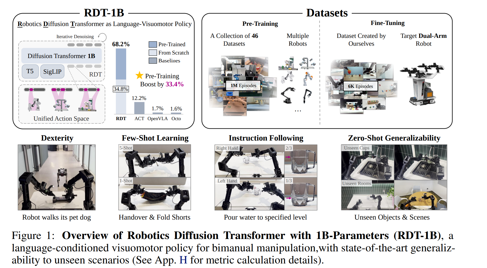
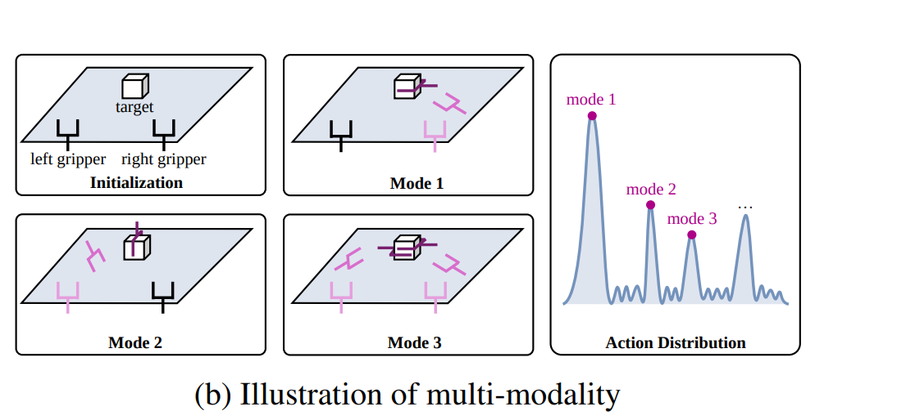
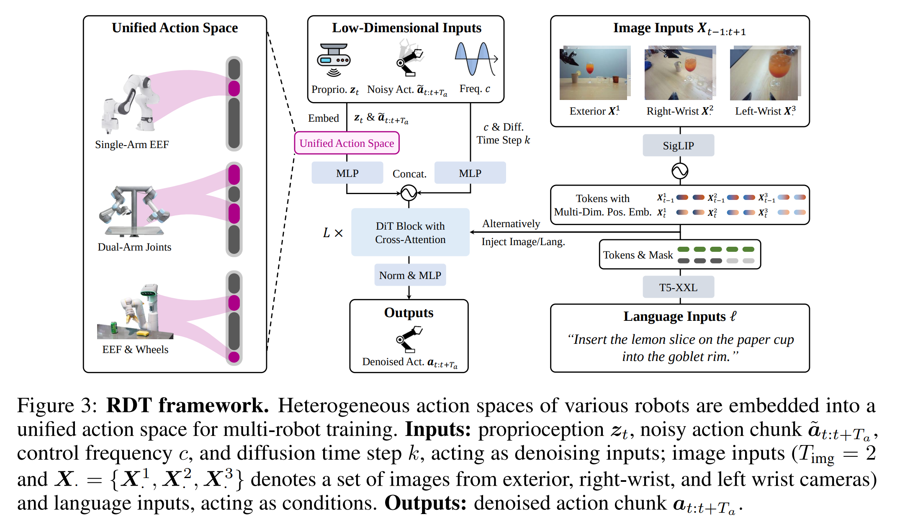
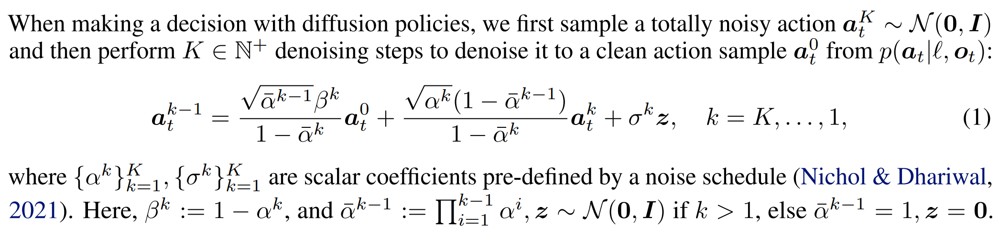
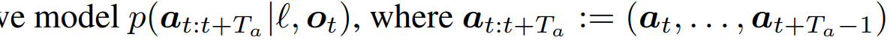
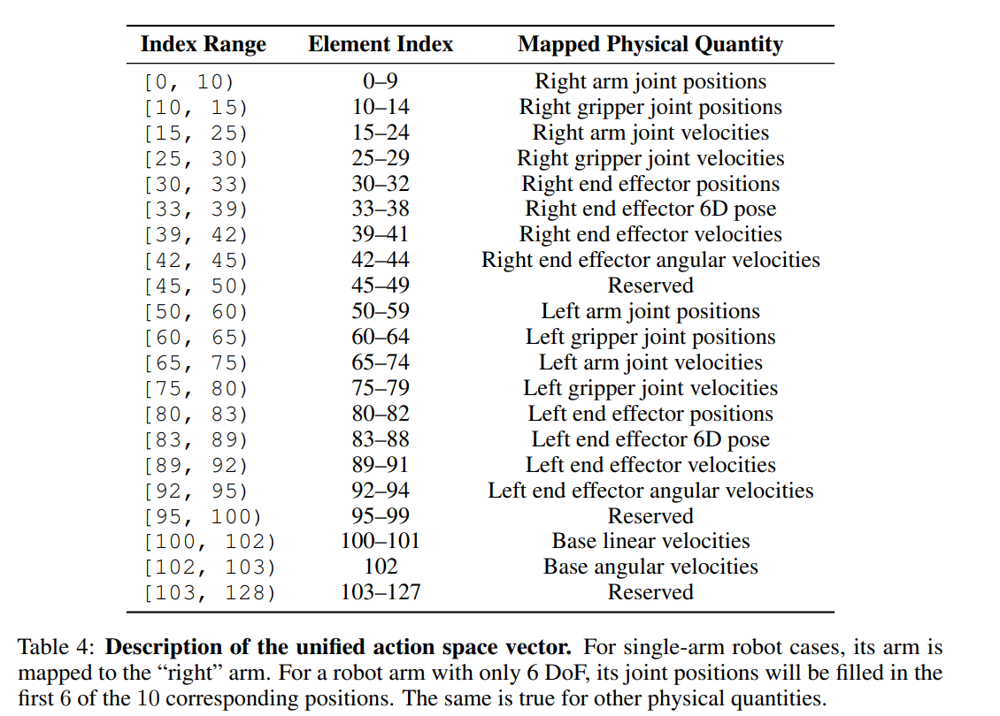
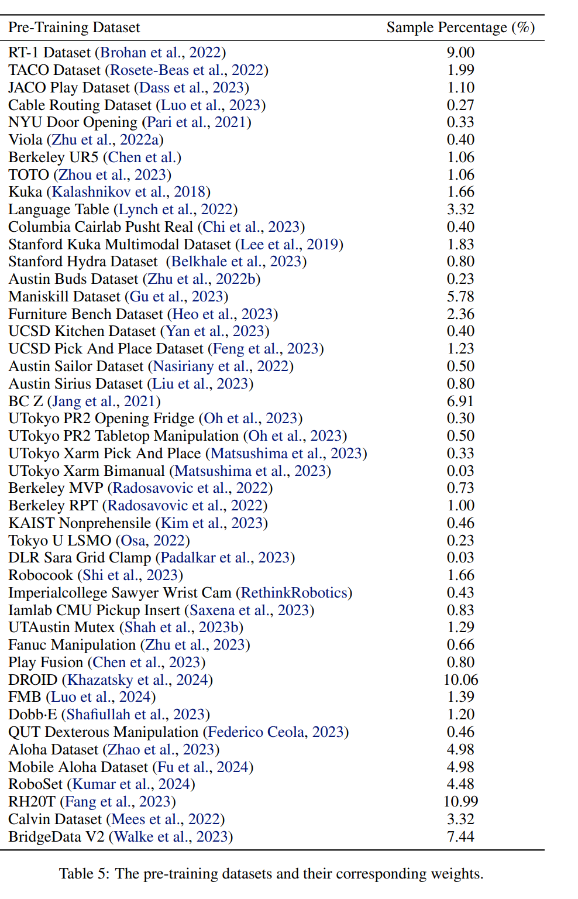
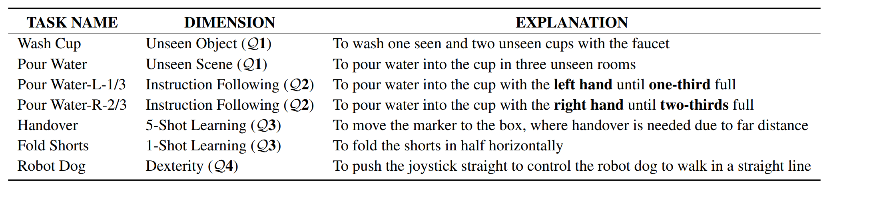

# [THU'24] RDT-1B
1. Link: https://rdt-robotics.github.io/rdt-robotics/
2. Arthurs and institution: Songming Liu, Lingxuan Wu, Bangguo Li, Hengkai Tan, Huayu Chen, Zhengyi Wang, Ke Xu, Hang Su, Jun Zhu from THU
**TL;DR**
We present Robotics Diffusion Transformer with 1.2B parameters (RDT-1B), the largest diffusion-based foundation model for robotic manipulation with bimanual capability.
**Todos**
1. Read DiT (diffusion transformer)
2. Read the pre-train paper， Alec Radford, Karthik Narasimhan, Tim Salimans, Ilya Sutskever, et al. Improving language understanding by generative pre-training. 2018
## Thoughts and critisims
1. The authors provides a very detailed data recipe and training procedure, which helps a lot.
2. through the fine-tuning, some tasks are not usefull at all.
3. the idea of Unified Action Space is interesting, but the arthurs it not clear about its goal, neither knows how to test the effectiveness of the module. Can we elaborate it a bit? I believe a good robot state encoder could be tested if we examine given 2 configurations of robots, the encoder should outputs same features if their eef pose are the same.
## Related works
### VLA
Directly predict actions --> discretization of action spaces--> quantization errors and uncoordinated behaviors --> diffusion models
### heterogeneous data
physical structure and the action space can vary greatly across different robots
1. restrict themselves to a subset of robots with similar action spaces
2. retain a subset of inputs sharing the same structure
## Contributions
## Key concepts
### Multimodality of actions
Given a task description, the robot has multiple choices for doing that.
1. Encoding of Heterogeneous Multi-Modal Inputs
   1. low-dim inputs
      1. proprioception, the action chunk, and the control frequency
      2. use MLPs with Fourier features to capture the high frequency changes in low-dim space
   2. image
      1. image-text-aligned pre-trained vision encoder, SigLIP
   3. language: T5-XXL (Raffel et al., 2020)
### RDT
1. overview
2. sampling
   1. 
3. use 2 mlps in decoder to improve non-linear robot actions
4. use cross-attention to accommodate conditions of images and languages
## Implementation details
### Action chunking
1. cumalative error in action prediction
2. robot action drifting
3. replace $a_t$ by $a_{t:t+T}$
   
4. predict multiple action in one-shot
### Action encoding
1. encode state and action chunks into token space by shared MLP
2. encode frequency and diffusion step into token space by 2 mlp repectively
3. we concatenate the action and proprioception with a
0-1 vector indicating whether each dimension is padded before encoding them into the token space
   1. This can supplement the missing availability information and eliminate confusion.
1. add positional embedding
### Data
1. pretrain data: 21T, 1M Trajs

   1. each with sampling weight
1. fine tuning data: 6K+ trajectories
   1. 300+ challenging tasks, from pick-and-place to plugging cables, even including writing math equations
   2. 100+ objects with rigid and non-rigid bodies of various sizes and textures
   3. 15+ different rooms with different lighting conditions.
2. pre-processing
   1. cleaning
      1. exclude re-petitive, failed episodes
      2. remove blank images
      3. exclude erroneously recorded velocities
      4. filter out overly short trajectories.
      5. Overlength trajectories will be downsampled to avoid unfairness.
   2. language
      1. remove illegal chars and extra spaces
      2. Capitalizing the beginging of sentence, adding period
   3. state
      1. unifying the action units
3. data augmentation
   1. image
      1. color jittering, image corruption
   2. state
      1. add Gaussian Noise with SNR=40dB
   3. intruction
      1. use GPT4
### Hardware
ALOHA dual-arm robot from agilex
### Software
1. real-time inference
   1. DPM-Solver++ (Lu et al., 2022)
   2. sample an action chunk from 100 steps to 5 steps
   3. 6 hz action chunk, 381 hz action per sec.
   4. on RTX 4090 24GB GPU.
### Training
1. model: 1.2B
2. pretrain: 48 H100 for a month, 1M iterations in total
3. fine-tuning: 3 days, 130K steps
4. pytorch+deepspeed
5. TensorFlowDataset(TFD)
6. tricks
   1. use MSE to supervise tranining process
   2. remove static parts at begining during finetuning
   3. sampling angmented instruction
   4. didn't use classifier free guidence 
## Experiments
### Questions
1. Can RDT zero-shot generalize to unseen objects and scenes?
2. How effective is RDT’s zero-shot instruction-following
capability for unseen modalities?
1. Can RDT facilitate few-shot learning for previously unseen
skills?
1. Is RDT capable of completing tasks that require delicate operations?
2. Are large model sizes, extensive data, and diffusion modeling helpful for RDT’s performance?
### Scenes
1. 7 challenging tasks. 5-350 demos per task for fine-tuning