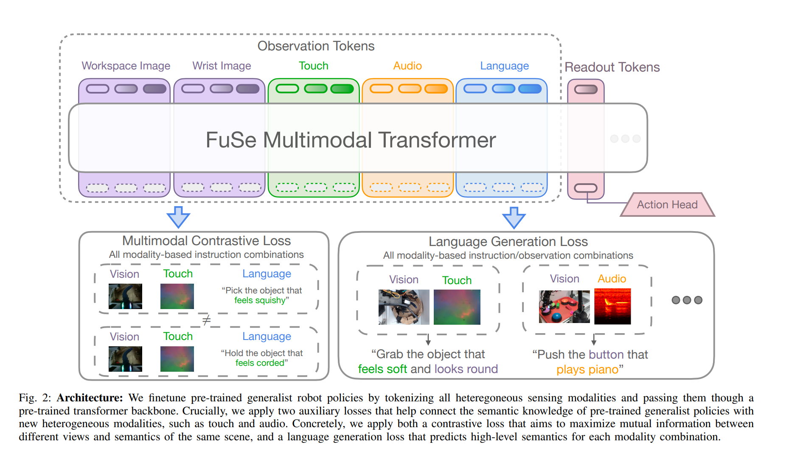

# [UCB'25] Beyond Sight: Finetuning Generalist Robot Policies with Heterogeneous Sensors via Language Grounding
1. Link: https://fuse-model.github.io/
2. Arthurs and institution: Joshua Jones, Oier Mees, Carmelo Sferrazza, Kyle Stachowicz, Pieter Abbeel, Sergey Levine from UCB
**NOTE:**
1. Oier Mees is post-docing with Levine and Sferrazza is post-docing with Abbeeel
**TL;DR**
A VLA framework improves performance across a number of tasks and settings and enables cross-modal reasoning

**Todos**
1. discuss with experts
## Thoughts and critisims
1. the idea of using constractive loss and generative loss is great, and it's highly helpful to my research
2. I should dig a bit more to the dataset, about the mass, innertia in it.
3. I could build the URDF encoder in a similar way. Directly use Octo and fine tune it with the URDF collected by A.A.

## Related works
### Multimodal Reasoning in Robotics
1. Aims: exploit complementarity across different sensors to enhance the capabilities of autonomous robot policies.
## Contributions
1. introduce a multi-task dataset that includes vision, touch, audio, inertial measurements, proprioception, as well as robot actions and language instructions
2. We then leverage this dataset to finetune large generalist robot models, unlocking novel multimodal reasoning capabilities.
## Key concepts
### Fuse Fine-Tuning
1. aims: finetune these policies to extend their semantic understanding to include additional sensing modalities, such as touch and sound, while retaining their pre-trained knowledge
2. challenges
   1. the weights of the feature extractors (encoders) for the new modalities generally need to be effectively
learned from a small dataset
   1. the finetuned model empirically tends to predominantly rely on the pre-training modalities, ignoring the new sensors
   2. novel cross-modal prompting capabilities rely on modality specific annotations, e.g., “the object feels soft and squish
1. encoders
   1. tactile
      1. TVL encoder: pre-trained via pairwise contrastive learning across vision, language, and tactile modalities.
   2. audio
      1. process to spectrogram and treated as a regular image and fed through a ResNet26 encoder
2. Auxiliary losses
   1. use MSE that conditional on additional sensory data
      1. leads to the policy over-relying on its pre-training modalities
      2. ignoring the new modalities
   2. purpose
      1. fully leverage multimodality
      2. connect the semantic knowledge of pre-trained generalist policies with unseen sensor modalities
   3. Multimodal Contrastive Loss
      1. CLIP-style contrastive learning
      2. It aims to maximize mutual information between different modalities and semantics of the same scene
      3. steps
         1. we build an observation embedding by feeding all modalities once more through the transformer and combining them via a multi-head attention layer
         2. Compute a CLIP-style loss for each possible instruction resulting from combining the different available modalities.
         3. These losses are finally averaged to form a combined multimodal contrastive loss
   4. Multimodal Generative Loss
      1. We design a generative network that functions as an add-on head to the backbone model.
      2. Steps
         1. for each possible modality combination, we build an observation embedding as above
         2. feed it through the generative head
         3. we compute an auxiliary cross-entropy loss by comparing the head output with the appropriate language instruction.
         4. We use a single transformer as the generative head for all possible modality combinations, with modality tokens to distinguish between input modalities.
3. final loss 
## Implementation details
1. bsize = 1024
2. 5000 steps on v5e-128 TPU pod
### Hardware
1.  WidowX 250 6-DoF robot arm
2.  delta end-effector position commands at a frequency of 5 Hz
3.  a third-person view RGB camera, a wrist RGB camera,
4.  two DIGIT tactile sensors at the gripper fingers
5.  a standard microphone, and a 9-DoF IMU
## Dataset
1. 26,866 trajectories by a Meta Quest 2 VR headset
## Experiments

### Addressed questions
1. Does FuSe help perform multimodal prompting tasks in a zero-shot manner in partially observable environments?
2. Does FuSe enable multimodal prompting to discriminate between objects that would be ambiguous as described by a single modality?
3. Can the multimodal capabilities of FuSe be applied to compositional reasoning tasks?
4. Are the proposed auxiliary cross-modal language grounding losses necessary to achieve high performance when finetuning FuSe?
5. Is FuSe applicable to different generalist robot policy architectures?