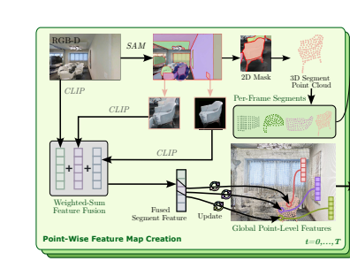
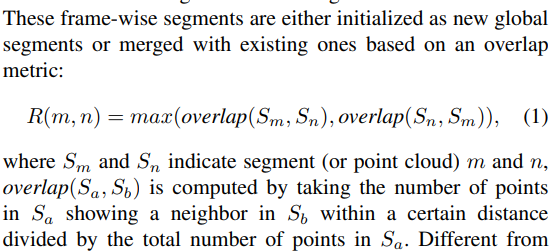
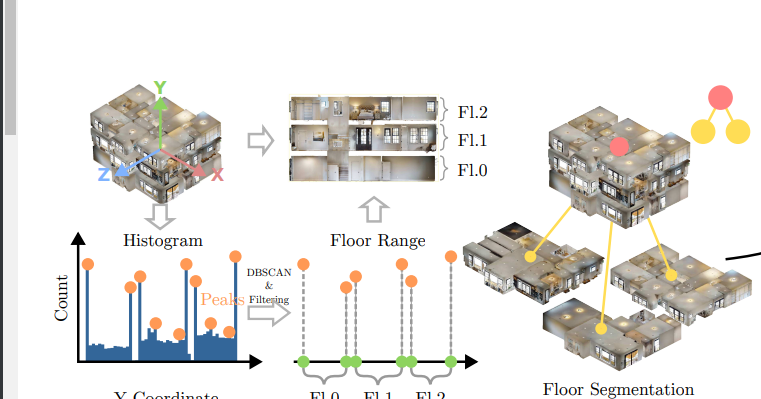
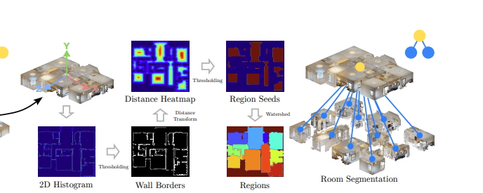
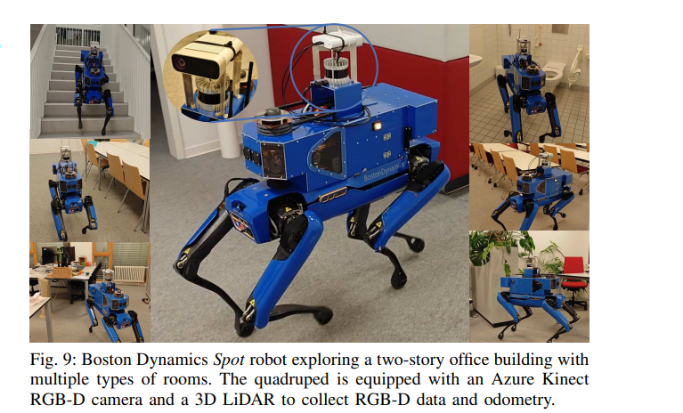

# [RSS'24] Hierarchical Open-Vocabulary 3D Scene Graphs for Language-Grounded Robot Navigation
1. Paper Link: https://roboticsconference.org/program/papers/77/
2. Github: https://github.com/hovsg/HOV-SG
3. Arthurs: Abdelrhman Werby, Chenguang Huang, Martin Büchner, Abhinav Valada (corr. authur), Wolfram Burgard (a big name in RAS)
4. Institutions: University of Freiburg, University of Technology Nuremberg (all german universitiesa)
   
## Existing problems
1. maps from SLAM are high-accuracy and dense, 0-shot VLMs give map open-vocabulary indexing of observed environments, these two marry together, bring larger scene representation
2. abstracting still poses a considerable hurdle
3. most 3DSG methods rely on closed set semantics with the exception of ConceptGraphs [14] that
focuses on smaller scenes.

## Main contributions
1. A novel fusion scheme using feature clustering of zero-shot embeddings that yields SOTA results in open-set 3D semantic segmentation.
2. An algorithm that enables the construction of truly actionable open-vocabulary 3DSG of multi-floor buildings.
3. We conduct real-world multi-floor object navigation experiments based on long natural language queries.
4. An evaluation metric for measuring open-vocabulary semantics termed AUCtop-k.

## TODO list
1. figure out what the voronoi graph is
2. read the source code, get an example of executable voronoi graph from hovsg
3. construct a real world voronoi graph, by slam from unitree/ hand craft.
4. generate the code
5. very easy demo

## Key concepts
1. Voronoi graph
    https://www.usna.edu/Users/cs/crabbe/SI475/current/simple-model/path_planning/voronoi.pdf
    https://github.com/sachabest/voronoi-planner

## Related work
### Scene Graphs for Planning
#### Line 1 robotic planning from pre-explored environment
1. RobLM: decomposes the planning stage by relying on
a fine-tuned GPT-2 instance that proposes high-level subproblems from scene graphs, which are in turn solved through PDDL task planners.
2. SayPlan [38] directly utilizes GPT-4 for iterative search on a scene graph to generate grounded plans, which requires feasibility constraints on the manipulated entities and actions.
#### Line 2 robotic navigation from scene graphs.
1. SayNav [44] obtains LLM-generated plans from scene graphs and executes shortdistance point-goal navigation sub-tasks. Contrary to that,
2. VoroNav [45] constructs a Voronoi graph that is attributed to camera observations in order to solve object navigation.
3. MoMa-LLM [46] tackles mobile manipulation objectives using scene graphs fed to GPT-4 in a task-specific manner.
4. GRID [47] uses a graph neural network to predict actions from scene graphs and LLM encodings.
5. ConceptGraphs is only evaluated on small scenes and mostly validated by human evaluators in terms of
semantic accuracy of nodes etc.
1. Hydra [19], which does not operate on open-vocabulary features

## Details
### The construction of the 3D segmentlevel open-vocabulary map

#### 1. Frame-Wise 3D Segment Merging
1. collect a time-sequence of RGBD images with odometry
2. use SAM to get a list of 2D masks
3. project depth image onto the masks, get a list of 3D masks
4. transform the 3D masks into a global coordinate system
5. calculate the merge ratio:
6. construct a fully connected graph, nodes are segments, edge weights are $R(m, n)$
#### 2. Segment-Level Open-Vocabulary Features Computation
1. for each 2D segmentation, we have 3 features: original RGB image, detection bbox and masked image, fuse the feature of 3 images from a CLIP backbone, then get a weighted sum (prove improvement by empirical results)
2. associate the CLIP feature with the nearest 3D points in a pre-computed reference point cloud
3. The final point-wise features are determined by averaging each reference point’s associated features
4.  match point-wise features with the obtained 3D segments.
    1. For each point within a segment
       1. identify the nearest points in the reference point cloud and collect their CLIP features
       2. leverage DBSCAN to cluster all the point-wise features of the segment and assign the feature that is closest to the majority cluster’s mean to the segment
    2. collapse while removing noise and thus produces more semantically meaningful segment features
**output**: 
    1. a global reference point cloud of the scene, 
    2. a list of global 3D segments
    3. their associated CLIP features
###  3D Scene Graph Construction
3DSG: $$\mathcal{G}=(\mathcal{N}, \mathcal{E})$$
$$\mathcal{N} = \mathcal{N}_S\cup\mathcal{N}_F\cup\mathcal{N}_R\cup\mathcal{N}_O$$

$$\mathcal{E} = \mathcal{E}_{SF}\cup\mathcal{E}_{FR}\cup\mathcal{E}_{RO}$$

A node contains point clouds of the concept it refers, associated open-vocabulary feature
#### 1. Floor Segmentation

1. identify peaks of a height histogram over all points contained in the point cloud. 
2. construct the histogram over all points along the height
axis using a bin size 0.01 m
3. we identify peaks in this histogram (within a local range of 0.2 m) and select only peaks that exceed a minimum of 90% of the highest intensity peak.
4. apply DBSCAN and select the two highest-ranking peaks
in each cluster
5. every two consecutive values in the sorted height vector represent a single floor in the building
6. addition, we equip each floor node with a CLIP text embedding using the template “floor {#}”
#### 2. Floor Segmentation

1. extract a binary wall skeleton mask by thresholding the histogram
2. dilating the wall mask and computing an Euclidean distance field (EDF), a number of isolated regions is derived by thresholding the EDF
3. Taking these regions as seeds, we apply the Watershed algorithm to obtain 2D region masks. 
4.  Given the 2D region masks, we extract
the 3D points that fall into the floor’s height interval as well as the BEV room segment to form room point clouds that are used to associate objects to rooms later
5. To enrich room nodes with open-vocabulary features, we
associate RGB-D observations whose camera poses reside
within a room segment to those rooms
6. CLIP embeddings of these images are distilled by extracting k representative view embeddings using the k-means algorithm
7. During inference, given a list of room categories encoded via
CLIP, we construct a cosine similarity matrix between the k
representative features and all room category features
8. Next,
we take the argmax along the category axis and obtain the
most probable room type for each representative separately,
resulting in k votes per room
9. Given these votes, we obtain
the predicted room category by either taking the maximumscore vote or the majority vote across all k representatives per
room.
10. These k representative embeddings and the room point
cloud attribute the room node Nf,r of room r on floor f. An
edge between the floor node and each room node (Nf , Nf,r) ∈
EF R is established. 
#### 3. Object Identification
1. Given the room point cloud, we associate object-level 3D segments that show a point cloud overlap with a potential candidate room in the bird’s-eye-view.
2. Whenever a segment shows zero overlap with any room, we
associate it with the room showing the smallest Euclidean distance.
3.  To reduce the number of nodes, we merge 3D segments
of significant pair-wise partial overlap (Sec. III-A) that produce
equal object labels when queried against a chosen label set.
4. Each merged point cloud constitutes an object node Nf,r,o
that is connected to its corresponding room node Nf,r ∈ NR
by an edge (Nf,r, Nf,r,o) ∈ ERO.
1. Each object node holds its corresponding 3D segment feature, its 3D segment point cloud as well as a maximum-score object label for intermediate naming
#### 4. Actionable Graph Creation
**per-floor graph**
1. btain all camera poses and project them as 2D points onto a BEV map of each floor, assuming areas within a certain radius of two nodes are pair-wise navigable. 
2. the entire floor’s region is obtained by projecting all floor-wise points into the BEV plane. 
3. An obstacle map is generated based on points within a
predefined height range [ymin + δ1, ymin + δ2], where ymin
is the minimal height of the floor points while δ1 = 0.2,
δ2 = 1.5 are empirically tuned
4. By taking the union of the
pose region map and the floor region map and subtracting
the obstacle region map, the free space map of each floor is
derived.
5. The Voronoi graph of this free map yields the floor
graph
**cross-floor graph**
1. camera poses on stairs are connected to form stair-wise graphs.
2. the closest nodes between the stairs graph and
the floor-wise graph are selected respectively and connected

### Navigation with Scene Graph
Language guided navigation with HOV-SG involves processing complex queries such as “find the toilet in the bathroom on floor 2” using a large language model
1. We break down such
lengthy instructions into three separate queries: one for the
floor level, the room level, and the object level
2. we
sequentially query against each hierarchy level to progressively
narrow down the solution corridor, This is done by taking
the cosine similarity between the identified query floor, query
region, and query object as well as all objects, rooms, and
floors given in the graph, respectively
3. Once a target node
is identified via scoring, we utilize the navigational graph
mentioned above to plan a path from the starting pose to
the target destination
### Real-World Application of HOV-SG

1. We calibrate the extrinsics between the LiDAR and the RGB-D camera
2. apply an off-the-shelf LiDAR SLAM implementation that combines FAST-LIO2 [52] with a loop closure component to obtain LiDAR poses.
3. we leverage the extrinsics to derive the associated camera poses. 
4. employing the RGB-D data and odometry,