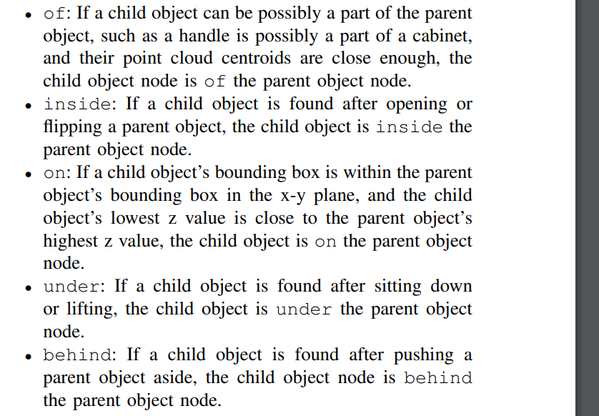
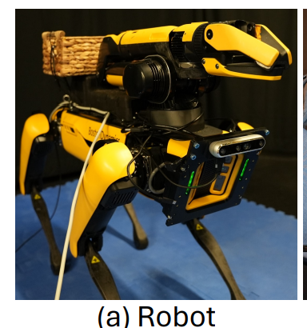
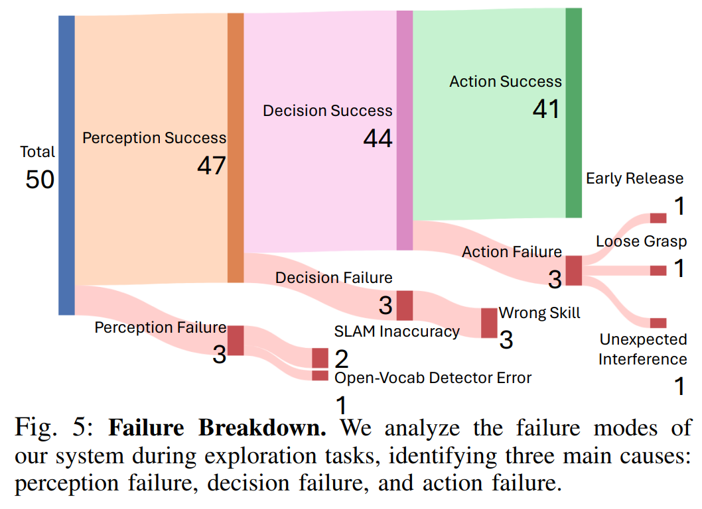

# [CU‘25] CuriousBot: Interactive Mobile Exploration
via Actionable 3D Relational Object Graph
1. Link: 
2. Arthurs and institution: Yixuan Wang, Leonor Fermoselle, Tarik Kelestemur, Jiuguang Wang, Yunzhu Li From Columbia Univ. and Boston Dynamics

**NOTE:**
1. Jiuguang Wang
   1. a interesting guy, got ph.d. from CMU, worked in Itunes, a start-up as CTO, was doing AD decision making at Optimus Ride.
   2. now he's a roboticist in Boston Dynamics AI institute, doing task-planning.
2. Tarik Kelestemur: researcher in Boston Dynamics, doing manipulation
3. Leonor Fermoselle: researcher in Boston Dynamics, doing SLAM
4. Yixuan Wang: Ph.D with Yunzhu Li
**TL;DR**
CuriousBot is a mobile robot that can interactively explore the environment, build a 3D relational object graph, and exploit the built graph for robotic manipulation tasks on diverse scenes.
**Todos**
1. read [IJRR'24 Foundations..] https://github.com/MIT-SPARK/Hydra
2. try to use RTAB-Map
   1. https://introlab.github.io/rtabmap/
## Thoughts and critisims
1. the contribution of "proposing 3DSG" is misclaiming.
## Related works
### Robotic Exploration
1. namely exploration and active perception
2. active interation is new
   1. roboEXP (previous work) on table top 
   2. [RAL'23 Fabian, et. al.] relys on AR markers
### 3DSG
1. previous works consider spatial relationships, they do not consider active interactions with the environment, such as opening drawers. In contrast, our representation considers how different actions can modify the environment
## Problem formulation
1. A graphs G has object nodes and directed relationship edges.
2. The objective of mobile exploration is to construct a graph G that can minimize the unknown space, discover as many object
nodes as possible, and establish correct object relationships.
## Contributions
1. We develop the CuriousBot system, which can automatically construct the 3D object graph, plan exploration, and interact with the environment to reduce unknown spaces.
2. We conduct comprehensive experiments, demonstrating that our system can fully explore environments and accurately build the object graph. 
## Key concepts
### SLAM
1. input RGBD sequence and odom estimation
2. output camera poses and map
###  Graph Constructor
1. input previous graph, image sequence and camera poses
2. output current graph
3. Steps
   1. use yolo+sam to detect objects
   2. use IOU to align previous detection and add new detections
   3. build up 5 rule-based relationships, including geom, semantic and action info.
### Task planner
1. LLM as planner + 3DSG
### Low-Level Skills
1. open
   1. norm axis determination + grasp + impedance control
   2. retry with different param if it fail
2. flip
   1. only flip opened box
3. lift
   1. only lift cloth
   2. grasp the CoM
4. push
   1. extend its arm and move sideways while maintaining the arm in an extended position.
5. sit
   1. spot API
6. collect
   1. SOTA grasp planner
## Implementation details
1. relationships

### Scene
3 * 4 m room
### Hardware

1. spot + realsense 435
2. desktop equipped with an Nvidia RTX A6000 GPU + 128 GB memory

## Experiments
