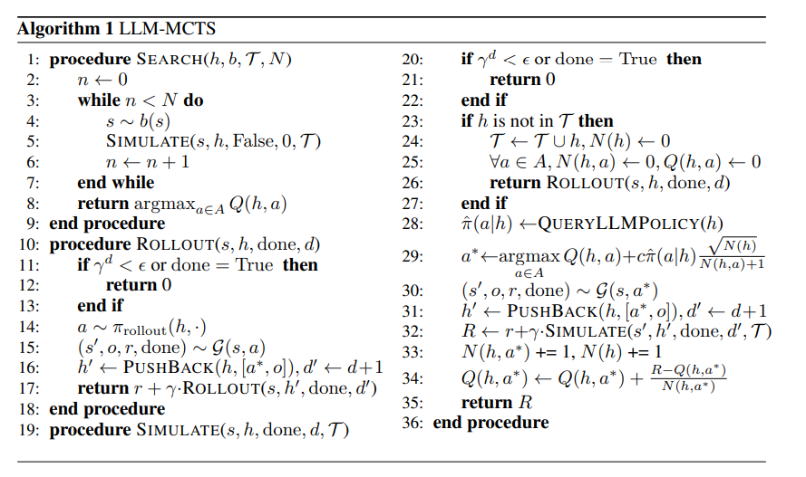
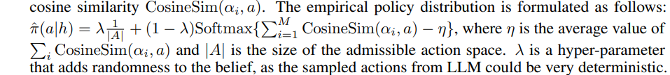
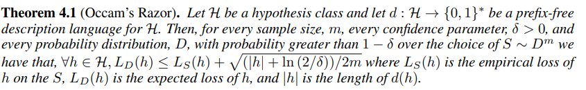
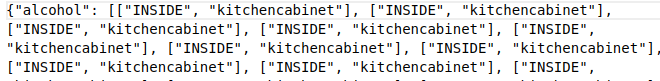
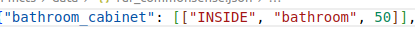

# [NIPS'23] Large Language Models as Commonsense Knowledge for Large-Scale Task Planning
1. Link: https://llm-mcts.github.io/
2. Arthurs and institution: Zirui Zhao, Wee Sun Lee, David Hsu from NUS
   
**TL;DR**
We use Large Language Models as both the commonsense world model and the heuristic policy within the Monte Carlo Tree Search framework, enabling better-reasoned decision-making for daily tasks.

# Differences of Setups between ULbench and this
|                      | ULBench               | LLM-MCTS         |
|----------------------|-----------------------|------------------|
| Simulator            | Coppeliasim           | VirtualHOme      |
| Scene                | table top, 1 room     | multiple rooms   |
| object set           | fixed                 | fixed            |
| object position      | random                | random           |
| task                 | fixed                 | random           |
| action space         | 9 * action param      | 5 * action param |
| transition of action | stochastic/determined | determined       |

## Existing problems
1. Even though LLMs are trained on internet-scale
data, LLM-Policies shows limits in generalization.

## Contributions
1. We use LLMs as the commonsense world model and the heuristic policy within MCTS to achieve
better-reasoned decision-making for daily tasks.

1. We propose using the minimum description length (MDL) principle to decide the question “when would using LLM as a model outperform using LLM as a policy, and vice versa?”

## Key concepts
### Algorithm

1. The parts done by LLM are:
   1. L-Model
      1. generate the initial belief of state
      2. translate the natural language goal into a formal goal for MCTS
   2. L-policy
      1. guide the action selection in the simulation procedure
      2. sample the LLM for M times to approximate the policy probability distribution
      3. empirical policy 
### MDL

1. a method that suggests  choosing the method that has a shorter description when both methods fit the training data. (the simpler the model ,the better the model, ceteris paribus)
2.  selecting between a model or policy depending on which of
them has the smaller description length given the description language.

## Details
1. action space {pick(obj), place(obj, placement), open(container), close(container), move(room/obj/container)}
2. belief contruction
   1. predict the position of all moveable object with INSIDE/ON relationship.
   (sample of llm queried results)  
   (frequency of an object)