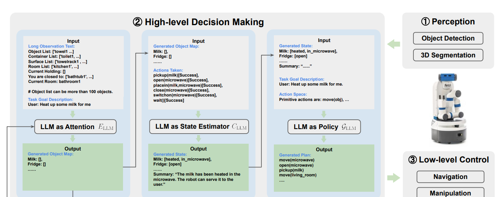

# [NUS'23] LLM-State: Expandable State Representation for Long-horizon Task Planning in the Open World
1. Link: https://arxiv.org/pdf/2311.17406
2. Arthurs and institution: Siwei Chen, Anxing Xiao, David Hsu from NUS
**TL;DR**
we propose a novel state representation for task planning with LLM in the open-world, constructed and updated automatically by LLM for object state tracking and reasoning

# comments and critisims
1. implicitly handling errors in a close loop (in LLM)
2. the system did not consider achieving optimal solution from the prompt setting
## Key points

### Inputs
1. Goal Instruction in text
2. Step-wise Observation
   1. current location
   2. observed objects
   3. rooms
   4. pre-defined primitave actions
### Outputs
1. Step-wise Primitive Action Commands
### State representation
1. structured obj entry
   1. a dictionary of objects, where key is the object name and values are attributions of objects (status, location, condition)
2. Unstructured Retrospective Summary Entry
   1. action histroy of robot
      1. helps to predict attributes of objects
   2. recent failures
      1. unknown preconditions
      2. unexpected transitions
### Modules

#### LLM as Attention
1. extend the list of key objects relevant to the task based on the latest observed object list
2. functions
   1. add_related_object()
#### LLM as state estimator
1. uses the key objects list, historically executed action with binary success indicator, and observation to generate the state representation with state change for the object in the key objects list and the summary
2. functions
   1. generate_summary(text)
   2. add_attributes(obj, attr)
#### LLM as Policy
1. generates the action sequences based on the current state representation, observation and instruction.
#### Exploration
1. For objects not present in the current state but required to complete a task, the LLM policy actively generates hypotheses using common sense.
## Details
1. perception
   1. 6 angles to fully cover 360 degree
   2. Recognize anything + GroundingDINO
   3. SAM
   4. back-projetion
2. low-level control
   1. navigation
      1. use grid map and Ros-build-in motion planning
   2. manipulation
      1. imitation learning with VR controller
      2. 30 trajectories per primitave skill
3. hardware
   1. running in a 4090 GPU
   2. stop by human monitor if the generated action is not callable
4. simulation: virtualhome