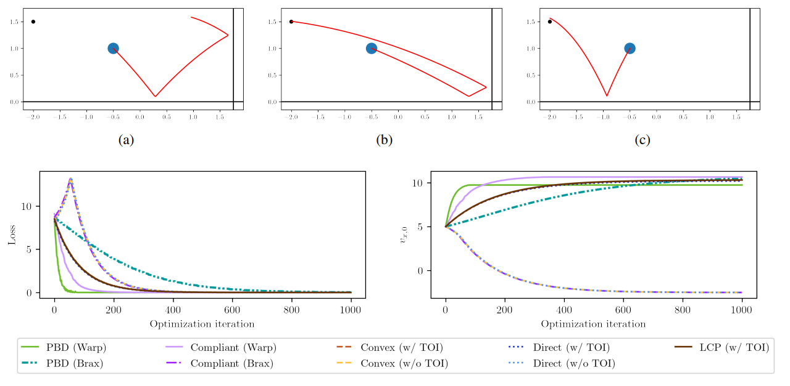

# [ICML'22] Differentiable Physics Simulations with Contacts: Do They Have Correct Gradients w.r.t. Position, Velocity and Control?
1. Link: https://arxiv.org/pdf/2207.05060
2. Arthurs and institution: Yaofeng Desmond Zhong, Jiequn Han, Georgia Olympia Brikis from Siemens Tech. and Flatiron Institute

**NOTE:**
1. Flatiron Institute is an division in SIMONS FOUNDATION.
2. Zhong wrote great blogs https://desmondzhong.com/blog/

**TODO**
1. read Zhong's two more papers
   1. one describe how to enhance gradient computing
   2. one propose a contact model that can be used to identify mass of object
2. run the code, learn how to compute gradient in differentiable simulators.

**TL;DR**
The arthur analyzed and compared the gradients calculated by 4 different contact models and show that the gradients are not always correct.

# comments and critisim
1. the literature review on the contact model in differentiable simulator is thorough.
2. To my research, I need to extent the question to 'do these differentiable contact formulations compute the correct gradients w.r.t. position, velocity, force, mass and other physical parameters?'
## Experiments
### Settings
1. task in 2D space
2. $\Delta t$ = 1/480s
### Task 1: Gradients with a Simple Collision

1.  a perfectly elastic frictionless collision with the 0-gravity ground
2.  analytical expression of the final height

1. test result

1. conclusions
   1. TOI is important, making $\Delta t$ smaller cannot address the issue
   2. The wrong gradient in compliant model might be due to different implementation details, e.g. spring stiffness.
   3. The gradient w.r.t. position in PBD is nearly zero, this because when a collision (interpenetration) is detected, the position of the ball is updated to resolve the interpenetration
   4. **the gradient may wrong in value, but they are correct in direction, it is possible that it ends up with a
reasonable solution**
###  Task 2: Optimize the Initial Velocity of a Bouncing Ball to Hit a Target

1. collisions are frictionless and the elastic coefficient is e = 0.92
2. the optimization process
   1. loss function: euclidean distance between final postion and target position
   2. get the gradient of loss function w.r.t. the velocity at start time
   3. use gradient descent to update the initial velocity
   4. learning rate = 0.01 for 1000 steps

1. 
2. conclusion
   1. all the implementations can successfully minimize the loss to zero and accomplish the task
   2. Different implementations learn different trajectories
   3. TOI affects the sign of gradient, which in turn affects the optimized trajectory
### Task 3: Learning Optimal Control with a Two-ball Collision
1. push ball 1 to strike ball 2 so that ball 2 will be close to the target position

1. optimization
   1. 
   2. the first term in objective function is the euclidean distance of between the final and target position, the second term is the runnning cost.
2. 
3. conclusions:
   1. two implementations without TOI and two compliant model implementations fail to converge to the analytical optimal loss
   2. two implementations without TOI and the Brax implementation of the compliant model, the learned control sequences are close to zero all the time

## Conclusions
1. gradients computed by differentiable physics simulators might not reflect the true gradients in the physics process. Nevertheless, they might still be helpful in gradient-based learning tasks
2. raising two questions
   1. how can the optimization task be successfully achieved with wrong gradients?
   2. how to improve differentiable simulations to compute correct gradients?