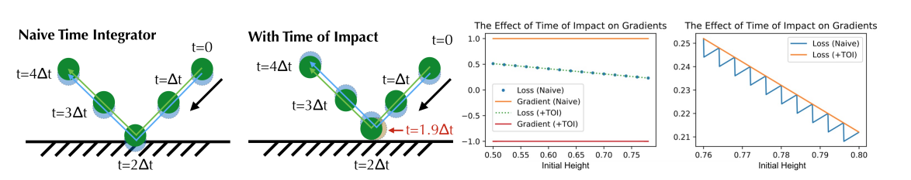
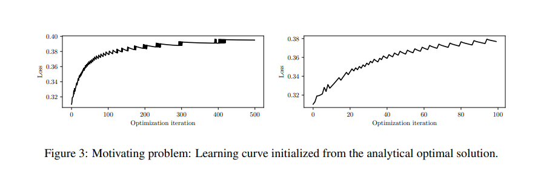
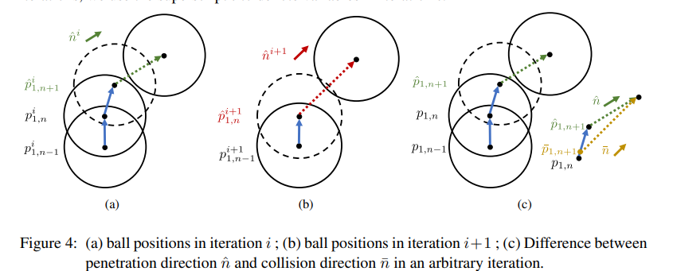
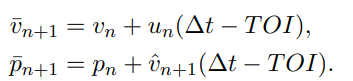
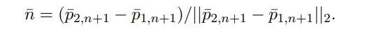
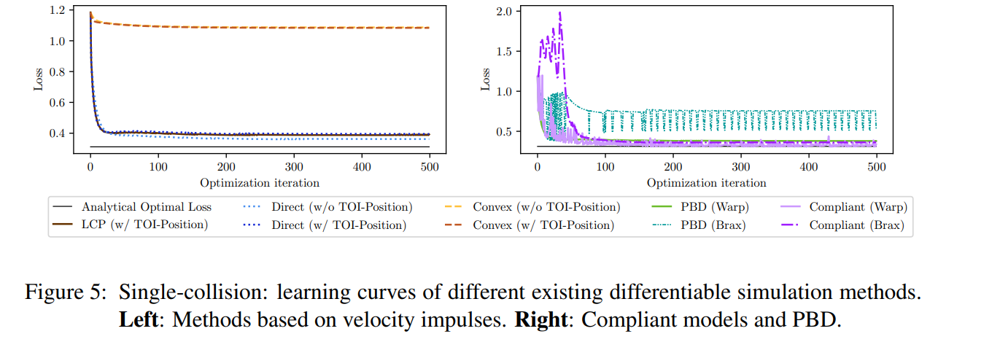

# [L4DC'23] Improving Gradient Computation for Differentiable Physics Simulation with Contacts
1. Link: https://proceedings.mlr.press/v211/zhong23a/zhong23a.pdf
2. Arthurs and institution: Yaofeng Desmond Zhong, Jiequn Han, Biswadip Dey, Georgia Olympia Brikis from Siemens Tech. and Flatiron Institute

**TODO**
1. read Zhong's one more papers
   1. one propose a contact model that can be used to identify mass of object
2. run the code, learn how to compute gradient in differentiable simulators.

**TL;DR**
We find that existing differentiable simulation methods provide inaccurate gradients when the contact normal
direction is not fixed. We propose to improve gradient computation by continuous collision detection and leverage the timeof-impact (TOI) to calculate the post-collision velocities.

# comments and critisim
1. The idea is simple and effective, can we have/do we need a TOI-acceleration?
2. difftaichi seems like a good choice. 
## Key insights
### TOI-Position
1. original paper: [ICLR'20] Differentiable Programming For Physical Simulation
2. link: https://arxiv.org/pdf/1910.00935
3. Arthurs: Yuanming Hu, Luke Anderson, Tzu-Mao Li, Qi Sun, Nathan Carr, Jonathan Ragan-Kelley, Frédo Durand from MIT CSAIL and UCB
4. 
   1. collision detection only happens at multiples of a timestep, thus the gradient may in wrong direction and value
   2. use TOI to get the correct gradient
5. Key insight: differentiating physical simulators does not always yield useful gradients of the physical system being simulated, even if the simulator does forward simulation well. 
6. formulation
   1. $TOI = d/((\hat{v_{2, n+1}} - \hat{v_{1, n+1}}) * \hat{n})$
where $d = ||\hat{p_{2, n+1}} - \hat{p_{2, n+1}}||_2 -2r$ is the penetration depth, $\hat{n} = (\hat{p_{2, n+1}} - \hat{p_{2, n+1}})/||\hat{p_{2, n+1}} - \hat{p_{2, n+1}}||_2$ is the penetration direction
   1. the collision frame is estimated by ($\Delta t$ - TOI) and $$p_{n+1} = p_n+\hat{v_{n+1}} * (\Delta t - TOI) + \tilde{v_{n+1}} * TOI$$
### TOI is not enough
1. 
2. Initiate the learning with the analytical solution.
3. We observe that the loss jumps up in certain iterations, and the learning converges to a solution with a higher loss
4. **Gradients computed by the differentiable simulation are incorrect**
### Reason behind
1. 
2. during calculating contact, the simulator computes a penetration position and direction as intermediate variable, the direction changes if the gradient update. Since the change in direction is not continuous, the change in velocity after collision is not continous. So the position of the ball suddenly change, result to a change in loss function.
### TOI-velocity
**Recompute the penetration direction by computing the velocity with TOI**
   
   
   