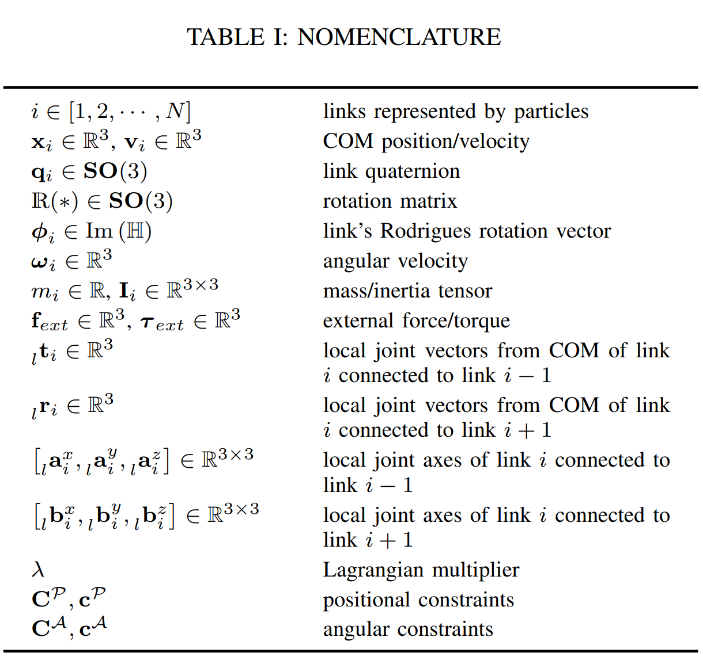
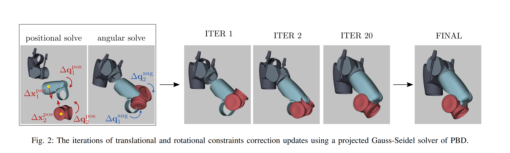
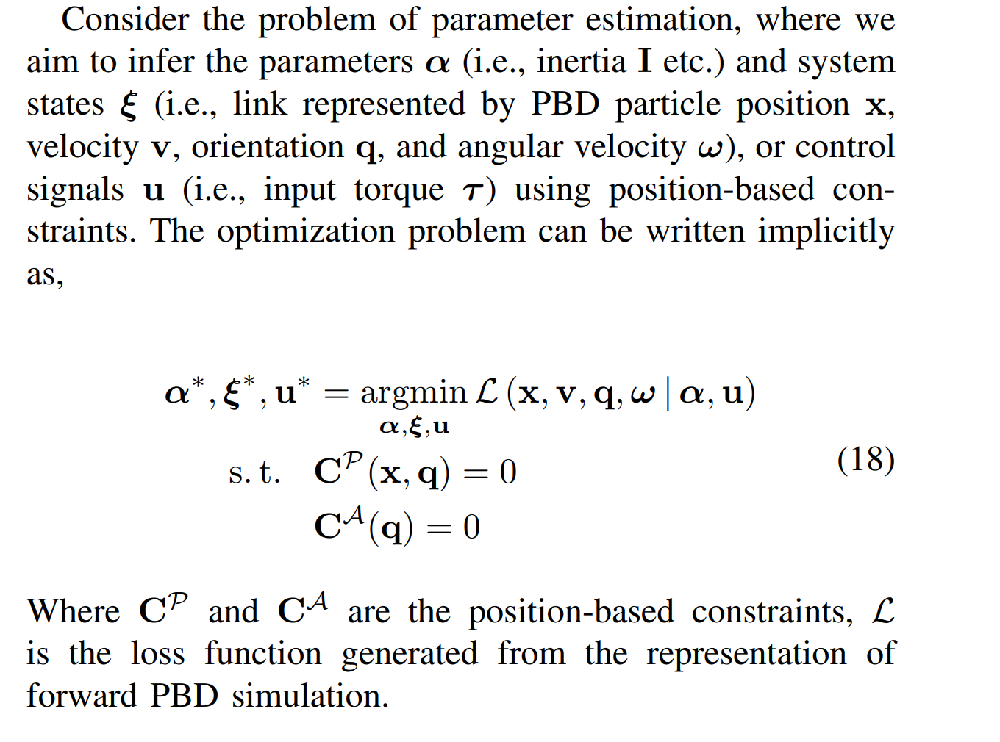
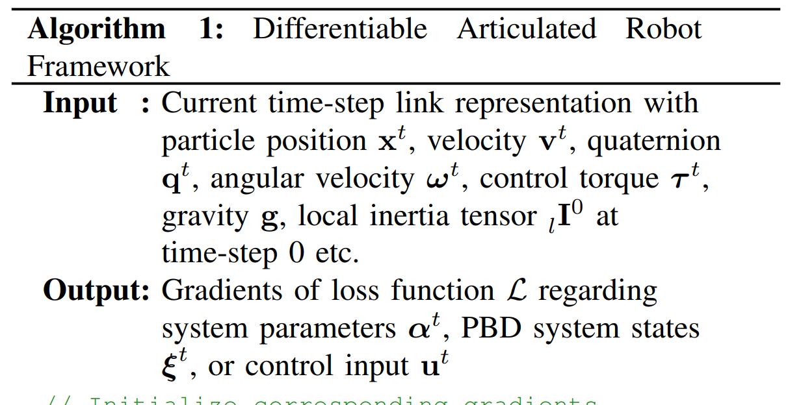
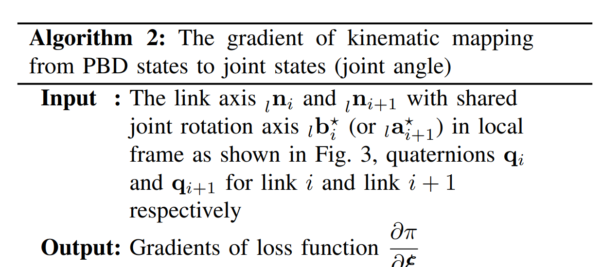
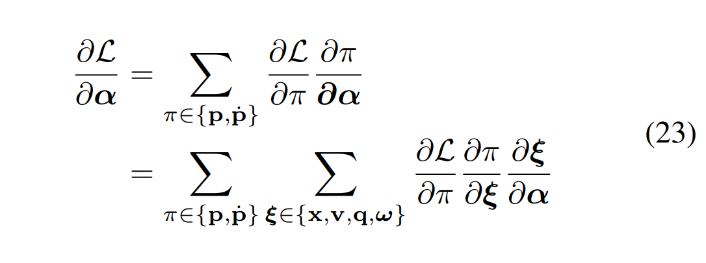
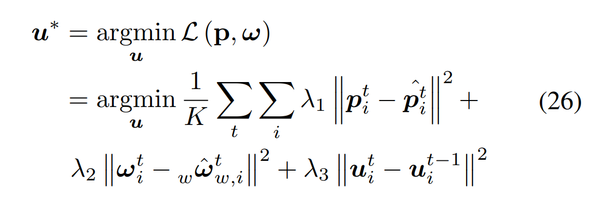
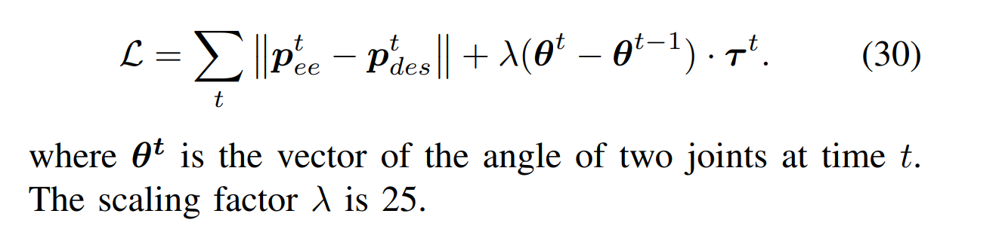

# [UCSD'24] Parameter Identification and Motion Control for Articulated Rigid Body Robots Using Differentiable Position-based Dynamics
1. Link: https://entongsu.github.io/differential_rigid-github.io/
2. Arthurs and institution: Fei Liu, Mingen Li, Jingpei Lu, Entong Su, Michael Yip from UCSD

**NOTE**
1. Michael Yip: Director of Advanced Robotics and Controls Laboratory (ARCLab), focus on robot manipulation, continumm robots and robotic surgey. He serves as A.E. of RA-L, A.E. and senior pragram committee of ICRA and primary area chair of RSS.
2. Fei Liu is Prof. Yip's postdoc.
3. the code in the article is not opened, the current status is in submission to TR-O
**TL;DR**
A mathematical formulation for coupling position-based dynamics (PBD) simulation and optimal robot design, modelbased motion control and system identification. We present a backpropagation method with automatic differentiation, which can integrate both positional and angular geometric constraints.

## Thoughts
1. we may use this paper as a framework for differentiating through URDF!
2. articulated robot design shares similar objective function with system identification!

## Contributions
1. We propose the implementation of a position-based dynamics framework for articulated rigid body robots, involving joint constraints representations and updates,
2. We formulate an optimization-based simulation workflow for differentiable framework by providing readyto-use gradients
3. We demonstrate the utility of differentiable PBD in optimal robotic design, parameter estimation, and motion control.
## Novelty
The novelty of our approach compared to existing differentiable works lies in introducing differentiability via computation graphs into a position-based framework. It maintains a sparse state representation using particles to represent articulated rigid robots

## Related Work
### Differentiable Rigid Physical Simulation
1. some are not able to differentiate through the robot geometric properties, such as link length and inertia
2. some are mostly applied to learning-based tasks with adaptation to neural networks. 
   1. optimal robot design
      1. gradient based method: [RSS'17] Joint optimization of robot design and motion parameters using the implicit function theorem
      2. differentiable design: most of them are soft robots
   2. Dynamical Motion Control
      1. enhance model-based motion control
   3. Parameter Identification
      1.  a loss function over sensors or even images
      2.  ranging from identifying mass, friction, inertia, to position, shape
      3.  use model-based/NN based approches

## Key ideas
### Differentiable PBD simulation
#### Articulated Rigid Body Position-based Dynamics
1. idea: to extend a rigid body system with ability to rotate and translate in space, the particle representation per link is extended with orientation information to model joint kinematic constraints.
2. representation of rigid body link:
   1. a particle at CoM with location
   2. a quaternion representing orientation, mass and moments of inertia
   3. vectors pointing from the COM towards its and the next hinge joint position
   4. To join two links together via a hinge joint, three different constraints need to be considered for each joint, i.e. positional, angular and angle limit constraints.

3. constraints derivation:
**NOTE** NOT READ ERROR
### Parameter Identification And Model-Predictive Control

1. Objective

2. algorithm inputs and outputs
   1. 
   2. 
3. param identification
   1. 
4. Torque Estimation From Trajectory
   1. 
### Double Pendulum Robot Design
1. determine the link lengths of a robot arm that would best carry out this trajectory while minimizing overall energy expenditure

