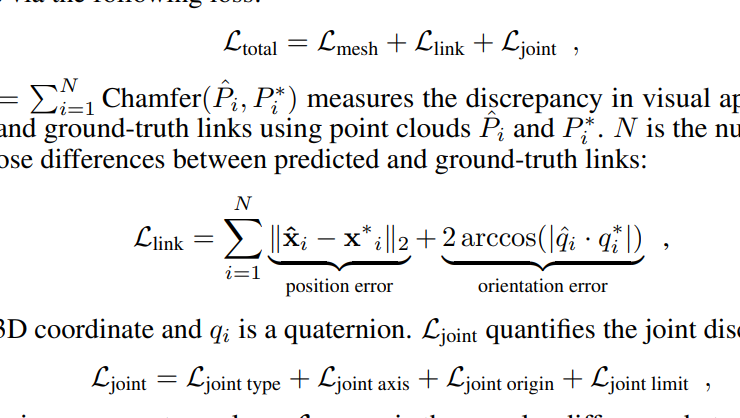

# [ICLR'23] ARTICULATE-ANYTHING: AUTOMATIC MODELING OF ARTICULATED OBJECTS VIA A VISION-LANGUAGE FOUNDATION MODEL
1. Link: https://articulate-anything.github.io
2. Arthurs and institution: Long Le, Jason Xie, William Liang, Hung-Ju Wang, Yue Yang, Yecheng Jason Ma, Kyle Vedder, Arjun Krishna, Dinesh Jayaraman, Eric Eaton from UPenn

**NOTE**
1. Eric Eaton and Dinesh Jayaraman are professors of GRASP lab
**TL;DR**
A state-of-the-art method for articulating diverse in-the-wild objects from diverse input modalities, including text, images, and videos. 

## comments and critisim
1. through good in performance, lack of novelty
2. the system handles geometry and kinematic parameters from visual feedback, but cannot handle dynamic properties of the articulated objects.
## Contributions
1. ARTICULATE-ANYTHING: We present a vision-language actor-critic system that accurately articulates objects from diverse input modalities, including texts, images, and videos.
2. Articulation as program synthesis: We develop a high-level Python API compilable into URDFs, enabling the VLM actor to generate compact, easily debuggable programs.
3. Extensive evaluation demonstrates superior performance. Quantitative analysis on the entire PartNetMobility dataset shows dramatic improvement over existing methods, increasing the success rate from 8.7–12.2% of prior work to 75%.

## Related works
### Articulated Object Modeling
1. Perception: focus on identifying und understanding articulated objects
2. Reconstruction: from rgb/rgbd/multi-view/p.c. to rebuild the model
3. Generation: cratin new articulated objects
## Problem Formulation
1. Given an input of text, image, or video depicting an objects, the goal of articulation is to autoimaticalling construct a URDF model that comprises the same set of links as the ground-truth, while minimizing 
## Algorithm

### Mesh retrieval
reconstructs the 3D structure for each object part by retrieving meshes from a 3D asset library
1. use VLM to cumpute their own annotations by prompting VLM to describe each mesh
2. use CLIP visual/text embeddings to get the most similar object from PartNet-Mobility
### Link PLacement
1. actor: place links together by aligning the child and parent's link centers along an axis and perform collision checks
2. critic: describe visual dissimilarity btw image and simulation, scale from 0-10.
### Joint Prediction
determines the potential kinematic movements between parts
1. similar setups to link placement, includes joint type, axis, origin, and limit
### Target affordance extraction
reduce the compuation/token used
1. ask VLM which child link should be annotated with a joint.
## Key points
1. directly generating URDF is challenging---> high level python code
   1. verbosity --> hallucination
   2. the need for performing complex mathematics in-place in many cases
## Experiments
Googles' Gemini Flash-1.5, pybullet + Sapien, motion traces using CoTracker
We use few-shot prompting with around 20 in-context examples.
1. 
2. input modality 
### failures causes

### choice of VLM
