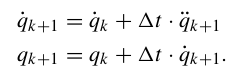

# [IEEE access‘24] A Review of Differentiable Simulators
1. Link: https://ieeexplore.ieee.org/abstract/document/10589638
2. Authors: R Newbury, J Collins, K He, J Pan, I Posner, D Howard, Akan Cosgun from Monash University

# Key Concepts

**Differentiable simulator**
**1. Defination:** Capable of calculating gradients throughout the entire duration of a simulation for a given loss function with respect to desired parameters
**2. Uses**
   1. system identification
   2. trajectory optimization
   3. policy optimization
   4. morphology optimization
   5. components
      1. gradient calculation: computing gradients with respect to the simulator’s parameters
      2. dynamics mode: the underlying physics governing the simulated system
      3. contact model: simulate interactions between objects during collision events
      4. integrator: numerically solves the equations of motion over discrete time steps

   6. gradient calculation
      1. automatic differentiation: just like autograd
         1. pytorch autograd/JAX/Difftachi
      6. symbolic differentiation: grad as symbolised equations
         1. the size grows rapidly with the complexity of the function
         2. typically only used when the dynamics are simple, or for a few select components of the simulator
      7. analytical gradients
         1. provides an explicit expression for the gradient a priori
         2. be computed more quickly and accurately
         3. can be used in discontinuous processes or phenomena
      8. dynamics model: mathematical model that describes the behavior of a system over time
         1. rigid body dynamics
            1. Newtonian dynamics: F=ma, only translational motion but no rotational motion
            2. Newton-Euler: $M(q)\ddot{q}+C(q, \dot{q}) = \tau$
               1. the vector of generalized force is equal to mass matrix times acceleration plus the bias orce matrix which accounts for other forces acting on the system, including centrifugal forces, Coriolis forces and gravity.
            3. Lagrangian dynamics
               1. principle of least action, which states that the motion of a system will minimize the action, which is a function of the system’s configuration and its time derivatives
               2. for a single particle, $$L=T-V$$
                  1. T is the kinetic energy and V is the potential energy
               3. Euler-Lagrange equation: equations of motion  for a system in terms of its Lagrangian
                  1. $$\frac{d}{dt}(\frac{\partial \mathcal{L}}{\partial\dot{q}}) - (\frac{\partial \mathcal{L}}{\partial q}) = 0$$
            4. extend to soft body
               1. should consider internal forces within the soft body
               2. FEM method: for each triangle face in the mesh, the deformation gradient is calculated as a variable of the strain
         2. soft body dynamics
            1. Continuum Mechanics
               1. deals with the mechanical behavior of materials modeled as continuous substances, rather than as collections of discrete particles
               2. MLS-MPM
               3. FEM
            2. Projective Dynamics: models object deformation as a projection onto its rest state, then minimizes an energy function that accounts for internal and external forces to obtain the desired dynamics
               1. DiffPD
            3. Compliant Position-Based Dynamics: computing particle positions
               1. brax: uses XPBD for rigid body dynamics
               2. warp
         3. fluid dynamics
   
   5. contact model
      9.  contact forces are discontinuous, step-like functions, where the gradient is not well-defined
      10. purposes:
         1. resolve interpenetrating objects
            1. in contact (normal velocities are zero)
            2. complementarity condition: not in contact (normal forces are zero)
         2. to apply frictional forces
            1. Coulomb’s friction law, formulation of friction forces, respect to normal force
      11. complementary problem
         1. 
         2. 
         3. NCP
         4. LCP
      12. compliant model
         1. approximate the contacts as soft contacts, The use of soft contacts can result in objects penetrating each other, however, this is normally aimed to be minimized
      13. position based models: first perform an update step without considering contact physics and then per-form a correction step to satisfy contact-based constraints
      14. MLS-MPM
         1. self-collision is automatically considered
         2. soft-rigid body collision are treated as boundary conditions
         3. gradient are direved analytically
   5. integrator
      15. use the computed forces to propagate a given dynamic model forwards in time
      16. explicit
         1. 
         2. relatively straightforward to differentiate through
         3. less numerically stable
         4. a larger memory overhead
      17. implicit
         1. 
         2. require more complex techniques to extract gradients
**use of differentiable simulator**

1. warp
   1. support XPBD integration
   2. gradsim use warp
   3. support adding meshes
2. difftaichi
   1. aiming to provide a method to calculate gradients of dynamical systems effectively and efficiently through source code transformations
   2. doesn't support urdf etc.
   3. kinematic chains needs to be entered pragmatically via the API
3. brax
   1. supports MJCF and URDF
4. GradSim
   1. does not support parallel execution
5. dojo
   1. only allowing collisions between primitive shapes
   2. no longer actively maintained

**applications**

1. system identification
   1. construct an accurate mathematical model of a physical system by estimating unknown parameters based on observations of the system.
   2. properties includes
      1. mass, moment of inertia
      2. inertial and kinematics
      3. stiffness and elasticity of cloths, rope, actuated soft robotics, use knife to cut 
      4. coefficient of friction
   3. works include
      1. knife and a soft object that it was cutting
      2. objectsliding on a surface
      3. URDF models of household objects are iteratively improved using differentiable simulation by robot interaction
      4. estimate parameters of real-world systems
      5. system and control
         1. ‘ball-in-cup’’ task,
   4. advantages
      1. converge to lower cost solutions in less computational time
      2. "parameter observability": possible to obtain parameters which are quite different from the ground truth values, while still yielding similar predicted trajectories
2. trajectory optimization
   1. determine optimal sequences of states and control inputs for dynamic systems
   2. 
3. morphology optimization
   1. find a set of material and geometric properties of a system that optimizes predefined objectives
4. policy optimization
   1. Analytic Policy Gradients: optimize neural network parameters directly to encode control policies
   2. Enhanced Policy Learning: 
      1. sample enhancement
      2. policy enhancement: the policy network is updated using physically-aware gradients from the differentiable physics simulator, which are generally more accurate 5. neural network augmented simulation
   3. Policy Learning using Imitation Learning
   4. Improving Convergence
5. neural network augmented simulation
   1. integration of a neural network and a differentiable physics engine for improved alignment between simulation and the real-world