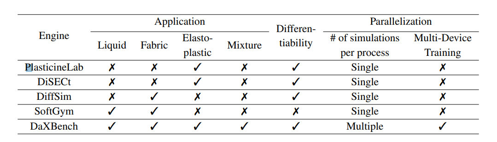

# [ICLR'23] DAXBENCH: BENCHMARKING DEFORMABLE OBJECT MANIPULATION WITH DIFFERENTIABLE PHYSICS
1. Link: https://github.com/AdaCompNUS/DaXBench
2. Arthurs and institution: Siwei Chen, Yiqing Xu, Cunjun Yu, Linfeng Li, Xiao Ma, Zhongwen Xu, David Hsu from NUS and Sea AI Lab
**TL;DR**
We propose a differentiable simulation framework for deformable object manipulation (DOM), together with a BenchMark which consists of tasks with varying levels of difficulty and well-defined reward functions.

# comments and critisim
1. can we represent a rigid body as mass-spring/particle dynamic model in DaX?

## Key points
### Comparison on key features with several simulators

### DaX
1. objects
   1. rope, cloth, liquid, and elasto-plastic materials
2. gradient calculation:  autodifferentiation and parallelization across multiple accelerators
3. env
   1. wrapped as OpenAI Gym API
4. State Representations
   1. MLS-MPM with particles
      1. liquid and rope
   2. mass-spring system
5. Forward tricks
   1. lazy dynamic update: only update particles of interest
   2. checkpointing method: only stores the values of a few states (i.e. checkpoints), and re-evaluates the sub-step gradients online during the back-propagation to reduce the memory consumption for long horizon problems
6. Discontinous gradient
   1. the gradient of non-contacted action is discontinous
   2. leads to a poor estimation of gradient during BP
   3. let actions always make the gripper in contact with the deformable objects
   
### Benchmark tasks
1. tasks
   1. Pour-Water
   2. Pour-soup
   3. Push-Rope
   4. Whip-Rope
   5. Fold-Cloth
   6. Fold-T-shirt
   7. Unfold-Cloth