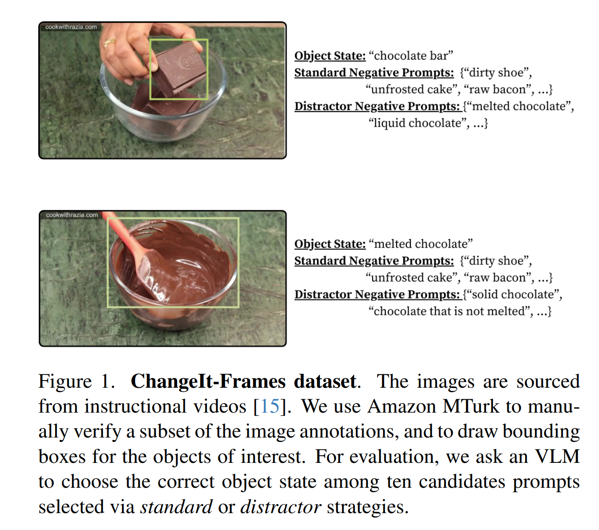
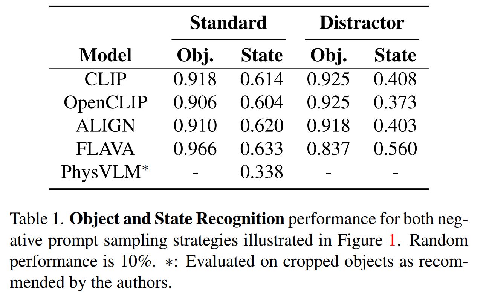
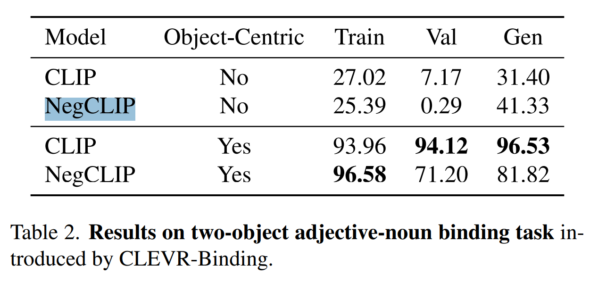

# [Brown'24] Do Pre-trained Vision-Language Models Encode Object States?
1. Link: https://arxiv.org/pdf/2409.10488
2. Arthurs and institution: Kaleb Newman, Shijie Wang, Yuan Zang, David Heffren, Chen Sun

**NOTE:**
1. Chen Sun currently is an AP in Brown University and a staff research scientist at Google Research. His ongoing research projects involve learning multimodal representation and visual commonsense from unlabeled videos, to recognize human activities, objects, and their interactions over time, and to transfer the representation to embodied agents.
2. Chen Sun is one of the arthurs in DenseTNT.
3. Currently(25.01.20) the paper does not release the repo yet.
**TL;DR**
We curate an object state recognition dataset ChangeIt-Frames, and evaluate nine open-source VLMs. We observe that these vision-language models consistently fail to accurately distinguish the objects’ physical states.
**Todos**

## Thoughts and critisims
1. the comparasion method is good
2. A preprint IS a preprint.
## Related works
## Problem formulation
### Object State
the physical and functional condition or configuration of an object, as discernible from visual data.
1. whether it is melted, dirty, or undergoing a process such as cutting or pouring
## Contributions
## Key concepts
### Recognizing Object States

1. a manually labelled dataset, consists of 1736 images from 25,735 images, each depicting one of 96 distinct object states.
2. 
## Implementation details
### Hardware
### Software
### Training
## Experiments
### Experiment 1
1. State recognization is harder.

### Experiment 2
1. WTF is NegCLIP
2. remove other information in image improves the performance.

### Experiment 3
1. The larger the model, the better the performance
2. State recognization is still not good.
### Experiment 4
1. (questionable) State + object is not classifiable
2. (questionable) same object in different state is not classifiable