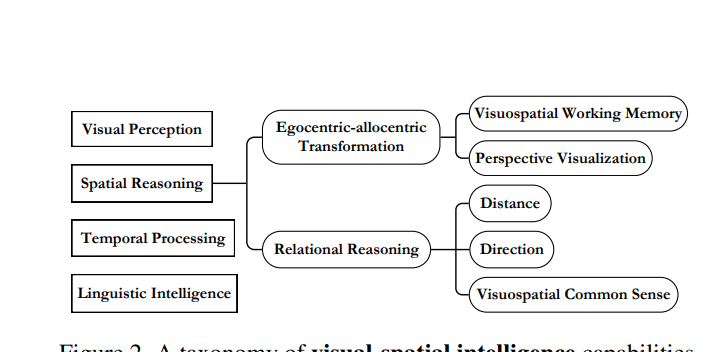
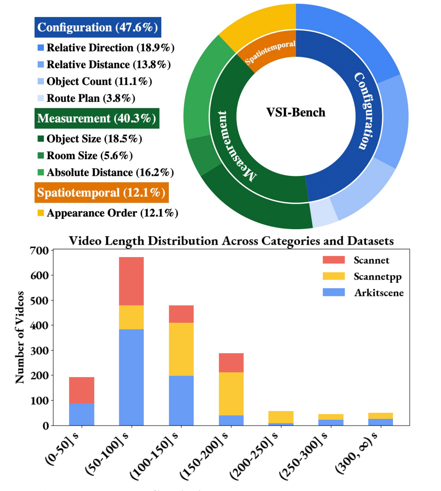
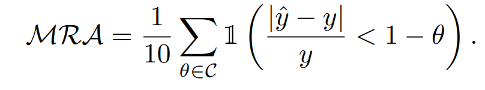
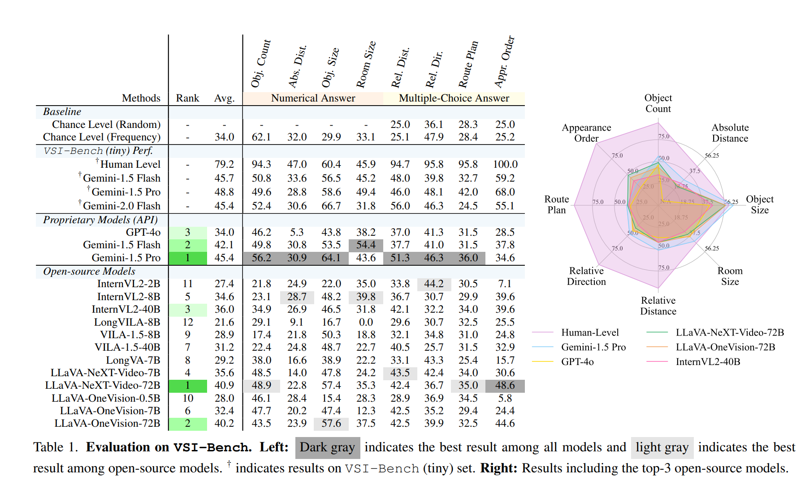
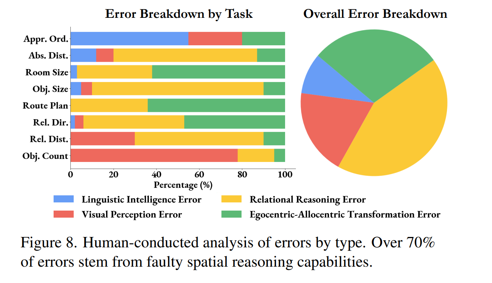
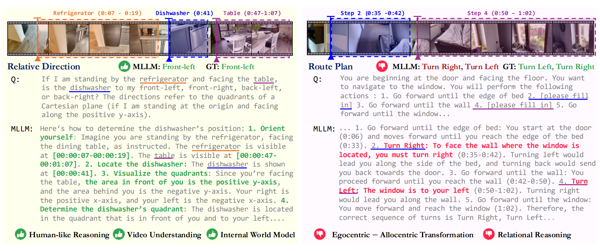
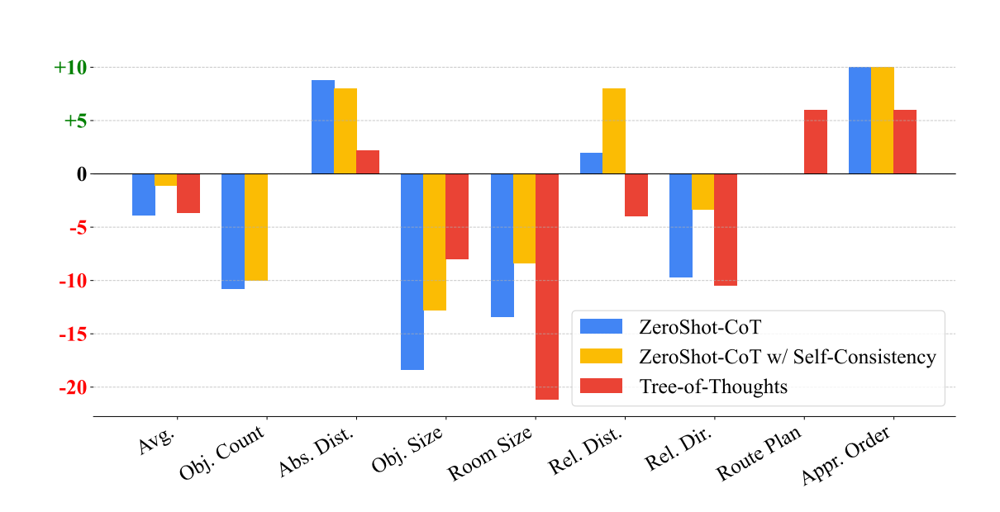
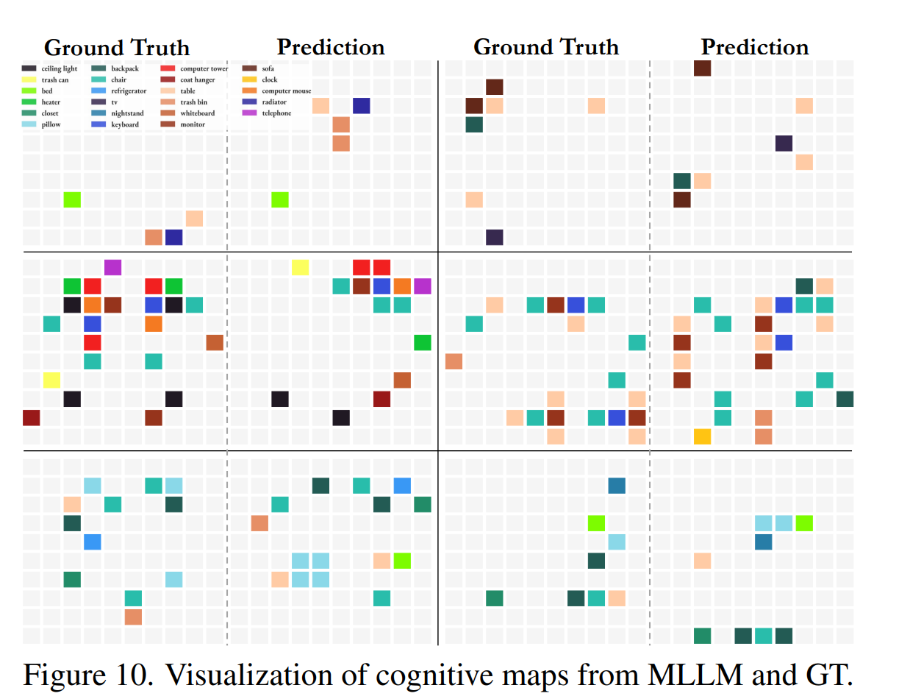
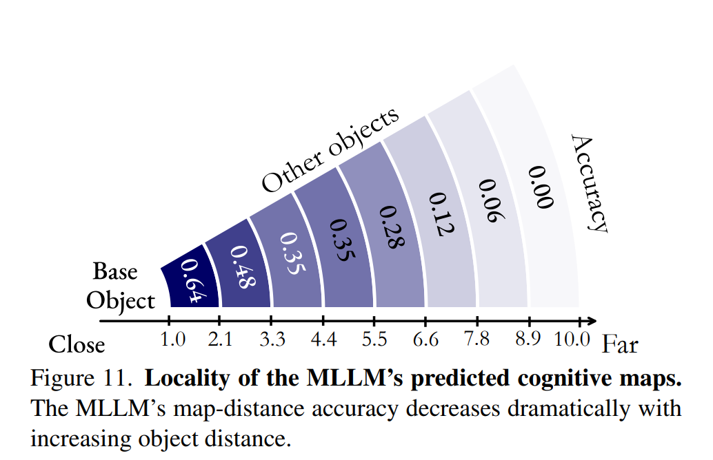

# [CVPR'25, oral] Thinking in Space How Multimodal Large Language Models See, Remember and Recall Spaces
1. Link: https://vision-x-nyu.github.io/thinking-in-space.github.io/
2. Arthurs and institution: Jihan Yang, Shusheng Yang, Anjali W. Gupta1, Rilyn Han, Li Fei-Fei, Saining Xie from NYU, Yale and Stanford.

**TL;DR**
A benchmark with 5000 QA pairs testing the spatiotemporal understanding ability of MLLMs, finds out 1) COT is useless 2)MLLMs are good at think locally, but not globally.

## Thoughts and critisims
1. Why do humans score so low on abs. dist, obj. size and room size? It doesn't quite make sense to me.
2. The authors set the confidence threshold of MRA in range(0.5, 0.95). When using MLLMs for robot planning/manipulation tasks, is a high confidence threshold necessary?

## Related works
## Problem formulation
## Contributions
## Key concepts
### Taxonomy
1. the taxonomy is built on some cognitive science results

1. Definitions
   1. Relational reasoning: ability to identify, via distance and direction, relationships between objects
   2. Egocentric-allocentric transformation: shifting between a self-centered (egocentric) view and an environment-centered (allocentric) one.
### Benchmark

#### Statics
1. 5,000 questionanswer pairs derived from 288 real videos
   1. ScanNet(++)/ARKitScenes
2. Tasks
   1. configurational: test a model’s understanding of the configuration of a space and are more intuitive for humans
      1. obj count
      2. relative distance
      3. relative direction
      4. route plan
   2. measurement estimation: of value to any embodied agent
      1. object size
      2. room size
      3. abs distance
   3. spatiotemporal: test a model’s memory of a space as seen in video
      1. appearance order
3. Answer type
   1. MCA
   2. numerical
#### Construction
1. Data Collection and Unification
   1. route plan is human-annotated
   2. the others are generated based on previous labels.
   3. human verification is implemented at all key stages for filtering low-quality videos, annotations, and ambiguous QA pairs
#### Metric
1. MCA: Accuracy
2. Numerical: Mean Relative Accuracy
    
#### Results

### Finds
#### How MLLMs Think in Space Linguistically
1. probing via self-explanation
   1. 
   2. good at human-like reasoning, video understanding and internal world model
   3. bad at ego-allocentric transformation and relational reasoning
   4. 
2. errors
   1. Visual perception error: stemming from unrecognized objects or misclassified object categories;
   2. Linguistic intelligence error: caused by logical, mathematical reasoning, or language understanding defects
   3. Relational reasoning error: errors in spatial relationship reasoning, i.e., distance, direction, and size
   4. Egocentric-allocentric transformation error: resulting from an incorrect allocentric spatial layout or improper perspective-taking
3. conclusion
   1. Spatial reasoning is the primary bottleneck for MLLM performance on VSI-Bench
   2. Linguistic prompting techniques, although effective in language reasoning and general visual tasks, are harmful for spatial reasoning
#### How MLLMs Think in Space Visually
1. ask MLLMs the position of objects in a 10 x 10 grid

1. conclusion: When remembering spaces, a MLLM forms a series
of local world models in its mind from a given video,
rather than a unified global model.
1. MLLMs do better jobs if ask them to generate a congitive map first.