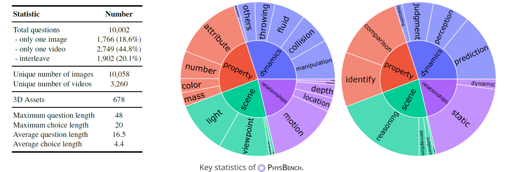
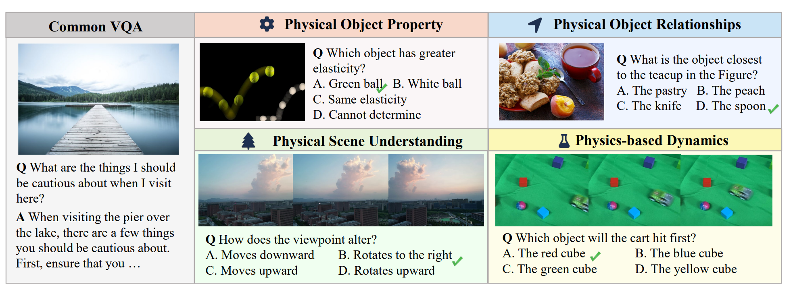
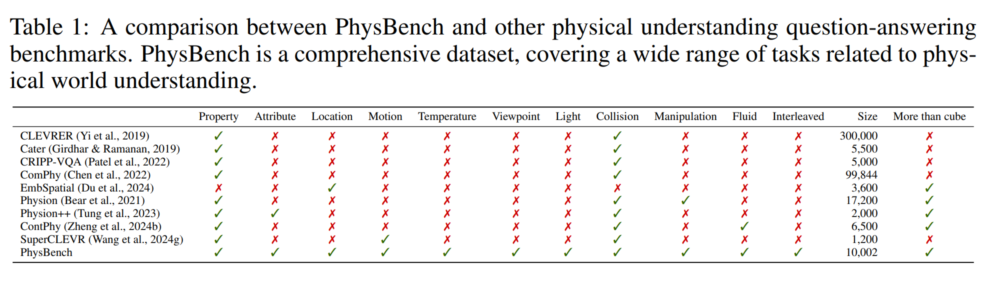
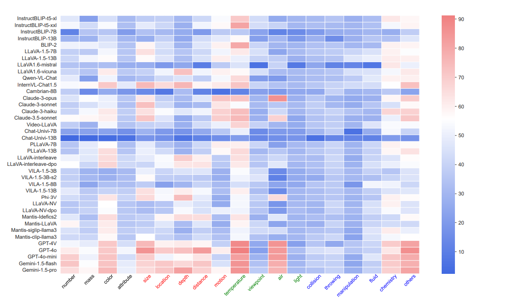
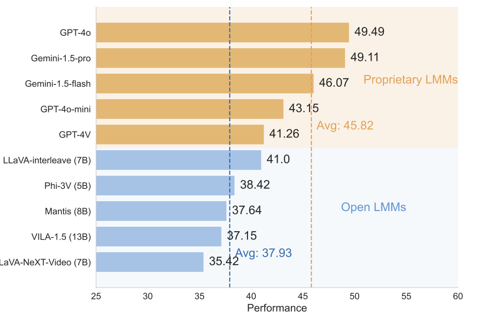
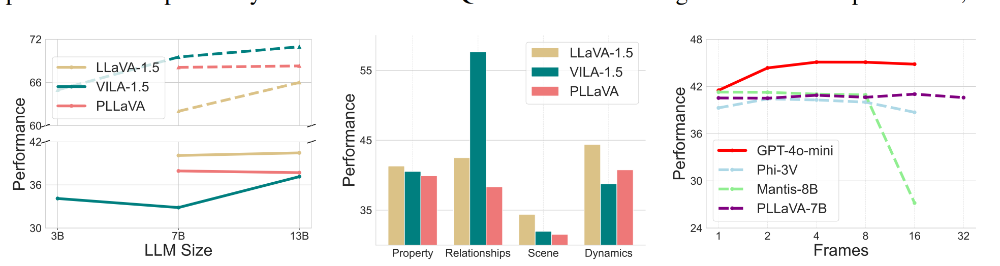
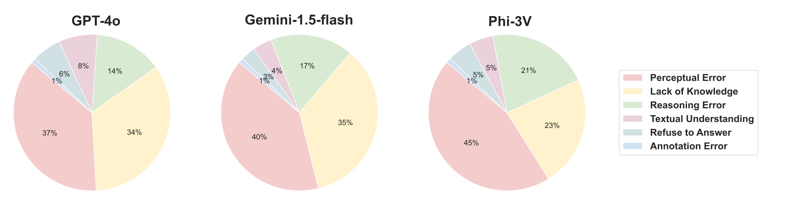
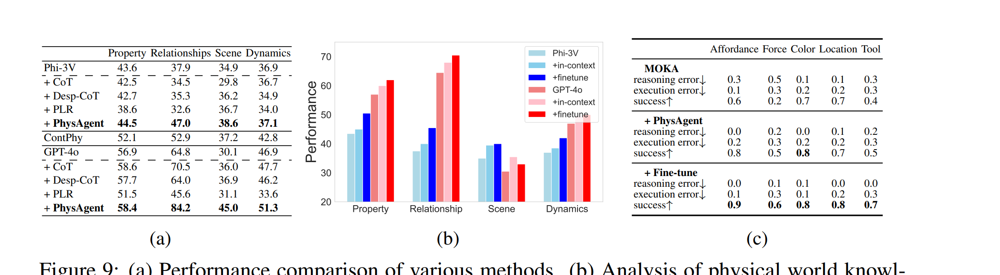
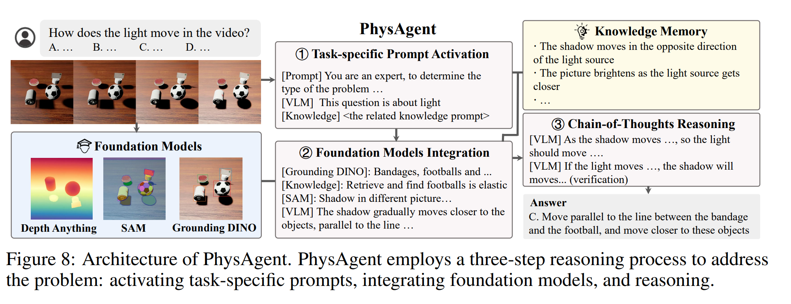

# [ICLR'25] PhysBench Benchmarking and Enhancing VLMs for Physical World Understanding

1. Link: https://physbench.github.io/
2. Arthurs and institution: Wei Chow, Jiageng Mao, Boyi Li, Daniel Seita, Vitor Guizilini, Yue Wang from USC.

**NOTE:**
1. Yue Wang is a new AP in USC, he's doing CV, simulation, perception and decision making. previously he graduated from MIT, UCSD and ZJU.
**TL;DR**
We propose Logo PhysBench, which comprehensively evaluates VLMs' perception of the physical world across four major task categories: property, relationship, scene understanding and dynamics.
**Todos**
**Philosophy**
Since these agents operate in and interact with the real world, VLMs must possess a comprehensive understanding of the physical world—a critical yet underexplored domain

## Thoughts and critisims
1. 被标题吸引，因实验部分离开
2. the work does not fully consider how we use VLM in robotic field
3. we could do an articulation pair to ask if VLM under stand the question.
## Related works
### Physical Comprehension Datasets

1. currently focus on commonsense reasoning rather than physical world perception
### Physical Reasoning Models
1. only a narrow range of tasks due to their reliance on predefined rules.
## Problems
1. Do VLMs possess an understanding of the physical world, and if not, what factors contribute to this limitation?
2. How can we enhance VLMs’ physical world understanding capabilities and facilitate the effective deployment of embodied agents like MOKA
## Contributions
1. We present PhysBench, a large-scale benchmark for evaluating the performances of vision-language models in physical world understanding. We identify the key challenges through extensive studies and provide insights into why the existing VLMs have insufficient physical world understanding capabilities.
2. We propose PhysAgent, a unified approach that improves VLMs’ physical world understanding abilities. Through extensive experiments, we demonstrate that enhancing VLMs’ comprehension of physical environments can significantly facilitate the deployment of embodied agents.
## Key findings
### 1
VLMs exhibit a limited understanding of the physical world

### 2
Closed-source models generally perform better

### 3
WHY DO VLMS STRUGGLE WITH PHYSICAL WORLD UNDERSTANDING
1. Physical world understanding differs significantly from common VQA tasks.
2. VLMs’s physical world understanding ability does not scale with model size, data, or frames
   
3. Perceptual and knowledge gaps constitute the majority of errors

1. Can VLMs transfer physical world knowledge?
yes

## PHYSAGENT
### HOW TO ENHANCE VLMS FOR PHYSICAL WORLD UNDERSTANDING
1. add vision fundation model as assistance
   
### Embodiment application
1. fine-tuning it with PhysBench
2. employing PhysAgent to zero-shot assist in reasoning about affordance representations.
## Implementation details
1. dataset
   1. video
      1. simulation/web/real-world
      2. sim rules/llm/human
   2. question
      1. handmade/gpt
      2. undergo with human review
2. data annotation
   1. human
3. fine-tune
   1. LLaVA fine-tunes both the FC layer and the LLM using a dataset of 158K instructional vision-language pairs
   2. PaliGemma has a architecture optimized to achieve superior fine-tuning performance across a comprehensive range of vision-language tasks, including image and short video captioning, visual question answering, optical character recognition, object detection, and instance segmentation
### Hardware
### Software
### Training
## Experiments