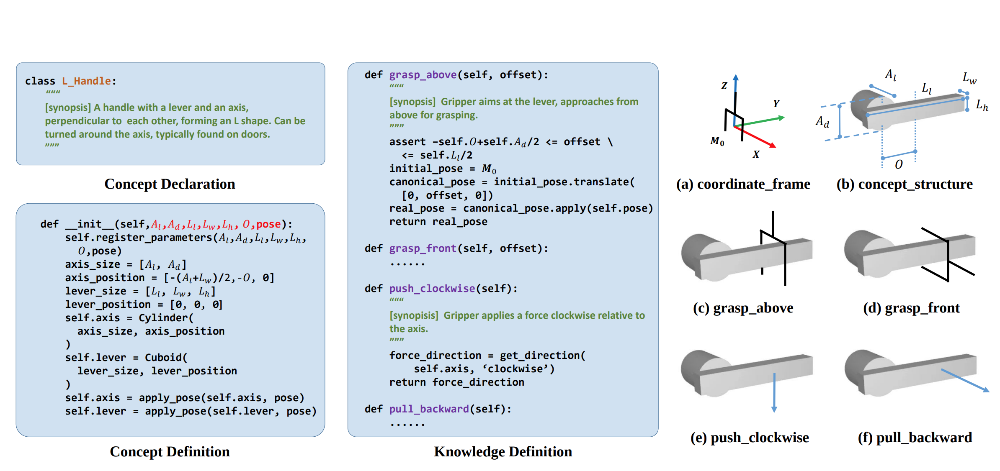
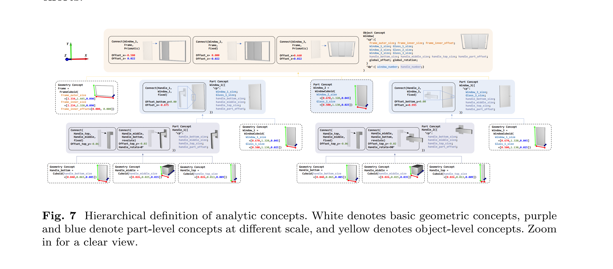
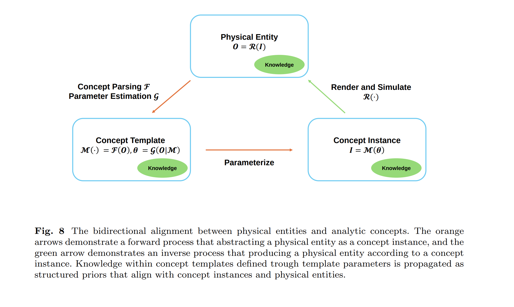

# [SII'25] Digital Gene
1. Link: https://arxiv.org/abs/2504.04170
2. Arthurs and institution: Jianhua Sun, Cewu Lu from SJTU and SII

**NOTE:**
**TL;DR**
An introduction of structured representation for physically grounded objects, including geometric and affordance representation by python code.
**Todos**
1. read those metioned papers

## Thoughts and critisims
1. The concept of 
2. The article does not introduce details in data preparation, traning process and concepts. Most of them lies in their previous works.
3. Rather than what they did, the authors put a major effort on describing what they could do.
## Contributions
1. a code-based representation of object geometric properties and affordance for articultated objects.
2. a tree structured that build an physical entity from parts.

## Key concepts
1. object definition

2. hierachical definition of object

2. traning and inference process
