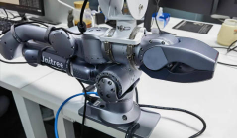
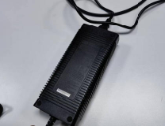
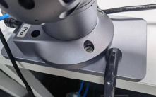

# User Guide for Manipulator

## 1. Introduction

This document provides an introduction to the hardware and software of the **Unitree Z1 Arm**. It is designed for roboticists who wish to use the manipulator, offering guidance and answers to common queries.

## Cautions
**SAFETY FIRST！！**
**If the user find any 'cracked' sign of the arm, please ask for help.**
1. Install the robot arm and connect the cables according to the requirements.
2. Ensure that the robot arm does **not collide** with people or other objects within its range of activity.
3. The robot arm will generate heat during operation, so please do **not touch it** during operation or when it has just stopped
4. Be sure to **power off** when the robot arm is finished using
5. Be sure to **turn off the control** program after the robot arm is powered off
   

## 2. Overview
One could find all details of the camera in the following links.
**Useful Links**
1. Z1 website: https://support.unitree.com/home/zh/Z1_developer
2. Github repositories
   1. Z1 controller msg: https://github.com/unitreerobotics/z1_controller
   2. Z1 SDK: https://github.com/unitreerobotics/z1_sdk
   3. Z1 system msg: https://github.com/unitreerobotics/unitree_ros_to_real/tree/master/unitree_legged_msgs

**Hardware Checklist**
| Name  | Num| Img|
|--|------|---| 
| manipulator| 1 | |
| ac/dc switching adaptor| 1 | |
| C-clamp| 1 | |
| fixed plate|  1 | |
| mobile plate|  1 | [**WIP**]|

**Manipulator Specification**

| Parameter                | Specification              |
|--------------------------|----------------------------|
| Degrees of Freedom         | **6** axes                     |
| Weight                     | 4.1kg                      |
| Payload                    | ≥3kg                       |
| Maximum Reach              | **740mm**                      |
| Repeatability & Precision  | **~0.1mm**                     |
| Power Requirements         | **Voltage 24V, Current >20A**   |
| Interface                  | **Ethernet**                   |
| User Control System        | Ubuntu                     |
| Power                      | Peak 500W                  |
| Force Feedback & Collision Detection | Yes             |
| Interface Control          | **Position + Force Control**   |


## 3. Unitree Z1 SDK
The use of manipulator consists of the following parts, all steps can be found in https://support.unitree.com/home/zh/Z1_developer/poweron
````
## Before Use
Step 1: setup the hardware correctly (zero position, connect the power before turning it on) 
Step 2: Power up the manipulator, set up the network configuration
## Use
Step 3: Install prerequisites (SDK, ROS2)
Step 4: Data sending and recording
```` 
## 4. Resources
1. URDF of z1: https://github.com/unitreerobotics/unitree_ros/tree/master/robots/z1_description
2. URDF of b2z1 (joint is set to fixed in purpose): https://github.com/cjt0313/unitree_rl_gym/tree/main/resources/robots/b2/urdf
## 5. FAQ
**[WIP]**
