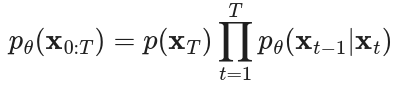
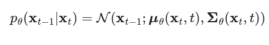

# Diffusion Model

credits to
1. an easy one https://lilianweng.github.io/posts/2021-07-11-diffusion-models/#what-are-diffusion-models
2. a complete one https://arxiv.org/pdf/2208.11970
3. a very high-level mathematical introduction https://dansblog.netlify.app/posts/2023-01-30-diffusion/diffusion
**Informal summary**:
They define a Markov chain of diffusion steps to slowly add random noise to data and then learn to reverse the diffusion process to construct desired data samples from the noise.
1. learned with fixed procedure
2. latent variables are high-dimensional

## Forward diffusion process
add small amount of Gaussian noise to the given sample $x_0 \sim q(x)$ in T steps
$$q(x_t|x_{t-1}) = \mathcal N(x_t; \sqrt{1-\beta_t} x_{t-1}, \beta_{t})$$
$$q(x_{1:T}|x_0)$$ $\\ = \Pi^T_{i=1} q(x_i|x_{i-1}:x_0) \\=Pi^T_{i=1} q(x_i|x_{i-1})$ by markov property
$x_t$ can be sampled at any arbitrary step

## Stochastic Gradient Langevin Dynamics (SGLD)
sample $p(x)$ using only gradients $\nabla_x log(p(x))$ in Markov chain of updates
, compare to SGD, the SGLD add noises for preventing collapse from locol minima

## Reverse diffusion process
If we wish to learn a parameterized model $p_\theta$ to approximate the margianl distribution of $p(x_0:x_T)$, we could have the formula by markov property 
and for each step, we have 