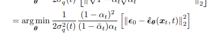

# Diffusion Model

credits to
1. an easy one https://lilianweng.github.io/posts/2021-07-11-diffusion-models/#what-are-diffusion-models
2. a complete one https://arxiv.org/pdf/2208.11970
3. a very high-level mathematical introduction https://dansblog.netlify.app/posts/2023-01-30-diffusion/diffusion
**Informal summary**:
They define a Markov chain of diffusion steps to slowly add random noise to data and then learn to reverse the diffusion process to construct desired data samples from the noise.
1. learned with fixed procedure
2. latent variables are high-dimensional

## Forward diffusion process
add small amount of Gaussian noise to the given sample $x_0 \sim q(x)$ in T steps
$$q(x_t|x_{t-1}) = \mathcal N(x_t; \sqrt{1-\beta_t} x_{t-1}, \beta_{t})$$
$$q(x_{1:T}|x_0)$$ $\\ = \Pi^T_{i=1} q(x_i|x_{i-1}:x_0) \\=Pi^T_{i=1} q(x_i|x_{i-1})$ by markov property
$x_t$ can be sampled at any arbitrary step

## Stochastic Gradient Langevin Dynamics (SGLD)
sample $p(x)$ using only gradients $\nabla_x log(p(x))$ in Markov chain of updates
, compare to SGD, the SGLD add noises for preventing collapse from locol minima

## Hierarchical Variational Autoencoders
joint distribution and the posterior of a Markovian HVAE as:

by Jenson's inequality, the ELBO of likelihood of x is , together we have 

## Variational Diffusion Models
VDM is a variant HVAE with 3 following restrictions
1. dimension of latent variable is equal to the input
2. foward process is not learnable
3. noise in final step is a standard gaussian
the posterior of VDM is 
and VDM can be optimized by maximizing ELBO as follows:

**NOTE** that the consistency term depends on two variables, and its a sum of expectation, thus the variance of the term is high, we wish to reduce it, thus we introduce condition on $x_0$ and we have 
still, due to the added complexity of simultaneously learning the encoder, the sumation term is hard to learn, we use the Gaussian transission property to solve this.
thus we compute the KL divergence as , substitute $\mu$ with corresponding values, as use estimation of x_0, we have 
thus, minimizing the summation term of our derived ELBO objective across all noise levels can be approximated by minimizing the expectation over all timestep
reparametrize the term to SNR, we have , the SNR_t can be parameterized as a NN model , the expotential term ensures its monotonicity. Then we have 
### different interpolations
1. learning a VDM by predicting the original image x0 is equivalent to learning to predict the noise

2.  learning to model the score function is equivalent to modeling the negative of the source
noise
Tweedle's formula for an exponential family
we have 
rewrite it we have 
## Score-based Generative Models
1. energybased models

2. to avoid learning/modelling Z is to learning score function of it.
  then we have the learning object 
3. Langevin dynamics for sample from any arbitary point until the mode is reached, the last noise term helps the sampling to be not deterministic and escape from local minima
4. problems for score matching
   1. the score function is ill-defined when x lies on a low-dimensional manifold in a high-dimensional space
   2. the estimated score function trained via vanilla score matching will not be accurate in low density regions (data in rare point)
   3. Langevin dynamics sampling may not mix, cannnot learning a mixture model since the gradient of log weight is zeros 
   ### adding multiple levels of Gaussian noise to the data solve the problems
   define a noise sequence and rewrite the learning object 
## Guidance
add condition y on x , use approximation  may fulfill the learning object, but we would know the level of impact for applying such condition
### Classifier Guidance

add a scalar on adversarial gradient would allow us  fine-grained control
Drawback:
1. the classifier must handle arbitrarily noisy inputs, which most existing pretrained classification models are not optimized to do, it must be learned ad hoc along side the diffusion model.
### Classifier-Free Guidance
rewrite the term 
1. learn both the conditional and unconditional diffusion models together as a singular conditional model
2. the unconditional diffusion model can be queried by replacing the conditioning information with fixed constant values, such as zeros.
3. essentially performing random dropout on the conditioning information.
4. Classifier-Free Guidance enables us greater control over our conditional generation procedure while requiring nothing beyond the training of a singular diffusion model