# [Signal Processing'20] Selective review of offline change point detection methods
1. Link: 
   1. Paper: https://arxiv.org/pdf/1801.00718
   2. Repo: https://centre-borelli.github.io/ruptures-docs/
2. Arthurs and institution: Charles Truonga, Laurent Oudreb, Nicolas Vayatis from CMLA, CNRS, ENS Paris Saclay and L2TI, University Paris 13

**TL;DR**
A selective survey of algorithms for the offline detection of multiple change points in multivariate time series, while it not cover the Bayesian methods.
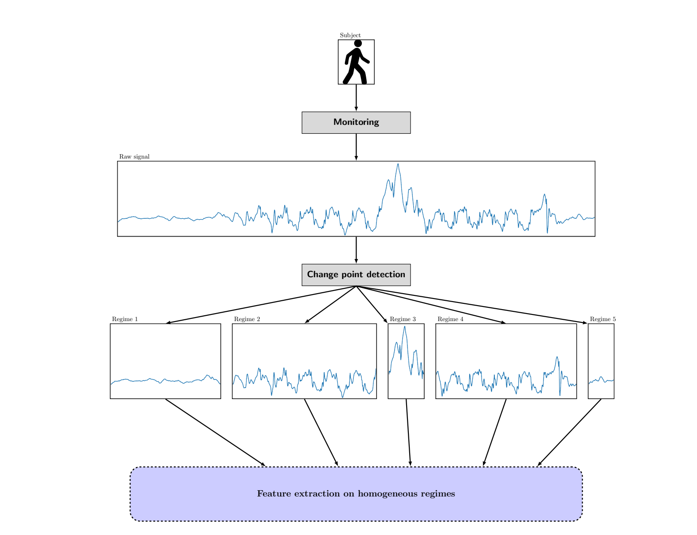
## Thoughts and critisims
## Problem formulation
1. data
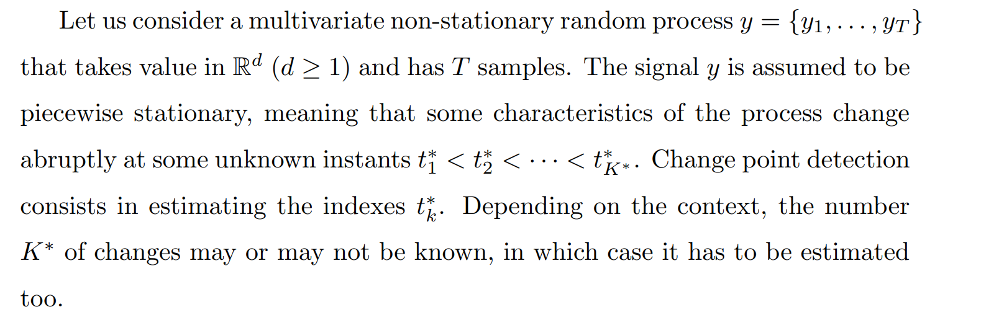
2. Objective
   
3. Modules
   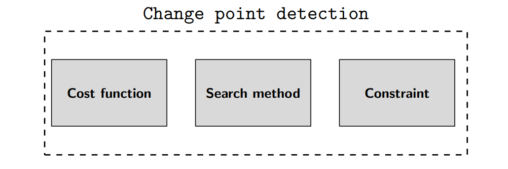
   1. Cost function. The cost function c(·) is a measure of “homogeneity”
   2. Search method. The search method is the resolution procedure for the discrete optimization problems associated with Problem 1 (P1) and Problem 2 (P2).
   3. Constraint (on the number of change points). When the number of changes is unknown (P2), a constraint is added, in the form of a complexity penalty pen(·) (P2), to balance out the goodness-of-fit term V (T , y). T
## Key concepts
### Cost function
1. property of estimation
   1. Asymptotic consistency
      1. 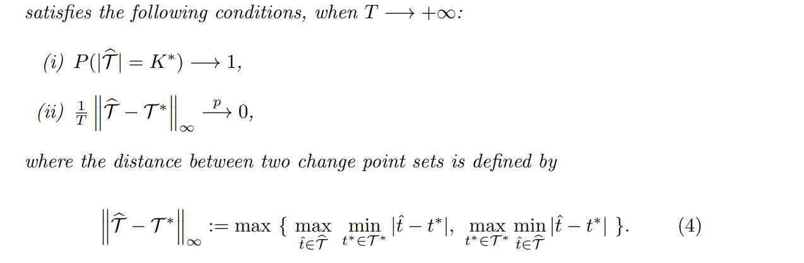
2. evaluation
   1. AnnotationError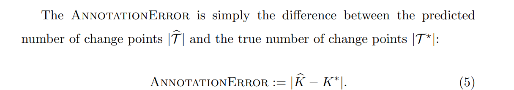
   2. Hausdorf 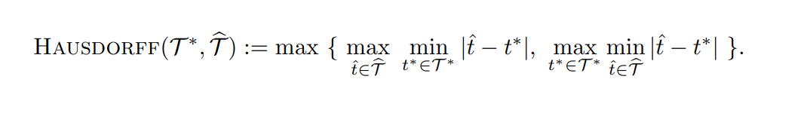
   3. RandIndex 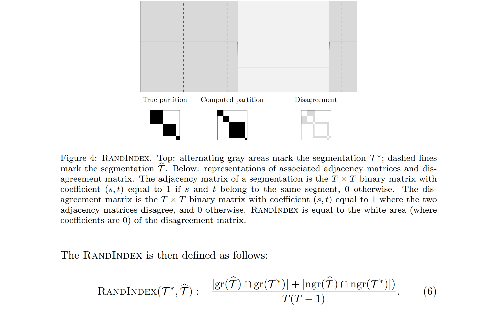
   4. F1-score 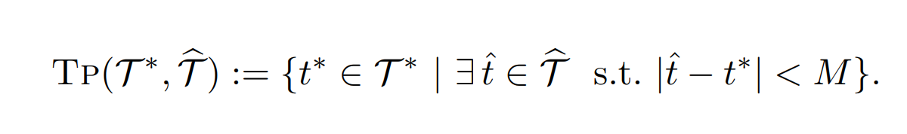
3. Cost functions
   1. parametric
      1. i.i.d. 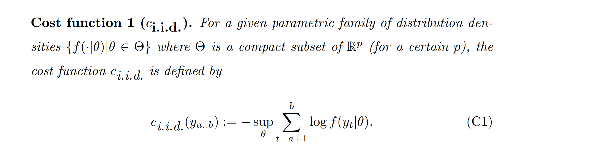
      2. cost 2: 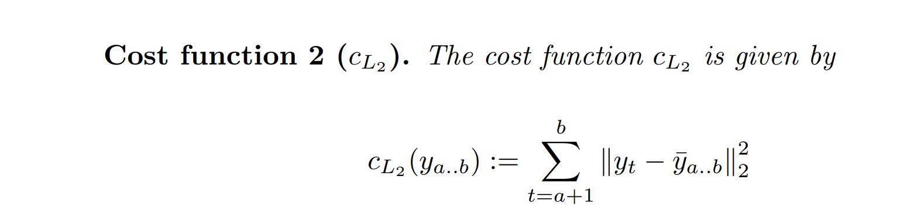
      3. cost 3: 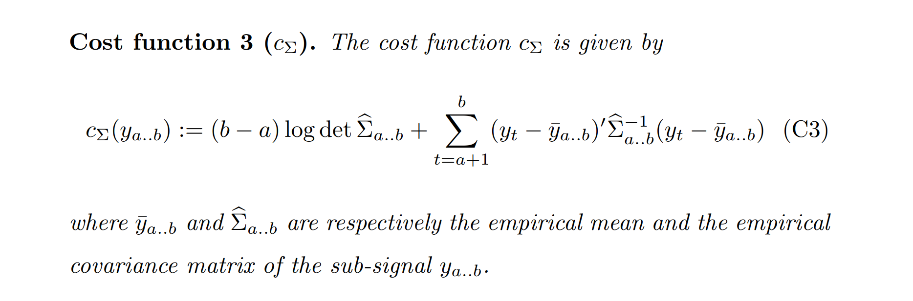
      4. cost 4: 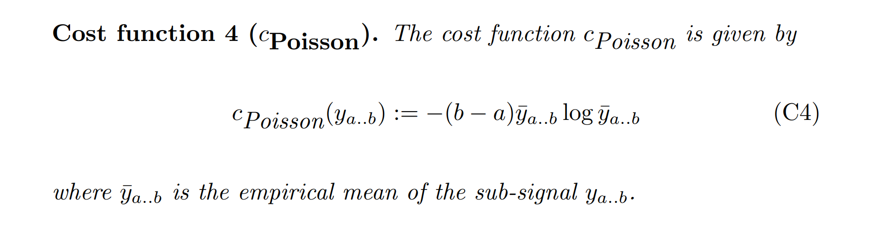
      5. cost 5: 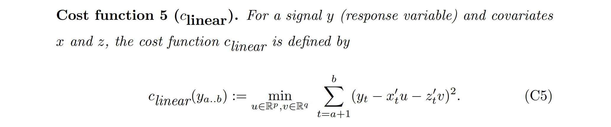
      6. cost AR: 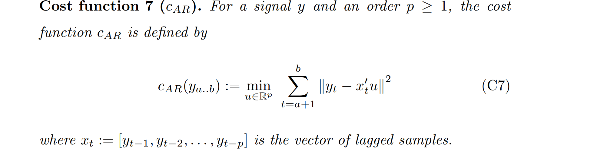
   2. non-parametric
      1. assume a emperical CDF
         1. 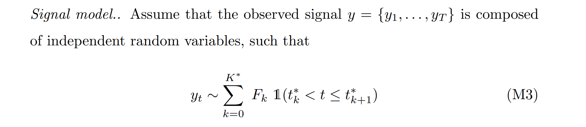
         2. MLE: 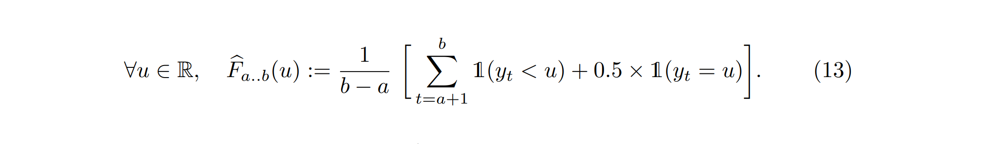
            1. cost function: 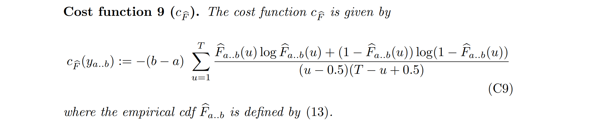
         3. kernel method: 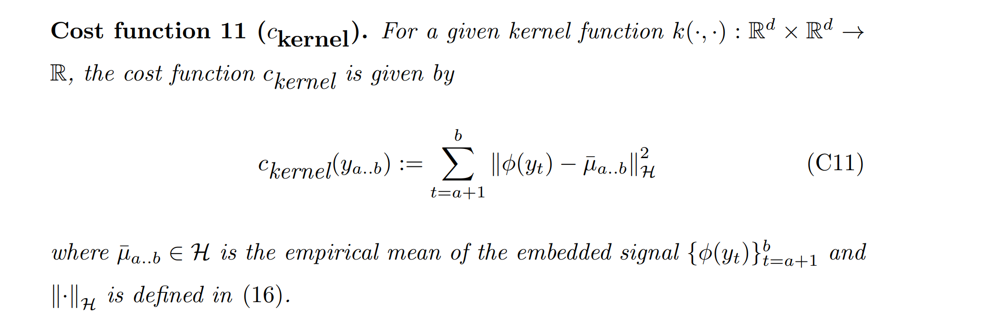
            1. rbf: 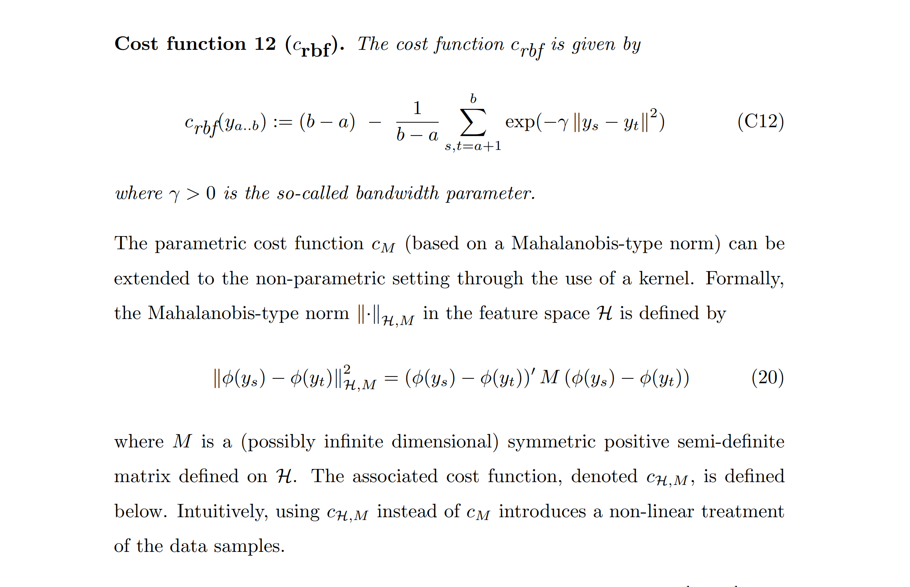
### Search method
#### optimal detection
1. if K is known
   1. dynamic programming 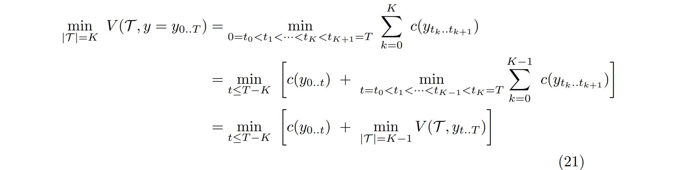
2. if K is unknown
   1. dynamic programming wiht penalty PELT (pruned exact linear time) 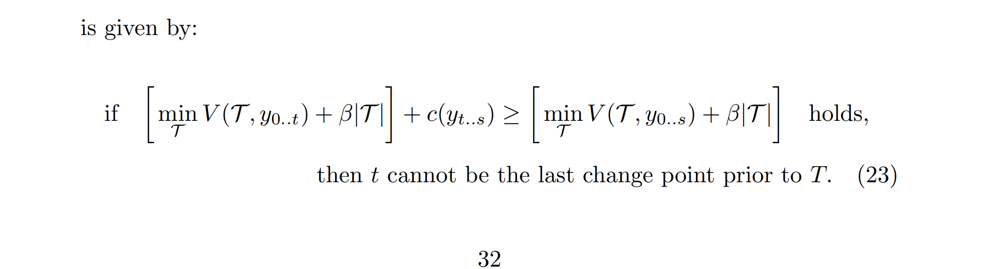
#### Approximate detection
1. window slicing
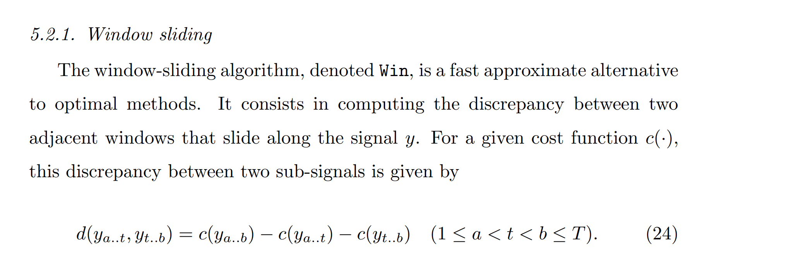
2. binary segmentation
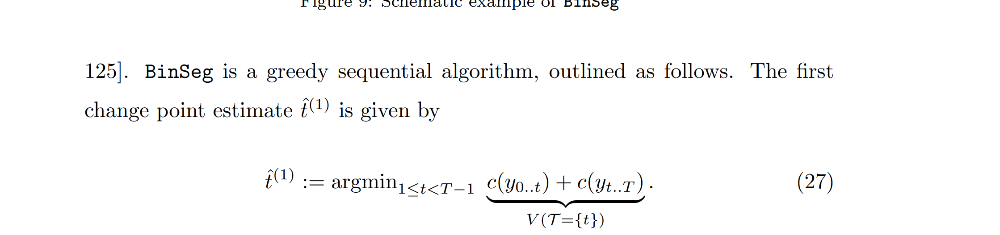
3. Bottom-up segmentation
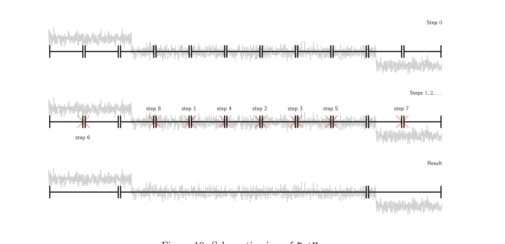
#### Penalties
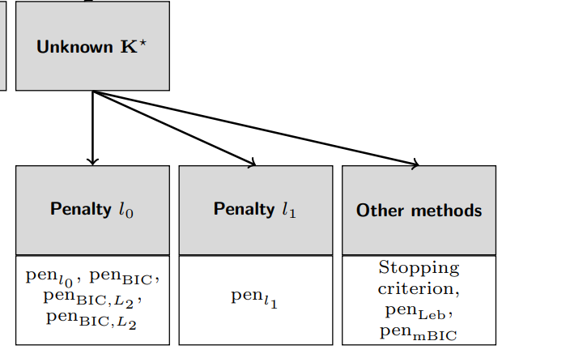